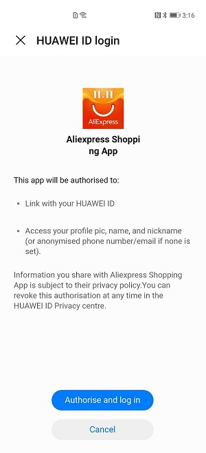
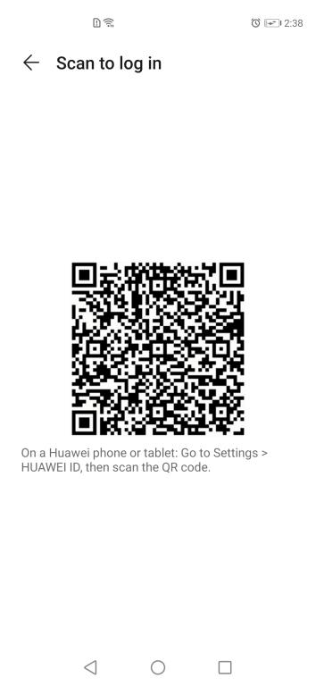
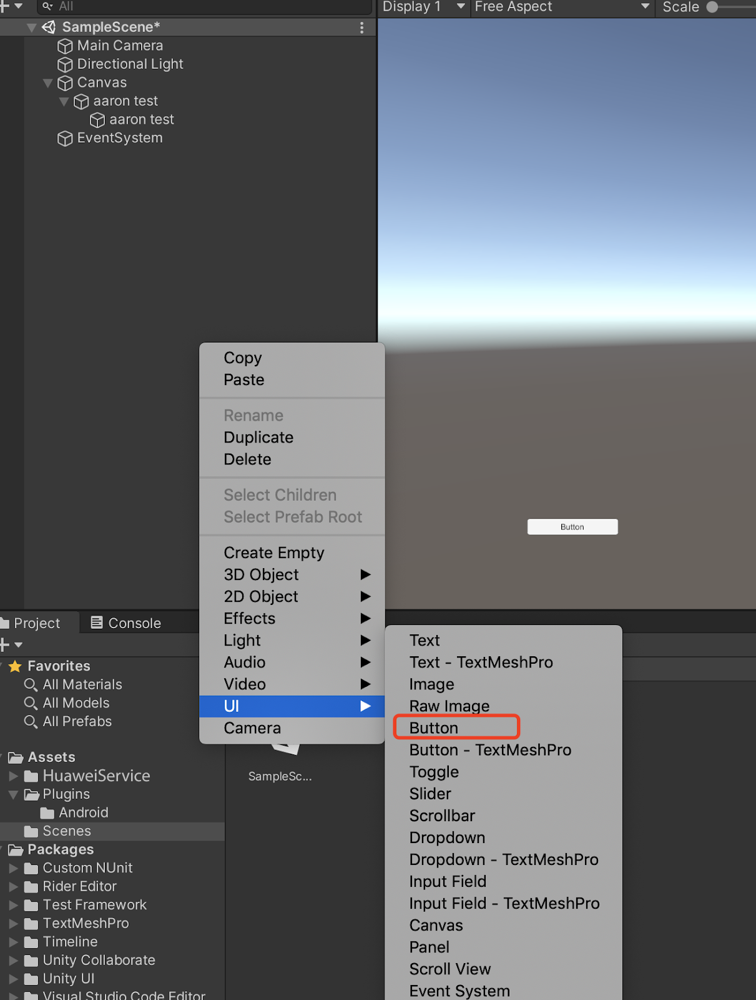
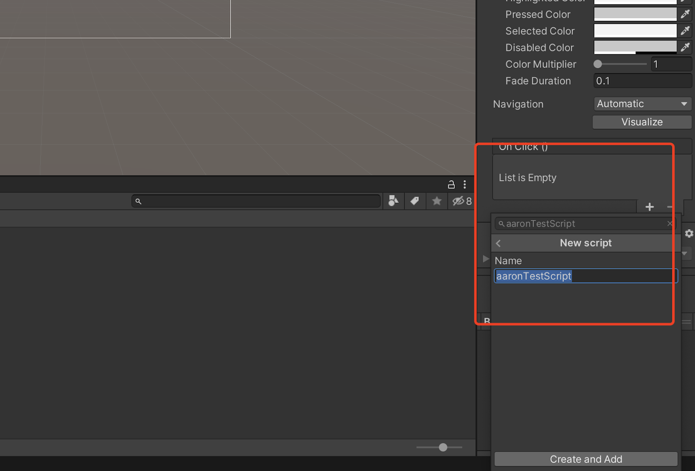

# Account

## Introduction
[Account Kit](https://developer.huawei.com/consumer/en/doc/development/HMSCore-Guides/introduction-0000001050048870) provides you with simple, secure, and quick sign-in and authorization functions. Instead of entering accounts and passwords and waiting for authentication, users can just tap the Sign in with HUAWEI ID button to quickly and securely sign in to your app with their HUAWEI  IDs.

## Use Case
### Quick Sign-In to Apps
Users can quickly and conveniently sign in to apps with their HUAWEI IDs. When signing in to an app using a HUAWEI ID for the first time, a user needs to authorize the app. Then, the user can sign in to the app with one tap. With one HUAWEI ID, a user can sign in to all apps on all devices.



### Sign-In Using QR Code
With Account Kit, the user who has already signed in with his/her HUAWEI ID on a device can easily sign in with the same ID on other devices by scanning a QR code.



## Developer Guide: How to integrate the Account Kit to your Unity project
### Integrating the AppGallery Connect SDK
You must integrate the AppGallery Connect SDK and plug-in before integrating the Account Kit into your app. For details, please refer to [AppGallery Connect Quick Start](https://developer.huawei.com/consumer/en/doc/development/AppGallery-connect-Guides/agc-get-started).

### Enabling the Account Service
Before using Account Kit, you need to enable it on the Manage APIs tab page in AppGallery Connect. For details, please refer to [Enabling Services](https://developer.huawei.com/consumer/en/doc/distribution/app/agc-help-enabling-service-0000001146598793).

### Signature

#### Create certificate
> Edit -> Project Settings -> Player -> Android(icon) -> Publishing Settings -> Keystore Manager

    Keytore... -> create new
    


`We should enter password when you open unity, otherwise We cannot build.`
**We donnot need add signature on gradle**

#### Generating a Signing Certificate Fingerprint

Refer to Huawei [preparation documentation step 4](https://developer.huawei.com/consumer/en/codelab/HMSPreparation/index.html#3) for generating a SHA256 Certificate Fingerprint.


#### Configuring the Signing Certificate Fingerprint

Refer to Huawei [preparation documentation step 5](https://developer.huawei.com/consumer/en/codelab/HMSPreparation/index.html#4) to add Fingerprint to AppGallery Connect.


### Config the json file

**Note:**
Copy the agconnect-services.json file to the **Assets/Plugins/Android** folder.


### Setting up unity Custom Android manifest and gradle
1. Switch platform to android. In player setting
2. Enable custom manifest and gradle in player setting. The following is in unity 2019.4
    
The android struct is after unity 2019.3, manifest and gradle are separated into multiple files.
3. Edit -> Project Settings -> Player ->  Android(icon) -> other settings -> Identification -> Package Name .The package name is the package name of app in huawei project.
    

### Integrating Account Kit
1. Enable and add configurations to project gradle

**Edit -> Project Settings -> Player -> Android(icon) -> Publishing Settings -> Build**
enable `Custom Base Gradle Template` and add the configuration to the Maven repository which path is 'Assets-> Plugins -> Android ->  baseProjectTmeplate.gradle'

You will get baseProjectTmeplate.gradle. If unity version is 2019.2 or before, you should add implement and other configuration on MainGradleTemplate.And the repository is:
```
    allprojects {
        buildscript {
            repositories {
                maven { url 'https://developer.huawei.com/repo/' }
            }
        }
        repositories {

            maven { url 'https://developer.huawei.com/repo/' }
        }
    }
```

2. Enable and add configurations to app gradle

**Edit -> Project Settings -> Player -> Android(icon) -> Publishing Settings -> Build**

enable `Custom Launcher Gradle Template`and add build dependencies in launcherTemplate.gradle and the path is ‘Assets-> Plugins -> Android ->  LauncherTmeplate.gradle‘

If unity version is 2019.2 or before, you should add implement and other configuration on MainGradleTemplate.
To add Account Kit.
```
    dependencies {

    implementation 'com.huawei.hms:hwid:6.4.0.300'

}
```

3. Enable and add configurations to base gradle

**Edit -> Project Settings -> Player -> Android(icon) -> Publishing Settings -> Build**

enable `Custom Main Gradle Template`and add build dependencies in mainTemplate.gradle and the path is ‘Assets-> Plugins -> Android ->  LauncherTmeplate.gradle‘

If the unity version is 2019.2 or before, you should add implement and other configuration on MainGradleTemplate.

To add Account Kit.
```
    dependencies {

    implementation 'com.huawei.hms:hwid:6.4.0.300'

}
```

4. Custom AndroidManifest and add custom HmsAccountActivity.java

>Why should we add a custom activity?

**Account Kit** receives sign in results in `onActivityResult` hook,which can't be overridden in c# code.
So we need a transparent activity as a proxy to receive and deliver the results.

To receive results, you shall get `mAuthService` and `getSignInIntent` in the proxy-activity but in the unityPlayerActivity where `onActivityResult` has not been overridden , then `startActivityForResult` and receive results in `onActivityResult` hook in the proxy-activity.

To deliver the results, you can write a custom `MyonActivityResult` in c# code, pass it on to in the proxy-activity,  call that callback in  `onActivityResult` in the proxy-activity, then you can handle the results in your c# code.

To simplify this scenario, we provide [AccountActivity.cs](https://github.com/Unity-Technologies/HuaweiServiceSample/blob/accountkit/Assets/HuaweiService/account/AccountActivity.cs), in which common functions are packaged. You can find the examples in [AccountTest.cs](https://github.com/Unity-Technologies/HuaweiServiceSample/blob/accountkit/Assets/HuaweiServiceDemo/Scripts/test/AccountTest.cs).  

Update AndroidManifest for HmsAccountActivity  in  **Assets/Plugins/Android/AndroidManifest.xml**

```
<?xml version="1.0" encoding="utf-8"?>
<!-- GENERATED BY UNITY. REMOVE THIS COMMENT TO PREVENT OVERWRITING WHEN EXPORTING AGAIN-->
<manifest
   xmlns:android="http://schemas.android.com/apk/res/android"
   package="com.unity3d.player"
   xmlns:tools="http://schemas.android.com/tools">
...
   <application>
        <activity
                android:name="com.unity.hms.account.HmsAccountActivity"
                android:theme="@android:style/Theme.Translucent.NoTitleBar"
                android:exported="true">
        </activity>
...
   </application>
</manifest>
```

You may add corresponding custom HmsAccountActivity.java in **Assets/Plugins/Android/HmsAccountActivity.java**
```
package com.unity.hms.account;

import android.os.Bundle;
import android.app.Activity;
import android.content.Intent;
import com.huawei.hms.support.account.AccountAuthManager;
import com.huawei.hms.support.account.request.AccountAuthParams;
import com.huawei.hms.support.account.service.AccountAuthService;

public class HmsAccountActivity extends Activity {
    private static AccountAuthService mAuthManager;
    private static AccountAuthParams mAuthParam;
    private static IAccountCallback mCallback;
    private static String mAccessToken;
    private static int mRequestCode;

    private static String mIntent = "test";

    public static void setIntent(String intent){
        mIntent=intent;
    }
    public static void setAccessToken(String token){
        mAccessToken=token;
    }
    public static void setAuthParam(AccountAuthParams AuthParam){
        mAuthParam=AuthParam;
    }
    public static void setCallback(IAccountCallback callback){
        mCallback=callback;
    }
    public static void setRequestCode(int requestCode){
        mRequestCode=requestCode;
    }

    @Override
    protected void onCreate(Bundle savedInstanceState) {
        super.onCreate(savedInstanceState);
        switch (mIntent) {
            case "signIn":
                signIn();
                break;
            case "independentSignIn":
                independentSignIn(mAccessToken);
                break;
            default:
                break;
        }
    }

    public static void start(Activity activity){
        Intent intent = new Intent(activity, HmsAccountActivity.class);
        activity.startActivity(intent);
    }

    public void signIn() {
        mAuthManager = AccountAuthManager.getService(this, mAuthParam);
        startActivityForResult(mAuthManager.getSignInIntent(), mRequestCode);
    }

    public void independentSignIn(String accessToken){
        mAuthManager = AccountAuthManager.getService(this, mAuthParam);
        startActivityForResult(mAuthManager.getIndependentSignInIntent(accessToken),mRequestCode);
    }

    @Override
    protected void onActivityResult(int requestCode, int resultCode, Intent data) {
        super.onActivityResult(requestCode, resultCode, data);
        if(mCallback!=null){
            mCallback.onActivityResult(requestCode, resultCode,data);
        }
        mRequestCode=0;
        finish();
    }
}
```

### Step 6: Setting up a scene
- 6-1. Open a scene:
<br>

- 6-2.Right click and select UI and then you can choose a button:
<br>

- 6-3.Add component to the button and develop a script:
<br>

<br>


- 6-4.Edit the script:
<br>

<br>Double click the script file,and u will open it in VS code
<br>

Create a function above

- 6-6.Bind buttons and interfaces in scripts
<br>

<br>
    - Step1. Click “+” to add a function
    - Step2. Choose a the corresponding scene which has the interface you want to use
    - Step3. Click the “No Function” select to choose the script and then choose the corresponding function
<br>


## Demo Project：How to use this demo project?
After Integration you could use them as if you are writing Android code. Please reference document here: [https://developer.huawei.com/consumer/en/doc/development/HMSCore-Guides/android-introduction-0000001098842325](https://developer.huawei.com/consumer/en/doc/development/HMSCore-Guides/android-introduction-0000001098842325). 

If there are still things not clear you can check the demo on github. The corresponding accountKit usage is [https://github.com/Unity-Technologies/HuaweiServiceSample/blob/accountkit/Assets/HuaweiServiceDemo/Scripts/test/AccountTest.cs ](https://github.com/Unity-Technologies/HuaweiServiceSample/blob/accountkit/Assets/HuaweiServiceDemo/Scripts/test/AccountTest.cs ) 

