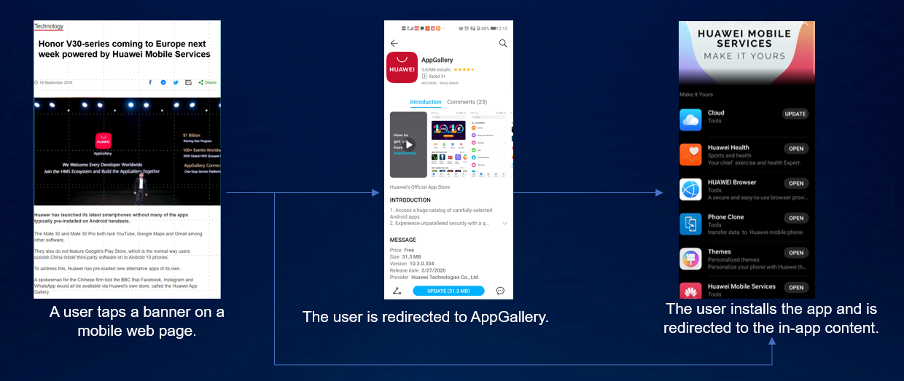
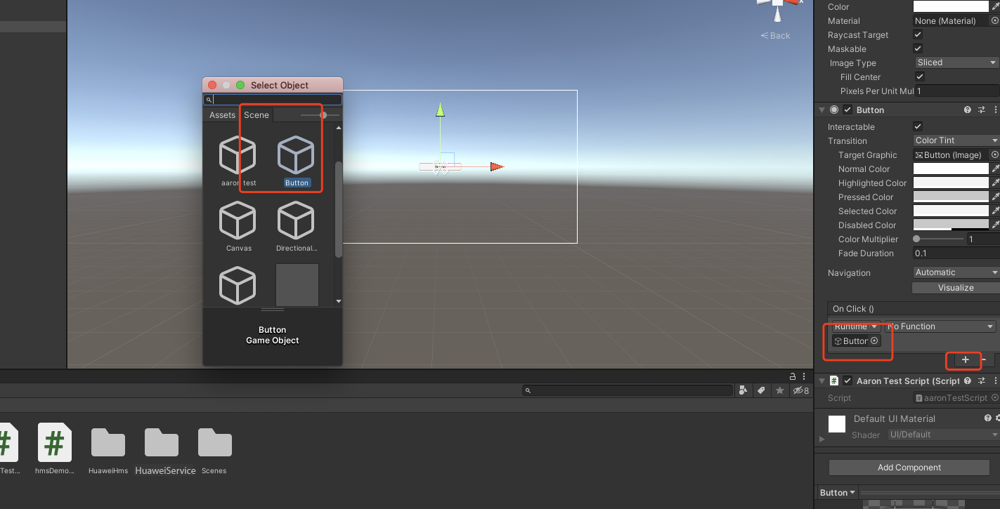
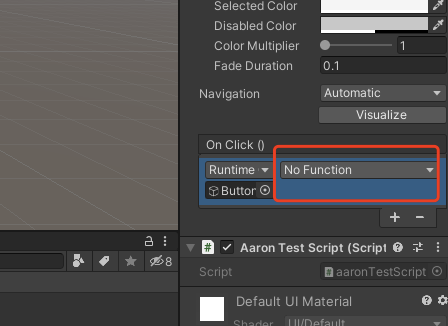

# App Linking (AGC)

## Service Introduction
[App Linking](https://developer.huawei.com/consumer/en/doc/development/AppGallery-connect-Guides/agc-applinking-introduction) allows you to create cross-platform links that can work as defined regardless of whether your app has been installed by a user. A link created in App Linking can be distributed through multiple channels to users. When a user taps the link, the user will be redirected to the specified in-app content. In App Linking, you can create both long and short links.

To identify the source of a user, you can set tracing parameters when creating a link of App Linking to trace traffic sources. By analyzing the link performance of each traffic source based on the tracing parameters, you can find the platform that can achieve the best promotion effect for your app.

### Use Cases

#### Waking Up Inactive Users/Increasing Views of a Specific Page

You can create a user waking-up activity under **Operate -> Promotion -> Manage promotions -> Activities** and then create a link of App Linking to direct users to the activity through social media, email, SMS message, or push message. If a user finds the activity attractive and taps the link, your app will be launched and the user will be redirected to the activity page and instructed to complete certain actions required by the activity, for example, sharing or making a payment. In this way, user activity is improved and the view count of the page increases.


#### Converting Mobile Website Users into Native App Users
When a mobile website user opens a common shared link (not a link of App Linking) on a page, the user needs to install the app first, go back to the page, and open the link again. App Linking can greatly improve user experience in this process by directly redirecting a user to the target in-app content after the user installs your app.



#### Tracing Traffic Sources in Daily Marketing to Identify the Most Effective Marketing Platform
You can set tracing parameters for a marketing link of App Linking to be placed on multiple marketing platforms so that you can identify which platform can achieve the best marketing result based on statistics collected for each platform and check whether users on this platform fit the user profile that you have defined at the beginning.


#### Encouraging Users to Share Links

App Linking can work with [Cloud Functions](https://developer.huawei.com/consumer/en/doc/development/AppGallery-connect-Guides/agc-cloudfunction-introduction) and [Cloud DB](https://developer.huawei.com/consumer/en/doc/development/AppGallery-connect-Guides/agc-clouddb-introduction) to encourage users to share links to their friends by offering incentives, effectively boosting user growth for your app.

### Main Functions


| <div style="width:140px">Function</div> | Description                                                  |
| :-------------------------------------- | :----------------------------------------------------------- |
| Support for deferred deep links         | Directs a user who has not installed your app to AppGallery to download your app first and then goes to the linked in-app content directly, without requiring the user to tap open the link again. |
| Link display in card form               | Uses a sharing identifier to display a link of App Linking as a card, which will attract more users on social media. |
| Data statistics                         | Records the data of all link-related events, such as numbers of link taps, first app launches, and non-first app launches, for you to conduct analysis. |

### Create a link of App Linking

There are three ways to create a link of App Linking:

1. Creating a link in AppGallery Connect

2. Creating a link by calling APIs on the client

3. Manually constructing a link

The created links include **long links** and **short links**. The first two creation methods can create long/short links, while the third method can only create long links.

#### Long link

A long link is a link of App Linking in its entirety, and generally follows this format:

**URL prefix + [Deep link] + [Android app parameters] + [Preview type] + [Social sharing identifier parameters] + [Tracing parameters] + [Site ID]**

* The URL prefix is the URL contained in a link, which is in https://Domain name format. You can use the domain name provided by AppGallery Connect for free.

* The deep link is the URL of your app content. This is where a user will be directed when they tap the link. So if you want the user to see a specific page when they tap a link, you can set the URL of that page as the deep link.

* Android app parameters include the APK name, the link that will be opened if your app is not installed, and the earliest version of your app where the link can be opened.

* The preview type defines the type of the preview page displayed when a link of App Linking is opened in the browser.

* Social sharing identifier parameters define what information will appear when the link is shared on social platforms. Links can currently be shared on Facebook, Messenger, Twitter, and WhatsApp.

* A tracing parameter is added to a link to track the effectiveness of campaigns across traffic sources.

* The site ID is determined based on the data storage location of your app. It is used to identify the site that provides the App Linking service for your app.

For more information about long links, please refer to [Manually Constructing a Link](https://developer.huawei.com/consumer/en/doc/development/AppGallery-connect-Guides/agc-applinking-createlinks-defined).

#### Short link

Short link addresses are shortened by shortening the information contained in a long link address to a random string suffix in order to prevent the link address from being too long for sharing. A short link follows this format:

**URL prefix + Random suffix of the string type**

* URL prefix: Consistent with long links.

* The suffix of a short link can be Long or Short:

    * Long suffix contains 17 characters.

    * Short suffix contains at least four random characters.

### Open a link of App Linking

A link can be opened either in a **browser** or in your **app**, which is specified by you.

* If you set the link as to be opened in a browser, a user can open the link in a browser either from a **mobile device** or **PC**.

* If you set the link as to be opened in your app:

    * When a user who has not installed the app taps the link, the user will be redirected to AppGallery (or a custom address) and instructed to install your app. After the user installs the app, the app will be launched and the in-app content will be displayed.

    * When a user who has installed your app taps the link, the user will be directly redirected to the target in-app content.

### Version Update Description
> [https://developer.huawei.com/consumer/en/doc/development/AppGallery-connect-Guides/agc-applinking-sdkchangenotes](https://developer.huawei.com/consumer/en/doc/development/AppGallery-connect-Guides/agc-applinking-sdkchangenotes)

## Setting up in Huawei AppGallery Connect

### Getting Started
The App Linking service provides the App Linking SDK. You must integrate the SDK into your app before your app can create and receive links of App Linking. After an app is integrated with the App Linking SDK, the App Linking service automatically reports event data when a user taps a link of App Linking. You can analyze the effect of the link based on the reported event data. This section describes the procedures for enabling the App Linking service and integrating the App Linking SDK.

### Integrating the AppGallery Connect SDK
You must integrate the AppGallery Connect SDK and plug-in before integrating the App Linking SDK into your app. For details, please refer to [AppGallery Connect Quick Start](https://developer.huawei.com/consumer/en/doc/development/AppGallery-connect-Guides/agc-get-started).

### Enabling the App Linking Service

1. Sign in to [AppGallery Connect](https://developer.huawei.com/consumer/en/service/josp/agc/index.html) and select **My projects**.

2. Find your project from the project list and click the app for which you need to enable App Linking on the project card.

   
   
3. Go to **Growing > App Linking**. On the App Linking page that is displayed, click **Enable now**.

    **Note:**
    You may need to set the data storage location when enabling App Linking. Then, the setting in `agconnect-services.json` will be automatically updated accordingly. If you set the data storage location when enabling App Linking, you need to download the `agconnect-services.json` file again and integrate it into your project after the service is enabled. For details, please refer to [Adding the Configuration File](https://developer.huawei.com/consumer/en/doc/development/AppGallery-connect-Guides/agc-get-started#addjson).

    

4. Config the json file
   
   Copy the `agconnect-services.json` file to the `Assets/Plugins/Android` folder in your Unity project.  
   
   

## Setting up in Unity

### Setting up Unity Custom Android manifest and gradle

1. Switch platform to Android in **Player setting**.

2. Enable custom manifest and gradle in Player setting. The following is in unity **2019.4**.

    

    The android struct is updated after unity **2019.3**. Manifest and Gradle are separated into multiple files (Main, Launcher & Base).  
    
3. Set the package name in **Edit -> Project Settings -> Player ->  Android(icon) -> other settings -> Identification -> Package Name**.

    The package name is the package name of app in huawei project.
    
   

### Integrating HUAWEI Analytics Kit
To collect statistics on App Linking events, you need to use HUAWEI Analytics Kit. Please refer to the [https://docs.unity.cn/cn/Packages-cn/com.unity.huaweiservice@1.3/manual/](https://docs.unity.cn/cn/Packages-cn/com.unity.huaweiservice@1.3/manual/)

### Integrating AppLinking Kit
1. Enable and add configurations to project gradle

   Go to **Edit -> Project Settings -> Player -> Android(icon) -> Publishing Settings -> Build**
   
   Enable **Custom Base Gradle Template** and add the configuration to the Maven repository. The path is `Assets/Plugins/Android/baseProjectTemplate.gradle`.

   If your unity version is **2019.2 or before**, you should add implement and other configuration on `MainGradleTemplate.gradle`. 

   And the repository is:

   ```
       allprojects {
           buildscript {
               repositories {
                   maven { url 'https://developer.huawei.com/repo/' }
               }
           }
           repositories {
   
               maven { url 'https://developer.huawei.com/repo/' }
           }
       }
   ```

2. Enable and add configurations to app gradle
   
   Go to **Edit -> Project Settings -> Player -> Android(icon) -> Publishing Settings -> Build**
   
   Enable **Custom Launcher Gradle Template** and add build dependencies in `launcherTemplate.gradle`. The path is `Assets/Plugins/Android/launcherTmeplate.gradle`.
   
   If your unity version is **2019.2 or before**, you should add implement and other configuration on `MainGradleTemplate`.
   
   
   ```
          dependencies {
          implementation 'com.huawei.agconnect:agconnect-applinking:1.4.1.300'
      }
   ```

3. Optional: update manifest for redirect to application

   Add intent filter into activity for redirection in `Assets/Plugins/Android/AndroidManifest.xml`.

   ```
   <manifest ...>
       ...
       <application>
           <activity ...>
               ...
                <intent-filter>
                   <action android:name="android.intent.action.VIEW" />
   
                   <category android:name="android.intent.category.DEFAULT" />
                   <category android:name="android.intent.category.BROWSABLE" />
   
                   <data
                       android:host="unity.cn"
                       android:scheme="https" />
               </intent-filter>
               ...
           </activity>
           ...
       </application>
       ...
   </manifest>
   ```

4. Optional: update manifest for reading content on the clipboard

   Add meta-data into activity for redirection in `Assets/Plugins/Android/AndroidManifest.xml`.

   ```
   <manifest ...>
       ...
       <application>
          ...
          <meta-data android:name="com.huawei.agconnect.applinking.READ_CLIPBOARD_PERMISSION"   android:value="xxxx"/>
           ...
       </application>
       ...
   </manifest>
   
   ```

   - If value is Available, the App Linking SDK reads content on the clipboard each time when the app is launched.

   - If value is Unavailable, the App Linking SDK does not read content on the clipboard.

   - If metadata is not configured, the App Linking SDK reads content on the clipboard only when the app is launched for the first time.

## Developing with the SDK

### Setting up a scene

1. Open a scene:

   
   
2. Right click and select UI and then you can choose a button:

   
   
3. Add component to the button and develop a script:

   

   

4. Edit the script:

   
   
   Double click the script file, and you will open it in VS code.

   

5. Define code to create a short link

   ```
   using System;
   using HuaweiAuthDemo;
   using HuaweiService;
   using HuaweiService.AppLinking;
   using UnityEngine;
   using Uri = HuaweiService.Uri;
   
   public class AppLinkingTest : MonoBehaviour
   {
      private const string URI_PREFIX = "https://unity.drcn.agconnect.link";
      private const string TITLE = "Unity test app";
      private const string DESCRIPTION = "This is description.";
   
      private const string IMAGE_URI =
          "https://unity.com/sites/default/files/styles/16_9_l_scale_width/public/2019-11/Unity-TheHeretic-hero-dark.jpg";
   
      private const string DEEP_LINK = "https://unity.cn/detail?id=123";
   
      public delegate void SuccessCallBack<T>(T o);
   
      public class HmsSuccessListener<T> : OnSuccessListener
      {
          public SuccessCallBack<T> CallBack;
   
          public HmsSuccessListener(SuccessCallBack<T> c)
          {
              CallBack = c;
          }
   
          public void onSuccess(T arg0)
          {
              Debug.Log("OnSuccessListener onSuccess");
              if (CallBack != null)
              {
                  CallBack.Invoke(arg0);
              }
          }
   
          public override void onSuccess(AndroidJavaObject arg0)
          {
              Debug.Log("OnSuccessListener onSuccess");
              if (CallBack != null)
              {
                  Type type = typeof(T);
                  IHmsBase ret = (IHmsBase) Activator.CreateInstance(type);
                  ret.obj = arg0;
                  CallBack.Invoke((T) ret);
              }
          }
      }
   
      public delegate void FailureCallBack(HuaweiService.Exception e);
   
      public class HuaweiOnFailureListener : OnFailureListener
      {
          public FailureCallBack CallBack;
   
          public HuaweiOnFailureListener(FailureCallBack c)
          {
              CallBack = c;
          }
   
          public override void onFailure(HuaweiService.Exception arg0)
          {
              if (CallBack != null)
              {
                  CallBack.Invoke(arg0);
              }
          }
      }
   
   // function for create link
      public void CreateAppLinking()
      {
          AppLinking.Builder builder = AppLinking.newBuilder()
              .setPreviewType(AppLinking.LinkingPreviewType.AppInfo)
              .setUriPrefix(URI_PREFIX)
              .setDeepLink(Uri.parse(DEEP_LINK))
              .setAndroidLinkInfo(
                  AppLinking.AndroidLinkInfo.newBuilder()
                      .setFallbackUrl(IMAGE_URI)
                      .setOpenType(AppLinking.AndroidLinkInfo.AndroidOpenType.CustomUrl)
                      .build())
              .setSocialCardInfo(
                  AppLinking.SocialCardInfo.newBuilder().setTitle(TITLE)
                      .setImageUrl(IMAGE_URI)
                      .setDescription(DESCRIPTION)
                      .build())
              .setCampaignInfo(
                  AppLinking.CampaignInfo.newBuilder()
                      .setName("name")
                      .setSource("AGC")
                      .setMedium("App")
                      .build())
              .setExpireMinute(2);
          builder.buildShortAppLinking(ShortAppLinking.LENGTH.SHORT).addOnSuccessListener(
              new HmsSuccessListener<ShortAppLinking>((shortAppLinking) =>
              {
                  string link = shortAppLinking.getShortUrl().toString();
                  Debug.Log("short link:" + link);
                  GUIUtility.systemCopyBuffer = link; // Copy link to clipboard
              })).addOnFailureListener(new HuaweiOnFailureListener((e) =>
          {
              Error error = new Error();
              error.message = "Login failed" + e.ToString();
              //------ Log Error for debug -----------
          }));
      }
   }
   
   ```
   Create a function above

6. Bind buttons and interfaces in scripts

   

   - Step1. Click “+” to add a function.

   - Step2. Choose the corresponding scene which has the interface you want to use.

   - Step3. Click **No Function** select to choose the script and then choose the corresponding function.

        

### Demo Project

How to use the demo project?

After Integration you could use them as if you are writing Android code. Please refer to the document here: [https://developer.huawei.com/consumer/en/doc/development/AppGallery-connect-Guides/agc-applinking-createlinks-bysdk](https://developer.huawei.com/consumer/en/doc/development/AppGallery-connect-Guides/agc-applinking-createlinks-bysdk). 

If there remains anything unclear you can check the demo on github. The corresponding appLinking usage is [AppLinkingTest.cs ](https://github.com/Unity-Technologies/HMSSDKSample/blob/master/Assets/HuaweiServiceDemo/Scripts/test/AppLinkingTest.cs ).


