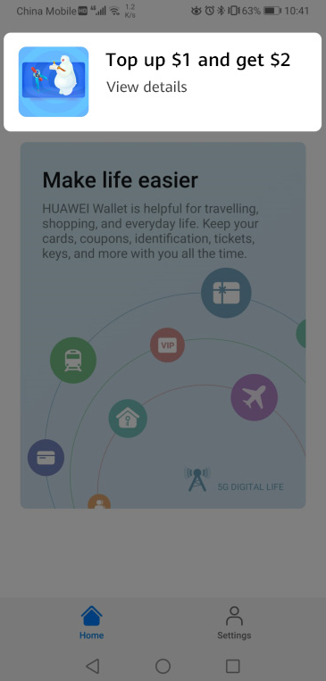
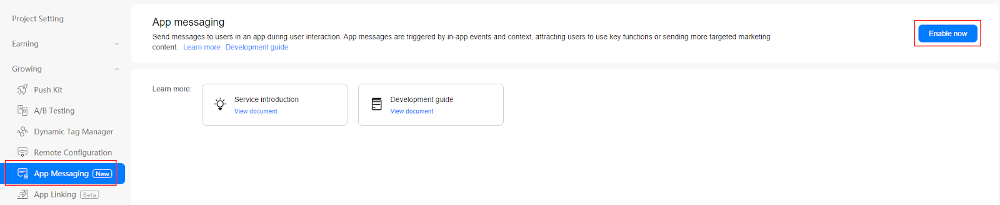
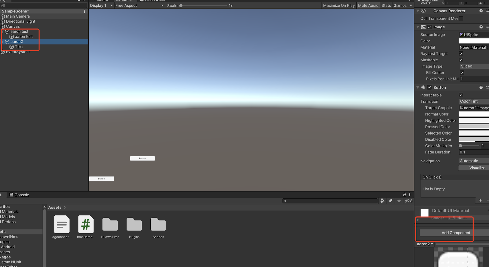

# App Messaging (AGC)

## Service Introduction

You can use [App Messaging](https://developer.huawei.com/consumer/en/doc/development/AppGallery-connect-Guides/agc-appmessage-introduction) of AppGallery Connect to send relevant messages to target users actively using your app to encourage them to use key app functions. For example, you can send in-app messages to encourage users to subscribe to certain products, provide tips on passing a game level, or recommend activities of a restaurant.

App Messaging even allows you to customize how your messages look and the way they will be sent, and define events for triggering message sending to your users at the right moment.

### Message Types

Currently, App Messaging supports pop-up, image, and banner messages, which have different content and layouts. You can customize the message content and layout as needed.

* A pop-up message can have a title and body and contain an image and up to two buttons. It is a better choice for you to send rich information to your users.

    

* A banner message is displayed on the top of the screen, containing a thumbnail and the message title and body. A user can tap the banner to access the specified page.

    
    
* An image message only contains an image. For example, an image message can be a poster well designed to promote an activity. A user can tap the image to access the activity details page.

    

### Working Principles

After you integrate the App Messaging SDK into your app, the SDK automatically synchronizes in-app messages published on the AppGallery Connect server and determines whether to display a specific in-app message based on the message's validity period and trigger. A default layout is provided to display an in-app message. You can also call relevant APIs of the App Messaging SDK to customize the message layout for personalized experience.
A user can tap an in-app message to access the destination specified during message creation. The App Messaging SDK reports the message display result to AppGallery Connect. You can view the statistics on message displays, taps, and conversion data in AppGallery Connect.

### Version Update Description

> [https://developer.huawei.com/consumer/en/doc/development/AppGallery-connect-Guides/agc-appmessage-sdkchangenotes](https://developer.huawei.com/consumer/en/doc/development/AppGallery-connect-Guides/agc-appmessage-sdkchangenotes)

## Setting up in Huawei AppGallery Connect

### Integrating the AppGallery Connect SDK

You must integrate the AppGallery Connect SDK and plug-in before integrating the App Messaging SDK into your app. For details, please refer to [AppGallery Connect Quick Start](https://developer.huawei.com/consumer/en/doc/development/AppGallery-connect-Guides/agc-get-started).

### Enabling the App Messaging Service

1. Sign in to [AppGallery Connect](https://developer.huawei.com/consumer/en/service/josp/agc/index.html) and select My projects.

2. Find your project from the project list and click the app for which you need to enable App Messaging on the project card.

    

3. Go to **Growing > App Messaging**. On the App Messaging page that is displayed, click Enable now.

    **Note:**

    You may need to set the data storage location when enabling App Messaging. Then, the setting in `agconnect-services.json` will be automatically updated accordingly. If you have set the data storage location when enabling App Messaging, you need to download the agconnect-services.json file again and integrate it into your project after the service is enabled. For details, please refer to [Adding the Configuration File](https://developer.huawei.com/consumer/en/doc/development/AppGallery-connect-Guides/agc-get-started#addjson).

    

4. Config the json file

    **Note:**
    Copy the `agconnect-services.json` file to the `Assets/Plugins/Android` directory.
    
    

## Setting up in Unity

### Setting up unity Custom Android manifest and gradle

1. Switch platform to android in player setting.

2. Enable custom manifest and gradle in player setting. The following is in unity **2019.4**.

    

    The android struct is updated after unity **2019.3**. Manifest and Gradle are separated into multiple files (Main, Launcher & Base). 

3. Set the package name

    Go to **Edit -> Project Settings -> Player ->  Android(icon) -> other settings -> Identification -> Package Name**.

    The package name is the package name of app in huawei project.
    
    

### Integrating HUAWEI Analytics Kit

To collect statistics on App Messaging events, you need to use HUAWEI Analytics Kit. Please refer to the [https://docs.unity.cn/cn/Packages-cn/com.unity.hms@1.2/manual/](https://docs.unity.cn/cn/Packages-cn/com.unity.hms@1.2/manual/)

### Integrating AppMessage Kit

1. Enable and add configurations to project gradle

   Go to **Edit -> Project Settings -> Player -> Android(icon) -> Publishing Settings -> Build**.

   Enable **Custom Base Gradle Template** and add the configuration to the Maven repository. The path is `Assets/Plugins/Android/baseProjectTemplate.gradle`

   If unity version is **2019.2 or before**, you should add implement and other configuration on `MainGradleTemplate.gradle`. And the repository is:
   
   ```
       allprojects {
           buildscript {
               repositories {
                   maven { url 'https://developer.huawei.com/repo/' }
               }
           }
           repositories {
   
               maven { url 'https://developer.huawei.com/repo/' }
           }
       }
   ```
   
2. Enable and add configurations to app gradle

   Go to **Edit -> Project Settings -> Player -> Android(icon) -> Publishing Settings -> Build**

   Enable **Custom Launcher Gradle Template** and add build dependencies in `launcherTemplate.gradle`. The path is `Assets/Plugins/Android/launcherTemplate.gradle`.

   If unity version is 2019.2 or before, you should add implement and other configuration on `MainGradleTemplate.gradle`.

   To add AppMessage Kit.

   ```
       dependencies {
   
       implementation "com.huawei.agconnect:agconnect-appmessaging:1.4.1.300"
   
   }
   ```

3. Enable and add configurations to base gradle

   Go to **Edit -> Project Settings -> Player -> Android(icon) -> Publishing Settings -> Build**

   Enable **Custom Main Gradle Template** and add build dependencies in `mainTemplate.gradle`. The path is `Assets/Plugins/Android/mainTemplate.gradle`.

   If the unity version is **2019.2 or before**, you should add implement and other configuration on `MainGradleTemplate.gradle`.

   To add AppMesasge Kit.
   
   ```
       dependencies {
       
       implementation "com.huawei.agconnect:agconnect-appmessaging:1.4.1.300"
   
   }
   ```

4. Custom AndroidManifest and add custom `Activity.java`

   Update AndroidManifest for setting app messaging in `Assets/Plugins/Android/AndroidManifest.xml`

   ```
   <?xml version="1.0" encoding="utf-8"?>
   <!-- GENERATED BY UNITY. REMOVE THIS COMMENT TO PREVENT OVERWRITING WHEN EXPORTING AGAIN-->
   <manifest
      xmlns:android="http://schemas.android.com/apk/res/android"
      package="com.unity3d.player"
      xmlns:tools="http://schemas.android.com/tools">
   ...
      <application>
          <activity android:name="com.hms.hms_activity.HmsActivity"
                    android:theme="@style/UnityThemeSelector">
   …
          </activity>
   ...
      </application>
   </manifest>
   ```

   Add corresponding `Activity.java` in `Assets/Plugins/Android/HmsActivity.java`

   ```
   package com.hms.hms_activity;
   
   import android.os.Bundle;
   
   import com.huawei.hms.analytics.HiAnalytics;
   import com.huawei.hms.analytics.HiAnalyticsTools;
   import com.unity3d.player.UnityPlayerActivity;
   
   import com.huawei.agconnect.appmessaging.AGConnectAppMessaging;
   import com.huawei.hms.aaid.HmsInstanceId;
   
   public class HmsActivity extends UnityPlayerActivity {
     private AGConnectAppMessaging appMessaging;
   
      @Override
      protected void onCreate(Bundle savedInstanceState) {
          super.onCreate(savedInstanceState);
          HiAnalyticsTools.enableLog();
          HiAnalytics.getInstance(this);
          appMessaging = AGConnectAppMessaging.getInstance();
          appMessaging.setFetchMessageEnable(true);
          appMessaging.setDisplayEnable(true);
          appMessaging.setForceFetch();
      }
   }
   ```

## Developing with the SDK

### Create App Message
[https://developer.huawei.com/consumer/en/doc/development/AppGallery-connect-Guides/agc-appmessage-create](https://developer.huawei.com/consumer/en/doc/development/AppGallery-connect-Guides/agc-appmessage-create)


### Enable and disable the corresponding app messaging
After the step “Custom AndroidManifest and add custom Activity.java”, if you add app message in agc, it will be displayed when the application is opened. 

### Example: force fetch app message

Setting up a scene

1. Open a scene:

   

2.  Right click and select UI and then you can choose a button:

   

3. Add component to the button and develop a script:

   
   

4. Edit the script:

   

   Double click the script file,and u will open it in VS code

   

5. Define the code

   ```
   using HuaweiService;
   ...
   public class ... 
   {
   ...
   public void ForceFetch()
   {
       var appMessaging = AGConnectAppMessaging.getInstance();
       appMessaging.setForceFetch();
   }
   ...
   }
   ```

   Create a function above

6. Bind buttons and interfaces in scripts

   

   - Step1. Click “+” to add a function

   - Step2. Choose the corresponding scene which has the interface you want to use

   - Step3. Click the “No Function” select to choose the script and then choose the corresponding function

      

### Demo Project

If there remains anything unclear, you can check the demo on github. The corresponding appMessaging usage is [AppMessageTest.cs ](https://github.com/Unity-Technologies/HuaweiServiceSample/blob/8a72eb9b34a2d6f1cfe3a8d3340dbf2c6ae1eb4b/Assets/HuaweiServiceDemo/Scripts/test/appmessage/AppMessageTest.cs ) 


