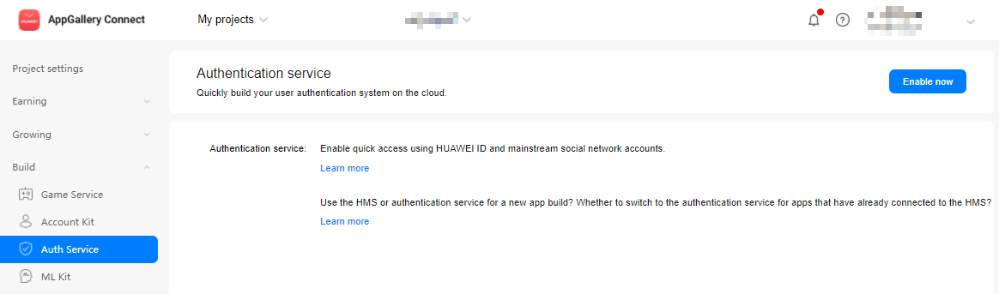
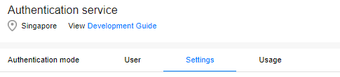
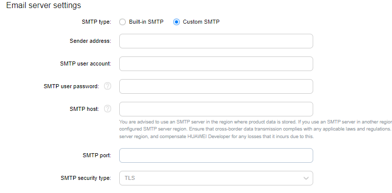

# Auth Service (AGC)

## Service Introduction
AppGallery Connect provides a cloud-based [Auth Service](https://developer.huawei.com/consumer/en/doc/development/AppGallery-connect-Guides/agc-auth-introduction-0000001053732605) and SDKs to help you quickly build a secure and reliable user authentication system for your apps to verify user identity.

The AppGallery Connect auth service supports multiple authentication methods and is seamlessly integrated with other Serverless services to help you secure user data based on simple rules that you have defined.

### Functions
By using the AppGallery Auth Service SDK, you can integrate one or more of the following authentication methods into your app for achieving easy and efficient user registration and sign-in.

- Self-owned account: Your self-owned account is used to support the access of your existing authentication system so that your existing users can access other serverless services in a secure manner.

- Anonymous account: Anonymous accounts can be used to access your apps as visitors. The auth service can assign user IDs to your app visitors so that they can access other serverless services in a secure manner. A visitor can be registered as a formal user and retain the original user ID to ensure service continuity.

- Third-party accounts: AppGallery Connect allows user identity to be verified by using third-party authentication services. The AppGallery Auth Service SDK supports the following accounts for user identity verification:

    - HUAWEI account
    - HUAWEI Game Service account
    - Phone number
    - Email account
    - WeChat account
    - Weibo account
    - QQ account

  The following accounts, are supported only at sites outside China. You can use these authentication methods when the data storage location you select resides in Germany, Singapore, or Russia. The Google account and Google Play Game account authentication methods are supported only on devices installing Google Mobile Services (GMS).

    - Google account
    - Google Play Game account
    - Facebook account
    - Twitter account

### Service Process

- Obtain the authentication credential

    The authentication method determines how you can obtain the authentication credential.
    
    - For a third-party account, the authentication credential is the OAuth token issued by the third-party auth service.

    - For an anonymous account, the authentication credential is the unified identifier generated by the on-device SDK for the app installation instance.

    - For a self-created account, the authentication credential is the token generated by the existing authentication system through the Server SDK.

- Report the authentication credential
  
   The app reports the authentication credential to the auth service through the AppGallery Auth Service SDK.

- Verify the authentication credential
  
    The auth service verifies authentication credential in the cloud.

- Display the authentication result
  
    The Auth service sends the authentication results back to the app. At this point the app can access and maintain the user's basic profile information (nicknames, avatars), as well as access and manipulate data protected by security rules in other Serverless services.

## Setting up in Huawei AppGallery Connect

### Prepare the environment
You must create AppGallery Connect project and add App to project and set Data storage location. For details, please refer to [AppGallery Connect Quick Start.](https://developer.huawei.com/consumer/en/doc/development/AppGallery-connect-Guides/agc-get-started)

### Enabling the Auth Service
1. Sign in to [AppGallery Connect](https://developer.huawei.com/consumer/en/service/josp/agc/index.html) and click **My projects**.

2. Find your project for which you need to enable Auth Service from the project list.

3. Go to **Build > Auth Service**. If it is the first time that you use Auth Service, click **Enable now** in the upper right corner.

   

4. Click **Enable** in the row of each authentication mode to be enabled.

   **NOTE**: For details about the authentication modes supported by Android, please refer to Key Functions.

   

   When you enable multiple authentication modes, you need to configure information required by your app in the dialog box that is displayed. The following table lists the authentication modes and how to obtain related configurations.
   
    

   **NOTICE:**<br>Accounts marked with asterisks (*) are supported only at sites outside the Chinese mainland. You can use these authentication modes when the data storage location that you selected resides in Germany, Singapore, or Russia.
   
   | Authentication Mode       | Information Required            | How to Obtain                                                |
   | ------------------------- | ------------------------------- | ------------------------------------------------------------ |
   | HUAWEI ID                 | App ID and app secret           | [Querying App Information](https://developer.huawei.com/consumer/en/doc/development/HMS-Guides/appgallery_queryappinfo) |
   | HUAWEI GameCenter account | Game public key and private key | [Querying Game Information](https://developer.huawei.com/consumer/en/doc/development/HMS-Guides/appgallery_querygameinfo) |
   | WeChat                    | App ID and app secret           | [WeChat Integration Guide](https://open.weixin.qq.com/)      |
   | QQ                        | App ID and app key              | [QQ Integration Guide](https://connect.qq.com/)              |
   | Weibo                     | App key and app secret          | [Weibo Integration Guide](https://open.weibo.com/index.php)  |
   | Facebook*                 | App ID and app key              | [Facebook Integration Guide](https://developers.facebook.com/docs/facebook-login/android) |
   | Twitter*                  | Client ID and client secret     | [Twitter Integration Guide](https://developer.twitter.com/en/docs) |
   | Google Play Games*        | Client ID and client secret     | [Google Play Games Integration Guide](https://play.google.com/apps/publish) |
   | Self-owned account        | Signature public key            | [Obtaining JWTs](https://developer.huawei.com/consumer/en/doc/development/AppGallery-connect-Guides/agc-auth-server-obtainjwt-0000001054048961) |

5. (Optional) If email verification code authentication is enabled, configure email server information on the Settings tab page.

   
   You can select Built-in SMTP or Custom SMTP.

   - When Built-in SMTP is selected, the sender name is the project name, and the sender address is product_id@mail.agconnect.link.

   - If you select Custom SMTP, configure the following information:

      - Sender address: email address of the sender.
   
      - SMTP user account and SMTP user password: user name and password for signing in to the email server.
   
      - SMTP host: name of the email sending server (SMTP server). For example, set this parameter for QQ accounts to smtp.exmail.qq.com.
      
      - SMTP port and SMTP security type: Set SMTP port to 465 and SMTP security type to TLS.
    

6. Config the json file
   
   **Note:**<br>Download `agconnect-services.json` from AppGallery Connect (project settings->app information->agconnect-services.json)

   Copy the `agconnect-services.json` file to the `Assets/Plugins/Android folder.`

   

## Setting up in Unity

### Setting up unity Custom Android manifest and gradle

1. Switch platform to Android in Player setting.

2. Enable custom manifest and gradle in Player setting. The following is in unity **2019.4**.

   

   The android struct is updated after unity **2019.3**. Manifest and Gradle are separated into multiple files (Main, Launcher & Base).  

3. Set the package name in **Edit -> Project Settings -> Player ->  Android(icon) -> other settings -> Identification -> Package Name**.

   The package name is the package name of app in huawei project.

   

### Integrating Auth Kit

1. Enable and add configurations to project gradle

   Go to **Edit -> Project Settings -> Player -> Android(icon) -> Publishing Settings -> Build**

   Enable **Custom Base Gradle Template** and add the configuration to the Maven repository. The path is `Assets/Plugins/Android/baseProjectTemplate.gradle`.

   If your unity version is **2019.2 or before**, you should add implement and other configuration on `MainGradleTemplate.gradle`. 

   - In allprojects > repositories, configure the Maven repository address for the AppGallery Connect SDK.
   
      ```
          allprojects {
              buildscript {
                  repositories {
      ...
                      maven { url 'https://developer.huawei.com/repo/' }
      ...
                  }
      ...
              }
      ...
              repositories {
      ...
                  maven { url 'https://developer.huawei.com/repo/' }
      ...
              }
          }
      
      ```
   
   - In buildscript > dependencies, configure the AppGallery Connect plug-in address.
   
      ```
      buildscript {  
                 dependencies { 
      ... 
                  classpath 'com.huawei.agconnect:agcp:1.4.2.301'
      ...
                 }  
      }
      
      ```

2. Enable launcher gradle and add configurations to gradle

   Go to **Edit -> Project Settings -> Player -> Android(icon) -> Publishing Settings -> Build**

   Enable **Custom Launcher Gradle Template** and add build dependencies in `launcherTemplate.gradle`. The path is `Assets/Plugins/Android/launcherTmeplate.gradle`.

   If your unity version is **2019.2 or before**, you should add implement and other configuration on `MainGradleTemplate.gradle`.
   
   apply plugin: ``'com.huawei.agconnect'`` in the file header:
   
   ```
    ...
   apply plugin: 'com.huawei.agconnect'
   ```

3. Enable and add configurations to MainTemplate gradle

   Go to **Edit -> Project Settings -> Player -> Android(icon) -> Publishing Settings -> Build**

   Enable **Custom Main Gradle Template** and add build dependencies in `mainTemplate.gradle`. The path is `Assets/Plugins/Android/mainTemplate.gradle`.

   If the unity version is **2019.2 or before**, you should add implement and other configuration on `MainGradleTemplate.gradle`.

   - apply plugin: 'com.huawei.agconnect' in the file header:

     ```
     ...
     apply plugin: 'com.huawei.agconnect'
     
     **APPLY_PLUGINS**
     ```

   - Configure build dependencies.
   
     ```
      dependencies { 
            ...     
        implementation 'com.huawei.agconnect:agconnect-credential:1.6.1.300'
        implementation 'com.huawei.agconnect:agconnect-auth:1.6.1.300'
     ...    
     }
     ```

4. Enable gradle properties

   Go to **Edit -> Project Settings -> Player -> Android(icon) -> Publishing Settings -> Build**

   Enable **Custom Gradle Properties Template** and add build dependencies in gradleTemplate. The path is `Assets/Plugins/Android/gradleTemplate.gradle`.

   Add

   ```
   android.useAndroidX=true
   android.enableJetifier=true
   ```

## Developing with the SDK

### Integrating Third Party Login

#### Extending the UnityActivity Java Code

If you use third party Login, you should follow the manual [Extending the UnityActivity Java Code](https://docs.unity3d.com/Manual/AndroidUnityPlayerActivity.html), write a java class extends UnityPlayerActivity.

1. import com.unity3d.player.UnityPlayerActivity,android.content.Intent, android.os.Bundle, and our LoginManager service

   ```
   ...
   import android.content.Intent;
   import com.hw.unity.Agc.Auth.ThirdPartyLogin.LoginManager;
   import com.unity3d.player.UnityPlayerActivity;
   import android.os.Bundle;
   ...    
   ```


2. Add our Login Service function `LoginManager.getInstance().initialize(this)` in onCreate function and add function `LoginManager.getInstance().onActivityResult(requestCode, resultCode, data)` in onActivityResult function 

   ```
    protected void onCreate( Bundle savedInstanceState) {
     super.onCreate(savedInstanceState);
      LoginManager.getInstance().initialize(this);
   ...
   }
   
   @Override
   protected void onActivityResult(int requestCode, int resultCode, Intent data) {
     ...
      LoginManager.getInstance().onActivityResult(requestCode, resultCode, data);
   ...
   }
   ```

   The whole class for example

   ```
      package xxxxx;
         
      import android.content.Intent;
      import android.os.Bundle;
      import com.hw.unity.Agc.Auth.ThirdPartyLogin.LoginManager;
      import com.unity3d.player.UnityPlayerActivity;
      
      public class xxxxxx extends UnityPlayerActivity {
      
         @Override
         protected void onCreate(Bundle savedInstanceState) {
             super.onCreate(savedInstanceState);
             LoginManager.getInstance().initialize(this);
             ...
         }
      
         @Override
         protected void onActivityResult(int requestCode, int resultCode, Intent data) 
      {
            ...
             LoginManager.getInstance().onActivityResult(requestCode, resultCode, data);
            ...
         }
      }
   ```

3. Put this java file to `Assets/Plugins/Android`

#### Modify the `AndroidManifest.xml`

1. First you need to enable `AndroidManifest.xml`

   Go to **Edit -> Project Settings -> Player -> Android(icon) -> Publishing Settings -> Build**, enable **Custom Main Manifest** and the file is in `Assets/Plugins/Android/AndroidManifest.xml`

2. Modify the Main Activity name, you should modify the com.unity3d.player.UnityPlayerActivity to your Activity (the java file you created in [Extending the UnityActivity Java Code](https://docs.google.com/document/d/1L3f1JERKpzp7YlBZs-KPbUd6ahN4nOeqP93cmkDY7DU/edit#heading=h.dc4k4er7sw6b))  

   ```
   <activity android:name="Your Activity name(include package name)"
            android:theme="@style/UnityThemeSelector">
      <intent-filter>
          <action android:name="android.intent.action.MAIN" />
          <category android:name="android.intent.category.LAUNCHER" />
      </intent-filter>
      <meta-data android:name="unityplayer.UnityActivity" android:value="true" />
   </activity>
   ```

3. Add the INTERNET User permission

   ```
   <uses-permission android:name="android.permission.INTERNET"/>
   <application>
     ...
   </application>
   ```

#### Third Party Integrating

If you want to enable third Party Login, firstly you need to [AppGallery Connect](https://developer.huawei.com/consumer/en/service/josp/agc/index.html), enable the Provider and enter the APP ID and APP Secret


- **HUAWEI ID** 

  Refer to the [Configuring App Information in AppGallery Connect, Integrating the HMS Core SDK](https://developer.huawei.com/consumer/en/doc/development/HMSCore-Guides/config-agc-0000001050196065),  Configure build dependencies in `MainTemplate.gradle`, about {version}, you can look up the doc [Configuring App Information in AppGallery Connect](https://developer.huawei.com/consumer/en/doc/development/HMSCore-Guides/config-agc-0000001050196065) for detail.

  ```
     dependencies { 
           ...     
        implementation 'com.huawei.hms:base:{version}'
        implementation 'com.huawei.hms:hwid:{version}'     
      ...    
      }
  ```

- **HUAWEI GameCentre Account**

  Refer to the [Configuring App Information in AppGallery Connect,Integrating the HMS Core SDK](https://developer.huawei.com/consumer/en/doc/development/HMSCore-Guides/config-agc-0000001050166285)  Configure build dependencies in `MainTemplate.gradle`. you can look up the doc [Configuring App Information in AppGallery Connect](https://developer.huawei.com/consumer/en/doc/development/HMSCore-Guides/config-agc-0000001050196065) for detail.

- **Wechat**

  Refer to the [Wechat Document](https://developers.weixin.qq.com/doc/oplatform/Mobile_App/Resource_Center_Homepage.html?action=dir_list&t=resource%2Fres_list)
  
  1) Configure build dependencies in `MainTemplate.gradle`
  
  ```
   dependencies { 
        ...     
    api 'com.tencent.mm.opensdk:wechat-sdk-android-without-mta:+'
  ...    
  }
  ```
  
  Add following dependencies
  
  ```
    dependencies { 
        ...     
    implementation 'com.squareup.retrofit2:retrofit:2.9.0'
  implementation 'com.squareup.retrofit2:converter-gson:2.1.0'
  ...    
  }
  ```
  
  2) Create a **Resources** Folder in Asset Folder (Folder name must be **Resources**), and Go to **HuaweiService->Auth->WxApi->WXEntryActivity.txt**  copy this file to **Resources** folder. It will be automatically packaged to your Android project.
  
  3) Add `WXEntryActivity` in `AndroidManifest.xml`, and the package name is same as  **Edit -> Project Settings -> Player ->  Android(icon) -> other settings -> Identification -> Package Name**
  
  ```
  <activity
         android:name="Your package name.wxapi.WXEntryActivity"
         android:label="@string/app_name"
         android:theme="@android:style/Theme.Translucent.NoTitleBar"
         android:exported="true"
         android:launchMode="singleTask">
  </activity>
  ```

- **Facebook**
**Important Note:** Facebook updated the webview policy
* Facebook Login will no longer support Android embedded browsers (WebViews) for authenticating users. Please refer to the following documents for configuration!
* https://developers.facebook.com/docs/facebook-login/android/deprecating-webviews

  1) Refer to the [Facebook Doc](https://developers.facebook.com/docs/facebook-login/android), Configure build dependencies in `MainTemplate.gradle`.

  ```
    dependencies { 
        ...     
      implementation 'com.facebook.android:facebook-android-sdk:4.20.0'
  ...    
  }
  ```

  2) Add `meta-data` in `AndroidManifest.xml`, replace "Your Facebook APP id" and "Your_Facebook_Login_protocol_scheme" with your own app_id and protocol scheme.

  ```
  <meta-data android:name="com.facebook.sdk.ApplicationId" android:value="Your Facebook APP id"/> 
  <activity android:name="com.facebook.FacebookActivity" android:configChanges= "keyboard|keyboardHidden|screenLayout|screenSize|orientation" android:label="@string/app_name" /> 
  <activity android:name="com.facebook.CustomTabActivity" android:exported="true"> <intent-filter> <action android:name="android.intent.action.VIEW" /> <category android:name="android.intent.category.DEFAULT" /> <category android:name="android.intent.category.BROWSABLE" /> <data android:scheme="Your_Facebook_Login_protocol_scheme" /> </intent-filter> 
  </activity>
  ```

- **Twitter**

  Refer to the [Twitter Doc](https://developer.twitter.com/en/docs), and Configure build dependencies in `MainTemplate.gradle`

  ```
    dependencies { 
        ...     
      implementation 'com.twitter.sdk.android:twitter-core:3.3.0'
  ...    
  }
  ```

- **Weibo**

  Refer to the [Weibo doc](https://open.weibo.com/index.php?sudaref=developer.huawei.com&display=0&retcode=6102),  and you need to download the SDK and put it in `Assets/Plugins/Android`.  Add the following to the `baseProjectTmeplate.gradle`.

  ```
   buildscript {
     repositories {**ARTIFACTORYREPOSITORY**
         google()
         jcenter()
        ...
         maven { url "https://dl.bintray.com/thelasterstar/maven/" }
     }
  ```

- **QQ**

  Refer to the [QQ doc](https://wiki.connect.qq.com/qq登录) , and you should download the SDK and put this SDK in `Assets/Plugins/Android`. Add following Activity in in `AndroidManifest.xml`

  ```
  <uses-permission android:name="android.permission.ACCESS_NETWORK_STATE" />
  <application>
  ...
   <activity
         android:name="com.tencent.tauth.AuthActivity"
         android:noHistory="true"
         android:launchMode="singleTask" >
      <intent-filter>
          <action android:name="android.intent.action.VIEW" />
          <category android:name="android.intent.category.DEFAULT" />
          <category android:name="android.intent.category.BROWSABLE" />
          <data android:scheme="Your tencent APP ID" />
      </intent-filter>
   </activity>
  <activity
        android:name="com.tencent.connect.common.AssistActivity"
     	 android:configChanges="orientation|keyboardHidden"
        android:screenOrientation="behind" 
  android:theme="@android:style/Theme.Translucent.NoTitleBar" />
  ...
  <application>
  ```

- **Google**

  Refer to the [Google documentation](https://developers.google.com/identity/sign-in/android/start-integrating) , and add configure build dependencies in `MainTemplate.gradle`

  ```
  dependencies { 
        ...     
   implementation 'com.google.android.gms:play-services-auth:19.0.0'
  ...    
  }
  ```

- **Google Play game**

  1) Refer to the doc [Google Play game](https://developers.google.com/games/services/android/quickstart),  and add configure build dependencies in `MainTemplate.gradle`

  ```
  dependencies { 
        ...     
   implementation 'com.google.android.gms:play-services-games:17.0.0'
  ...    
  }
  ```

  2) Add following Activity in in `AndroidManifest.xml`

  ```
  <meta-data
         tools:replace="android:value"
         android:name="com.google.android.gms.games.APP_ID"
         android:value="@string/google_game_app_id" />
  <meta-data
         tools:replace="android:value"
         android:name="com.google.android.gms.version"
         android:value="@integer/google_play_services_version" />
  ```

  3) Modify the Google game app id to your own in `HuaweiService/Android/res/Auth/strings.xml`

  ```
  <?xml version="1.0" encoding="utf-8"?>
  <resources>
      <string name="google_game_app_id">Replace me</string>
      <string name="facebook_app_id">Replace me</string>
      <string name="fb_login_protocol_scheme">Replace me</string>
      <string name="tecent_app_id">Replace me</string>
  
  </resources>
  ```

  **Note:**<br>For Google game login, you must modify the `google_game_app_id` in `strings.xml`, don’t type your game app id in `AndroidManifest.xml` directly, which will cause error.


#### Sign Your Android APP
go to **Edit->project settings->player->Android(icon)->Publishing Settings**, custom your own keystore, and make sure your android app keystore is the same with the thirdParty platform sign.


### How to get Access Token Info from Third Party
**NOTE:**<br>You can directly use `HuaweiOnsuccessListener` and `HuaweiOnFailureListener` class or write new class inherit `OnSuccessListener` or `OnFailureListener` when need use callback function.

#### 1. HUAWEI Account

1. start Login with HUAWEI Account, use `LoginManager.getInstance().startHWID(OnSuccessListener sucessCallback,OnFailureListener failCallback)`  to get the Access Token Json

2. Then use `HWIDGetBack obj=JsonAuthorizeData<HWIDGetBack>.FromJson()` to parse Json to get the Token

   ```
   LoginManager.getInstance().startHWID(new HuaweiOnsuccessListener<string>((Token) =>{
   HWIDGetBack obj = JsonAuthorizeData<HWIDGetBack>.FromJson(Token.ToString());
   	AGConnectAuthCredential credential =HwIdAuthProvider.credentialWithToken(obj.Token);
   	AGConnectAuth.getInstance().signIn(credential)
              .addOnSuccessListener(new HuaweiOnsuccessListener<SignInResult>((signresult) =>
              {
                  ...
                     
              }))
              .addOnFailureListener(new HuaweiOnFailureListener((exception) =>
              {
                  ...
                     
              }));
      }), new HuaweiOnFailureListener((exception)=>
      {
          ...
   
      }));
   ```

#### 2. HUAWEI GameCentre Account

1. start Login with HUAWEI Account, use `LoginManager.getInstance().startHWGame(OnSuccessListener sucessCallback,OnFailureListener failCallback)` to get the Access Token Json

2. and then use `HWGameGetBack player=JsonAuthorizeData<HWGameGetBack>.FromJson()` to parse Json to get the Player info.

   ```
   LoginManager.getInstance().startHWGame(new HuaweiOnsuccessListener<string>((Token) =>{
   
      HWGameGetBack player=JsonAuthorizeData<HWGameGetBack>.FromJson(Token
      );
      AGConnectAuthCredential credential = new HWGameAuthProvider.Builder()
          .setPlayerSign(player.PlayerSign)
          .setPlayerId(player.PlayerId)
          .setDisplayName(player.DisplayName)
          .setImageUrl(player.ImageUrl)
          .setPlayerLevel(player.PlayerLevel)
          .setSignTs(player.SignTs)
          .build();
   
      AGConnectAuth.getInstance().signIn(credential)
          .addOnSuccessListener(new HuaweiOnsuccessListener<SignInResult>((signresult) =>
          {
            ...
          })).addOnFailureListener(new HuaweiOnFailureListener((exception) =>
          {
            ...
          }));
   }), new HuaweiOnFailureListener((exception)=>
   {
         ...
   }));
   ```

#### 3. Wechat Account
1. start Login with Wechat, use LoginManager.getInstance().startWechatLogin(string APP_ID,string APP_SECRET,OnSuccessListener successCallback,OnFailureListener failCallback) and then to get the Token and openID Json,

2. use `WechatGetBack obj= JsonAuthorizeData<WechatGetBack>.FromJson()` to parse Json to get the Token and openID

   ```
   LoginManager.getInstance().startWechatLogin("Your APP ID", "Your APP Secret",
      new HuaweiOnsuccessListener<string>((Token) =>
      {
          WechatGetBack obj=JsonAuthorizeData<WechatGetBack>.FromJson(Token.ToString());
          AGConnectAuthCredential credential =
              WeixinAuthProvider.credentialWithToken(obj.Token, obj.OpenId);
          AGConnectAuth.getInstance().signIn(credential)
              .addOnSuccessListener(new HuaweiOnsuccessListener<SignInResult>((signresult) =>
              {
                  ...
              })).addOnFailureListener(new HuaweiOnFailureListener((exception) =>
              {
                  ...
              }));
      }), new HuaweiOnFailureListener((exception)=>
      {
          ...
      }));
   ```

#### 4. Facebook Account

1. Start login with Facebook Account, use LoginManager.getInstance().startFacebook(string APP_ID,OnSuccessListener successCallback,OnFailureListener failCallback) to get Access Token Json

2. Use FacebookGetBack obj=JsonAuthorizeData<FacebookGetBack>.FromJson(JsonObject.ToString()) to parse the token

   ```
   LoginManager.getInstance().startFacebook("Your App Id",new HuaweiOnsuccessListener<string>((JsonObject) =>
   {
      FacebookGetBack obj=JsonAuthorizeData<FacebookGetBack>.FromJson(JsonObject.ToString());
   
      AGConnectAuthCredential credential = FacebookAuthProvider.credentialWithToken(obj.Token);
   
      AGConnectAuth.getInstance().signIn(credential)
          .addOnSuccessListener(new HuaweiOnsuccessListener<SignInResult>((signresult) =>
          {
              ...
          })).addOnFailureListener(new HuaweiOnFailureListener((exception) =>
          {
              ...
          }));
   }), new HuaweiOnFailureListener((exception)=>
   {
      ...
   }));
   ```

#### 5. Twitter Account

1. Start login with Twitter Account,use LoginManager.getInstance().startTwitter(string App_id,string App_secret,OnSuccessListener successCallback,OnFailureListener failCallback)to get the Access Token Json, 

2. and then use TwitterGetBack obj=JsonAuthorizeData<TwitterGetBack>.FromJson(JsonObject.ToString()) to parse the Json

   ```
   LoginManager.getInstance().startTwitter("Your APP ID", "Your APP secret",
      new HuaweiOnsuccessListener<string>((Token) =>
      {
          TwitterGetBack obj=JsonAuthorizeData<TwitterGetBack>.FromJson(Token.ToString());
          AGConnectAuthCredential credential =
              TwitterAuthProvider.credentialWithToken(obj.Token, obj.Secret);
   
          AGConnectAuth.getInstance().signIn(credential)
              .addOnSuccessListener(new HuaweiOnsuccessListener<SignInResult>((signresult) =>
              {
                  ...
              })).addOnFailureListener(new HuaweiOnFailureListener((exception) =>
              {
                  ...
              }));
      }), new HuaweiOnFailureListener((exception)=>
      {
          ...
      }));
   ```

#### 6. Weibo Account
1. Start login with Weibo Account,use  LoginManager.getInstance().startWeibo(string APP_ID,OnSuccessListener successCallback,OnFailureListener failCallback) to get Token and Uid Json,

2. And use  WeiboGetBack obj=JsonAuthorizeData<WeiboGetBack>.FromJson(JsonObject.ToString()) to parse Json

   ```
   LoginManager.getInstance().startWeibo("Your APP ID",
      new HuaweiOnsuccessListener<string>((JsonObject) =>
      {
          WeiboGetBack obj=JsonAuthorizeData<WeiboGetBack>.FromJson(JsonObject.ToString());
   
          AGConnectAuthCredential credential =
              WeiboAuthProvider.credentialWithToken(obj.Token, obj.Uid);
   
          AGConnectAuth.getInstance().signIn(credential)
              .addOnSuccessListener(new HuaweiOnsuccessListener<SignInResult>((signresult) =>
              {
                  ...
              })).addOnFailureListener(new HuaweiOnFailureListener((exception) =>
              {
                  ...
              }));
      }), new HuaweiOnFailureListener((exception)=>
      {
          ...
      }));
   ```

#### 7. QQ Account

1. Start login with QQ Account,use  LoginManager.getInstance().startQQ(string app_id,OnSuccessListener successCallback,OnFailureListener failCallback) to get Token and OpenId Json

2. and use QQGetBack obj=JsonAuthorizeData<QQGetBack>.FromJson(Token.ToString()) to parse Json 

   ```
   LoginManager.getInstance().startQQ("Your APP ID",
      new HuaweiOnsuccessListener<string>((JsonObject) =>
      {
          QQGetBack obj=JsonAuthorizeData<QQGetBack>.FromJson(JsonObject.ToString());
          AGConnectAuthCredential credential =
              QQAuthProvider.credentialWithToken(obj.Token, obj.OpenId);
          AGConnectAuth.getInstance().signIn(credential)
              .addOnSuccessListener(new HuaweiOnsuccessListener<SignInResult>((signresult) =>
              {
                  ...
              })).addOnFailureListener(new HuaweiOnFailureListener((exception) =>
              {
                  ...
              }));
      }), new HuaweiOnFailureListener((exception)=>
      {
          ...       
      }));
   ```

#### 8. Google Account
1. Start login with Google Account,use  LoginManager.getInstance().startGoogle(string client_id,OnSuccessListener successCallback,OnFailureListener failCallback) to get Token Json

2. and use GoogleGetBack obj=JsonAuthorizeData<GoogleGetBack>.FromJson(string json) to parse Json

   ```
   LoginManager.getInstance().startGoogle("Your client id",
   new HuaweiOnsuccessListener<string>((JsonObject) =>
   {
      GoogleGetBack obj=JsonAuthorizeData<GoogleGetBack>.FromJson(JsonObject.ToString());
      AGConnectAuthCredential credential =
          GoogleAuthProvider.credentialWithToken(obj.Token);
      AGConnectAuth.getInstance().signIn(credential)
          .addOnSuccessListener(new HuaweiOnsuccessListener<SignInResult>((signresult) =>
          {
   
          })).addOnFailureListener(new HuaweiOnFailureListener((exception) =>
          {
   
          }));
   }), new HuaweiOnFailureListener((exception)=>
   {
         
   }));
   ```

#### 9. Google Play game Account

1. Start login with Google play game  Account,use  LoginManager.getInstance().startGooglePlay(string client_id,OnSuccessListener successCallback,OnFailureListener failCallback) to get Token Json

2. and use GooglePlayGetBack obj=JsonAuthorizeData<GooglePlayGetBack>.FromJson(string json) to parse Json 

   ```
   LoginManager.getInstance().startGooglePlay("Your client id",
   new HuaweiOnsuccessListener<string>((JsonObject) =>
   {
      GooglePlayGetBack obj=JsonAuthorizeData<GooglePlayGetBack>.FromJson(JsonObject.ToString());
      AGConnectAuthCredential credential =
          GoogleAuthProvider.credentialWithToken(obj.Token);
      AGConnectAuth.getInstance().signIn(credential)
          .addOnSuccessListener(new HuaweiOnsuccessListener<SignInResult>((signresult) =>
          {
           ...
          })).addOnFailureListener(new HuaweiOnFailureListener((exception) =>
          {
           ...
          }));
   }), new HuaweiOnFailureListener((exception)=>
   {
         
   }));
   ```

#### 10. Link
1. Firstly get Token Json, for example link Google account(linking with other third party is same as following)

   use `LoginManager.getInstance().startGoogle(string client_id,OnSuccessListener successCallback,OnFailureListener failCallback)` to get Token Json

2. Parse the Json, for example Google account(Others are the same way), use 

   `GoogleGetBack obj=JsonAuthorizeData<GoogleGetBack>.FromJson(string json)`

3. Get credential, for example Google account(Other are the same way), use

   `AGConnectAuthCredential credential = GoogleAuthProvider.credentialWithToken(obj.Token);`

4. use link function, for example Google account

   ```
   LoginManager.getInstance().startGooglePlay("Your client id",
   new HuaweiOnsuccessListener<string>((JsonObject) =>
   {
      GooglePlayGetBack obj=JsonAuthorizeData<GooglePlayGetBack>.FromJson(JsonObject.ToString());
      AGConnectAuthCredential credential =
          GoogleAuthProvider.credentialWithToken(obj.Token);
      AGConnectAuth.getInstance().getCurrentUser().link(credential)
          .addOnSuccessListener(new HuaweiOnsuccessListener<SignInResult>((signresult) =>
          {
           ...
           AGConnectUser user = signInResult.getUser();
          ...
   
          })).addOnFailureListener(new HuaweiOnFailureListener((exception) =>
          {
           ...
               
          }));
   }), new HuaweiOnFailureListener((exception)=>
   {
    ...     
   }));
   ```

### Demo Project

How to use this demo project?

**Note:** Auth demo code is in `HuaweiServiceDemo->HuaweiAuthDemo`

#### 1. Import TMP

If Use AgcUnityAuth.unity demo，click **Import TMP Essentials**.


#### 2. Add agconnect-services.json 
Download `agconnect-services.json` from [AppGallery Connect](https://developer.huawei.com/consumer/en/service/josp/agc/index.html) and put it to the `Assets/Plugins/Android` folder(Replace the original).

#### 3. Replace with Your Own ID

modify `HuaweiService/Android/res/Auth/strings.xml`, Please Replace `google_game_app_id`, `facebook_app_id`, `fb_login_protocol_scheme`, `tecent_app_id` to your own id.
```
<?xml version="1.0" encoding="utf-8"?>
<resources>
    <string name="google_game_app_id">Replace me</string>
    <string name="facebook_app_id">Replace me</string>
    <string name="fb_login_protocol_scheme">Replace me</string>
    <string name="tecent_app_id">Replace me</string>

</resources>
```

#### 4. Modify your package name

Make sure your package name is same with in [AppGallery Connect](https://developer.huawei.com/consumer/en/service/josp/agc/index.html) and other ThirdParty developer platform（ **Edit -> Project Settings -> Player ->  Android(icon) -> other settings -> Identification -> Package Name**. The package name is the package name of app in huawei project.）


#### 5. Replace App id and App secret in demo
Go to `HuaweiAuthDemo->panel->DetailLogin.cs`, replace your Appid and AppSecret to Which ThirdParty Login you need. (replace the string “Replace me”)


#### 6. Modify Activity name in AndroidManifest.xml
If use Wechat Login, please modify the `AndroidManifest.xml` (`plugins/Android/AndroidManifest.xml`), replace "Your_Package_name" to your own Package name.


#### 7. Generate JWToken
If you use Self-owned Login in demo, firstly need to generate JWT token (if you use our generating tool, token valid time is 48 hours) or you can generate JWT by your own Auth server.
1. Refer the [Download Authentication Credential](https://developer.huawei.com/consumer/en/doc/development/AppGallery-connect-Guides/agc-get-started-server#initsdk), enable service in [AppGallery Connect](https://developer.huawei.com/consumer/en/service/josp/agc/index.html)
   And download agc-apiclient Credential file.

2. Our tool is in HuaweiServiceDemo->HuaweiAuthDemo->GenJWTokenGradle.zip,  uncompress it,  go to this directory run the command
   `./gradlew run --args='Your_Credential_file_path Need_Generate _RSA_Pair Your_user_id Your_display_name'`
   **Note:** the second argument (1 represent need generate new RSA key pair, 0 represent don’t need generate new RSA key pair)
   **For example:**  `./gradlew run --args='/Users/XXX/Desktop/agc-apiclient-507787480892715392-6901174904591909948.json 1 123321 zzz'`

3. Copy the public key to your [AppGallery Connect](https://developer.huawei.com/consumer/en/service/josp/agc/index.html), and go to `HuaweiServiceDemo->HuaweiAuthDemo->panel->DetailLogin.cs`, copy the JWT token to startSelf_own token.
   

#### 8. Sign Your Android APP
go to **Edit->project settings->player->Android(icon)->Publishing Settings**, custom your own keystore, and make sure your android app keystore is the same with the thirdParty platform sign.


