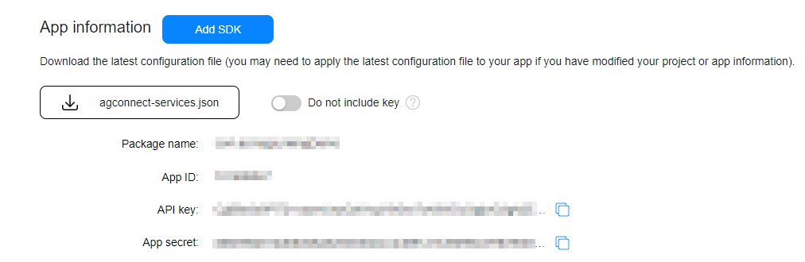
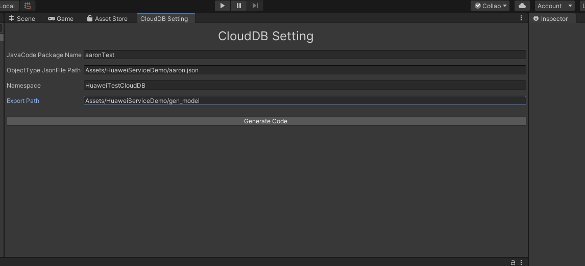
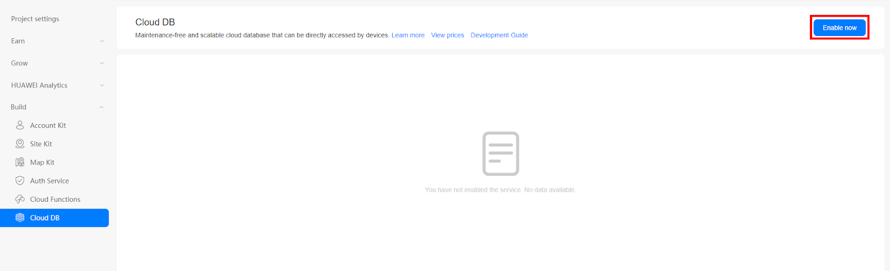
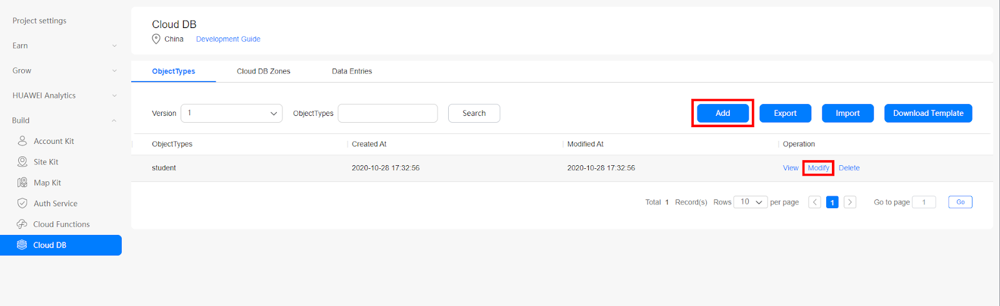
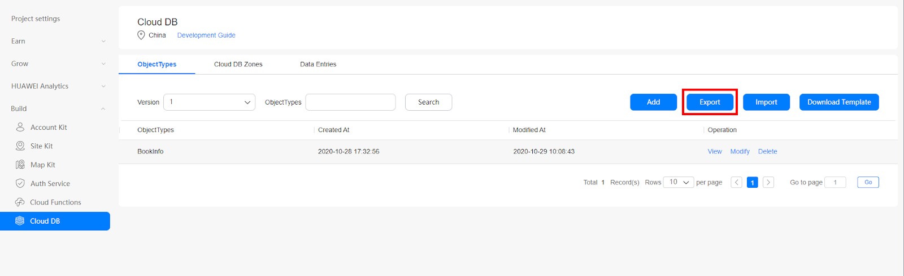
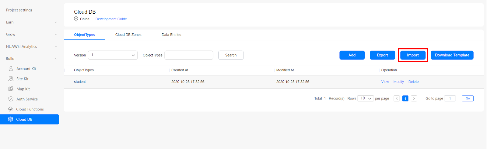

# CloudDB

## Service Introduction
In the traditional mobile application development, developers have to build each service from the ground-up, leading to heavy development workload and high technical requirements. In addition to writing application logic, developers need to perform data management, device-cloud data synchronization, and server deployment and maintenance.

[Cloud DB](https://developer.huawei.com/consumer/en/doc/development/AppGallery-connect-Guides/agc-clouddb-introduction) is a device-cloud synergy database product that provides data synergy management capabilities between the device and cloud, unified data models, and various data management APIs. In addition to ensuring data availability, reliability, consistency, and security, CloudDB enables seamless data synchronization between the device and cloud, and supports offline application operations, helping developers quickly develop device-cloud and multi-device synergy applications. As a part of the AppGallery Connect solution, Cloud DB builds the Mobile Backend as a Service (MBaaS) capability for the AppGallery Connect platform. In this way, application developers can focus on application services, greatly improving the production efficiency.

### Apply for Test Qualification
The Cloud DB service is currently in beta testing. If you want to use this service, please download and fill in an [application form](https://communityfile-drcn.op.hicloud.com/FileServer/getFile/cmtyManage/011/111/111/0000000000011111111.20201030091810.06962989220424325009804976035185:50511103085702:2800:64FD098C479820A4BC92E57D8F71B71FB53A5816702A9C89A07D54FF5332B227.xlsx?needInitFileName=true), and send it to agconnect@huawei.com to submit the application.

Set your email title format as: **[Cloud DB]-[Company name]-[Developer account ID]-[App ID]**. For details about how to query the app ID, see Querying App Information. After receiving your application, Huawei operations personnel will reply to you within 1 to 3 working days.


### Charge
The Cloud DB service is currently in beta testing and free of charge. Huawei will send an email to you to announce related charging policies and fee rate one month in advance of formal charge. When you enable the Cloud DB zone service, the system provides the following free Cloud DB zone service quotas by default:
Service Type | <div style="width:100px">Quota</div> 
---|---
Storage capacity on the Cloud | 2GB
Maximum number of concurrent connections | 150
Maximum number of operations per second in the Cloud DB zone | 10
When using Cloud DB service, if the free resource quota cannot meet the developer's current application needs, please download the [application form](https://communityfile-drcn.op.hicloud.com/FileServer/getFile/cmtyManage/011/111/111/0000000000011111111.20201030091810.06962989220424325009804976035185:50511103085702:2800:64FD098C479820A4BC92E57D8F71B71FB53A5816702A9C89A07D54FF5332B227.xlsx?needInitFileName=true) and fill in the content, and then send it to the email address to submit the application. The email address and email header format are consistent with the [Apply for Test Qualification](https://docs.cocos.com/creator/manual/en/cocos-service/agc-clouddb.html#apply-for-test-qualification).

## Setting up in Huawei AppGallery Connect

### Getting Started

#### Applying for the Cloud DB Service

The Cloud DB service is still in beta state. Before using this service, [download](https://communityfile-drcn.op.hicloud.com/FileServer/getFile/cmtyManage/011/111/111/0000000000011111111.20201116171653.92706435491554464614976922105888:50511118004030:2800:3468843BA1E167EEE28DCB36DB9C6C14BED13D4F866F3EFFFCDFCBEFC9FDF01F.xlsx?needInitFileName=true) and fill in an application form, and send it as an attachment to agconnect@huawei.com.
Email title format: **[Cloud DB]-[Company name]-[Developer account ID]-[Project ID]**. For details about how to query the developer account ID and project ID, please refer to [Querying the Developer Account ID and Project ID](https://developer.huawei.com/consumer/en/doc/development/AppGallery-connect-Guides/agc-query-ID).

After receiving your application, Huawei operations personnel will reply to you within 1 to 3 working days.<br>

**Notice:**<br>
This email address is for receiving AppGallery Connect service enabling applications only. Please do not send other consultation emails to this address.<br>

**Overviews of Cloud DB**<br>
Cloud DB uses cache mode or local mode for synchronization and data is synchronized by Cloud DB zone. During application development, you can select a data synchronization mode for each Cloud DB zone based on application requirements. The cache mode and local mode can be used together or separately. The detailed information about the cache mode and local mode is as follows:<br>

- Cache mode<br>
In this mode, you can implement device-cloud data management and synchronize data between the device and cloud or among multiple devices. Application data is stored on the cloud, and data on the device is a subset of data on the cloud. If persistent cache is allowed, Cloud DB supports the automatic caching of query results on the device. When data is cached, the data that is not synchronized locally is not overwritten.
- Local mode<br>
In this mode, users can operate only the local data on the device, while device-cloud and multi-device data synchronization cannot be implemented.

The following figure shows the Cloud DB-based application development processes.
Figure 1-1 Development processes
<br><br>

To learn more details about Cloud DB, you can visit https://developer.huawei.com/consumer/en/doc/development/AppGallery-connect-Guides/agc-clouddb-overview.

#### Permission Management
Cloud DB can authenticate all users' access to ensure security of application data. By default, users who access Cloud DB from the cloud are assigned the administrator role, that is, users who access Cloud DB from the AppGallery Connect console or cloud function have all permissions by default. The device is where applications are running. Data operations on the device are strictly restricted by security rules. The read and write permissions of device-side data are controlled based on the permission management table on the cloud.

Cloud DB supports application development in cache mode and local mode. Data permission management varies depending on the mode.

- In cache mode, after a data synchronization channel is established between the device and cloud, the permission management table on the cloud is synchronized to the device for the device to control data permissions.
- In local mode, data operations on the device are not affected by the permission management table on the cloud. The device has all operation permissions on the device-side data.

NOTE：<br>
In the following scenarios of the cache mode, the data operation permissions of device-side users are as follows:

- After applications are installed and before the device-cloud synchronization channel is established for the first time, the device-side user does not have any permissions. After device applications obtain the permission management table from the cloud, device-side user permissions are allocated based on the permission configuration table.
- If a device-side user deregisters the AppGallery Connect authentication or the AppGallery Connect authentication expires (for example, the offline duration exceeds the validity period of the authentication information), the role of the user is changed from Authenticated user to Everyone, and the user has all permissions of the Everyone role.

Cloud DB defines four roles: Everyone, Authenticated user, Data creator, and Administrator, and three permissions: query, upsert (including adding and modifying), and delete.

Table 1-1 Permission configuration table 
Role | Query | Upsert | Delete  
---|---|---|---
Everyone | √ | – | –
Authenticated user | √ | √ | √
Data creator | √ | √ | √
Administrator | √ | √ | √

- Everyone: all users, including authenticated and non-authenticated users. This role has the query permission by default and cannot be granted the upsert or delete permissions.
- Authenticated user: users who have passed the AppGallery Connect login authentication. This role has the query permission by default and can be granted the upsert and delete permission.
- Data creator: authenticated users who create data. Each data record has a corresponding creator (namely an application user). Data creators can upsert or delete the data created only by themselves. The information about data creators is stored in the system table of data records. This role has all permissions by default and can customize the permissions.
- Administrator: application developers who access Cloud DB from the AppGallery Connect console or Function as a Service (FaaS). This role has all permissions by default and can customize the permissions. An administrator can manage and configure the permissions of other roles.

Note:<br>
If you want to use the permissions of Authenticated user when developing applications on the device, you need to enable the AppGallery Connect authentication service.

#### Integrating the Auth Service SDK
For details, please refer to [Auth Service Development Guide](https://developer.huawei.com/consumer/en/doc/development/AppGallery-connect-Guides/agc-auth-introduction-0000001053732605).

### Integrating the Cloud DB SDK
You must integrate the AppGallery Connect SDK and plug-in before integrating the Cloud DB SDK into your app. For details, please refer to [AppGallery Connect Quick Start](https://developer.huawei.com/consumer/en/doc/development/AppGallery-connect-Guides/agc-get-started).

1. On the Project Settings page, download the configuration file `agconnect-services.json`.

   

   Copy the `agconnect-services.json` file to the `Assets/Plugins/Android folder`.

   

2. Copy the Export JAVA File and Export JSON file to `Assets/Plugins/Android` folder.

   

## Setting up in Unity

### Setting up Unity Custom Android manifest and gradle

1. Switch platform to Android in **Player setting**.

2. Enable custom manifest and gradle in Player setting. The following is in unity **2019.4**.

   

3. Set the package name in **Edit -> Project Settings -> Player ->  Android(icon) -> other settings -> Identification -> Package Name**.

    The package name is the package name of app in huawei project.

    


### Enable and add configurations to project gradle

Open **Edit > Project Settings > Player -> Android(icon) > Publishing Settings > Build**. 

Enable **Custom Base Gradle Template** and add the configuration to the Maven repository which path is `Assets/Plugins/Android/baseProjectTemplate.gradle`.

The repository is:

```
    allprojects {
        buildscript {
            repositories {
...
                maven { url 'https://developer.huawei.com/repo/' }
            }
           dependencies {
                classpath 'com.android.tools.build:gradle:3.6.4'
                classpath 'com.huawei.agconnect:agcp:1.6.1.300'
           }
...
        }
...
        repositories {
...
            maven { url 'https://developer.huawei.com/repo/' }
...
        }
    }

```
### Enable and add configurations to app gradle
Open **Edit > Project Settings > Player -> Android(icon) > Publishing Settings > Build**. 

Enable **Custom Launcher Gradle Template** and add the configuration to the Maven repository which path is `Assets/Plugins/Android/launcherTmeplate.gradle`.

```
apply plugin: 'com.huawei.agconnect'

dependencies {
...
   implementation project(':unityLibrary')
   implementation 'com.android.support:appcompat-v7:28.0.0'
...
   }
```

To add CloudDB Kit:
```
  dependencies {
…
   implementation 'com.huawei.agconnect:agconnect-core:1.6.1.300'
   implementation "com.huawei.agconnect:agconnect-cloud-database:1.5.0.300"
...
}

```
### In Early Version
If unity version is **2019.2 or before**, you should add implement and other configuration on `MainGradleTemplate.gradle`. 
```
buildscript {
            repositories {
...
                maven { url 'https://developer.huawei.com/repo/' }
...
            }
        dependencies {
            classpath 'com.android.tools.build:gradle:3.6.4'
            classpath 'com.huawei.agconnect:agcp:1.6.1.300'
       }

...
        }
…
allprojects {
        repositories {
...
            maven { url 'https://developer.huawei.com/repo/' }
...
        }
    }
…
apply plugin: 'com.huawei.agconnect'

dependencies {
...
   implementation 'com.android.support:appcompat-v7:28.0.0'
   implementation 'com.android.support:appcompat-v7:28.0.0'
   implementation 'com.huawei.agconnect:agconnect-core:1.6.1.300'
   implementation "com.huawei.agconnect:agconnect-cloud-database:1.5.0.300"
...
   }

```
## Developing with the SDK

### Generate C# Model

Go to **CloudDB Kit > CloudDB Setting**, input setting parameters:

- JavaCode Package Name: The package name you’ve set when exporting Java file

- ObjectType JsonFile Path: The path of the json file you exported. In this document, the path is `Assets/Plugins/Andriod/model.json`

- Namespace: The namespace of the generated C# code.

- Export Path: Create a new dictionary to put generated C# code.

  

After setting all parameters correctly, click **Generate Code**.

### Set up Unity Scene
1. Open a scene:

   

2. Right click and select UI and then you can choose a button:

   

3. Add component to the button and develop a script:

   

   

4. Edit the script:

   

### Adding and Exporting Object Types
You can create or modify object types on the AppGallery Connect console. An object type is a set for storing objects and data generated by applications.

#### Prerequisites
You have created a project and application on the AppGallery Connect console. For details, see [Getting Started with Android](https://developer.huawei.com/consumer/en/doc/development/AppGallery-connect-Guides/agc-get-started#createproject).

#### Precautions
During application upgrade on the device, you can only add object types, or add fields or indexes to existing object types. Therefore, after the application is brought online, you are not allowed to delete object types, fields, or indexes on the AppGallery Connect console. Otherwise, the application upgrade on the device will fail.

#### Procedure
1. Log in to [AppGallery Connect](https://developer.huawei.com/consumer/en/service/josp/agc/index.html) and click **My projects**.

2. Select a project from the project list and click an app for which you need to add or modify an object type.

3. In the navigation tree, choose **Build > Cloud DB**.

4. (Optional) When you create a CloudDB for the first time, click **Enable now**.

   

5. Perform the following operations as required:

   - Create an object type. Click **Add**.

   - Edit an existing object type. In the Operation column of the object type list, click **Modify**.

     
6. Set **Object Type Name** and click **Next**.

   The object type name must contain 1 to 30 characters, including the following characters:

   - Letters: A–Z or a–z, which are mandatory
   - Digits: 0–9
   - Special character: underscore (_)

   Note:

   - The object type name must start with a letter and end with a letter or digit.
   - The object type name is case insensitive.
   - The object type name cannot start with sqlite_.
   - The object type name cannot be the reserved system names: naturalbase_metadata, t_data_upgrade_info, and ObjectTypeInfoHelper.
   - The object type name cannot be modified when you modify an object type.

7. Click **+ Add Field**, add fields to the object type, set the following parameters, and click **Next**.

   - Parameter: Field

     Field name. The field name must contain 1 to 30 characters, including the following characters:

     - Letters: A–Z or a–z, which are mandatory
     - Digits: 0–9
     - Special character: underscore (_)

     Note:

     - The field name must start with a letter and end with a letter or digit.
     - The field name is case insensitive.
     - When modifying an object type, you can only add or delete fields. Added field names must be different from deleted field names.
     - The following reserved field names cannot be used: <br>
       naturalbase_version, naturalbase_deleted, naturalbase_operationtype, naturalbase_creator, naturalbase_accesstime, naturalbase_operationtime, naturalbase_syncstatus, naturalbase_changedfieldsbitmap, naturalbase_lastmodifier, cmin, cmax, xmin, xmax, ctid, oid, tableoid, xc_node_id, tablebucketid, and rowid.

   - Parameter: Type

     Data type of a field.

     The following data types are supported: String, Boolean, Byte, Short, Integer, Long, Float, Double, ByteArray, Text, and Date.

   - Parameter: Primary Key

     Specifies whether the field is set as the primary key of the object type.

     - Set at least one field as the primary key.
     - A composite primary key consists of a maximum of five fields. The sequence of fields is the same as that set in the Field parameter.
     - Fields whose data type is ByteArray, Text, Date, Double, Float, or Boolean cannot be set as primary keys.

   - Parameter: Not Null

      Indicates whether the field value can be empty or not.

      - For fields whose data type is ByteArray, Text, or Date, Not Null cannot be selected.
      - Not Null is selected for the primary key by default and cannot be deselected.

   - Parameter: Encrypt
   
      If Not Null is selected, the default value of the field must be set.

      - The default value cannot be set for the primary key.
      - Default values cannot be set for encrypted fields.
      - For fields whose data type is ByteArray, Text, or Date, default values cannot be set.

8. Click **+ Add Field**, set the index of the object type, and click **Next**.

   - Parameter: Index Name

     Index name.

     The index name must contain 1 to 30 characters, including the following characters:
     
      - Letters: A–Z or a–z, which are mandatory
      - Digits: 0–9
      - Special character: underscore (_)

     Note:
      - The index name must start with a letter.
      - The index name is case insensitive.
      - When modifying an object type, you can only add or delete indexes.
      - The index name of each object type must be unique.
      - For fields whose data type is ByteArray or Text, no indexes can be set.
      - Encrypted fields cannot be set as an index.

   - Parameter: Index Field

     Fields contained in the index.
     
      - A composite index is supported, that is, an index can consist of multiple fields. A composite index contains a maximum of five fields.
      - Click  “**+**”  in the Indexed Field column to add more fields for the index.

9. Set whether each role has the query, upsert (including adding and modification), and delete permissions on the object type. Click Next.

   Supported roles are as follows:

   - Everyone: users who do not need to be authenticated for login, with only the read permission.
   - Authenticated user: users who have passed the AppGallery Connect login authentication, including anonymous users using implicit login.
   - Data creator: authenticated users who create data. Each data record has a corresponding creator.
   - Administrator: the application developer.

   Note:<br>
   After an application is brought online, you are not allowed to modify the permission information of created object types. Otherwise, data synchronization between the device and cloud will fail. You can modify the permission information of object types only in the development and debugging phase.

10. Click **OK**.

    The created object types are displayed in the object type list.

### Exporting Object Types
You can export object type definitions by Version on the AppGallery Connect console. The format of the exported file can be JSON, JAVA, or Objective-C.
- JSON

  You can add object type definitions to the exported JSON file but the existing object type definitions cannot be modified. Then, import the modified file to add object types. The existing object types are not updated. If you add object types to the exported file and modify the existing object types, the import will fail.

- JAVA

  - android

    During Android application development, you can directly add the exported Java files to the local development environment without locally creating object types again, and use the corresponding method to define and create object types.

    The exported file is a compressed package, which contains the object type definition files and ObjectTypeInfoHelper file of the version. Object type definition files define all object types. The ObjectTypeInfoHelper file contains version information and object type information, which is used to define and create object types during local application development.

  -  adminSDK

    During development of services on the server, you can directly import the exported Java files to the local development environment without locally creating object types again.

    The exported file is a compressed package, which contains all object type definition files of the version. The file contains the definition of each object type and is used to define and create object types when you develop services on the server.

- Objective-C

  During iOS application development, you can directly add the exported Objective-C files to the local development environment without locally creating object types again, and use the corresponding method to define and create object types.

  The exported file is a compressed package, which contains the object type definition files and AGCCloudDBObjectTypeInfoHelper file of the version. Object type definition files define all object types. The AGCCloudDBObjectTypeInfoHelper file contains version information and object type information, which is used to define and create object types during local application development.

  Files can be exported by version, rather than by specified object type. That is, all object types of the specified version can be exported. Object types can be exported by historical version or latest version.

  - Historical version is used by the device to determine the version used for the application upgrade. The modified historical version cannot be imported again.
  - Latest version is used to upgrade object types in the current version, for example, adding object types, fields, and indexes. You can import the modified file to upgrade the object type version.

#### Precautions
You are not allowed to modify exported JAVA and Objective-C files. Otherwise, the data synchronization function is abnormal.

#### Procedure
1. Log in to AppGallery Connect and click **My projects**.

2. Select a project from the project list and click an app for which you need to export an object type.

3. In the navigation tree, choose **Build > Cloud DB**.

4. (Optional) Select a version number from the Version drop-down list box.
    If you do not select a version number, object types of the latest version are exported by default.

5. Click **Export**.

   

6. Select the format of file to be exported.

    - JSON

    - JAVA

      a. Select a JAVA file.

      - android: develops Android applications.
      - adminSDK: develops services on the server.

      b. Enter the package name in the JAVA file. 

      The package name must start with a letter or underscore (\_) and can contain only the following types:

      - Letters A–Z or a–z
      - Digits: 0–9
      - Special characters: underscore (_) and period (.)

    - Objective-C

7. Click **Export**.
   
   The file that contains all object types in the version is exported to the local PC.


### Importing Object Types

You can create object types by importing one or more new object types.

#### Precautions

- When creating or modifying object types and their property parameters, follow the specifications in Adding or Modifying Object Types.

- The size of each imported file cannot exceed 20 MB. A file whose size exceeds 20 MB must be divided into multiple files whose size is less than 20 MB.

- Only files in JSON format can be imported, and the JSON format must be complete.

- When importing object types, you can add object types but cannot modify existing object types.

#### Procedure

1. Log in to AppGallery Connect and click **My projects**.

2. Select a project from the project list and click an app for which you need to import an object type.

3. In the navigation tree, choose **Build > Cloud DB**.

4. Click Import and select the target file.

   

5. Click **OK**.
   The imported object types are displayed in the object type list.

### Adding a Cloud DB Zone

You can create a cloud-side data Cloud DB zone on the AppGallery Connect console. Perform the following steps to set Cloud DB Zone Name to QuickStartDemo.

1. Log in to AppGallery Connect and click **My projects**.

2. Select a project from the project list and click an app for which you need to add a Cloud DB zone.

3. In the navigation tree, choose **Build > Cloud DB**.

4. Click the **Cloud DB Zones** tab.

5. Click **Add** to go to the Cloud DB zone creation page.

   
   
6. Enter QuickStartDemo in the Cloud DB Zone Name text box.

7. Click **OK**.

8. The created Cloud DB zones are displayed in the Cloud DB zone list.

### Demo Project

If there are still things not clear you can check the demo on github.
https://github.com/Unity-Technologies/unity-hms_sdk/blob/master/hmsDemo/Assets/HuaweiServiceDemo/HuaweiCloudDBDemo/Scripts/CloudDBTest.cs

1. Create a repo from https://github.com/Unity-Technologies/HuaweiServiceSample/tree/master/Assets/HuaweiServiceDemo/HuaweiCloudDBDemo/Scenes
and checkout to `clouddb branch`.

2. Replace  `agconnect-services.json` file from your remote project and configure your gradle files

3. Open Unity Hub, add hmsDemo Project (Unity version **2019.3**).

   Note: if the editor is non-matching version, please click **continue**

4. Switch platform to Android and Open Performance Test Scene

