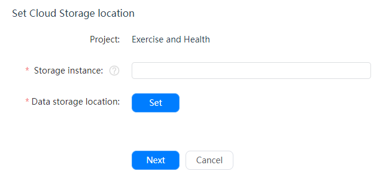
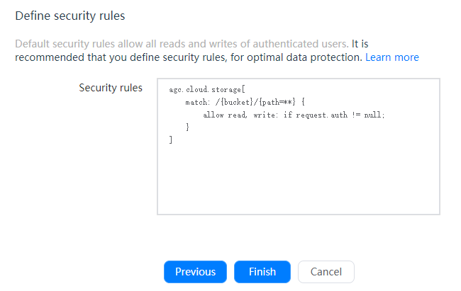
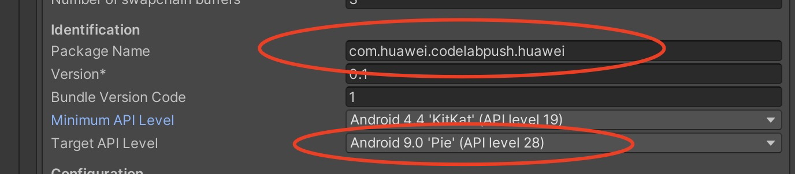
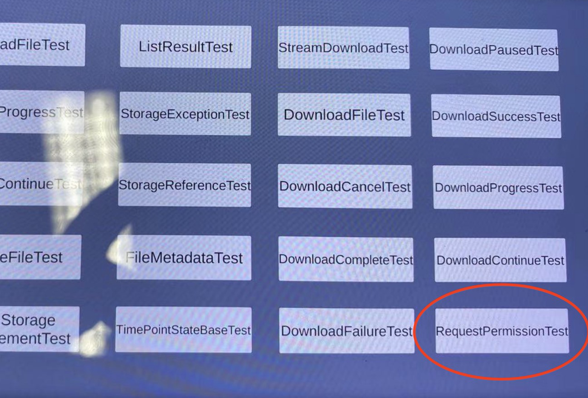

# Cloud Storage

## Introduction

[Cloud Storage](https://developer.huawei.com/consumer/en/doc/development/AppGallery-connect-Guides/agc-cloudstorage-introduction) is scalable and maintenance-free. It allows developer to store high volumes of data such as images, audios, and videos generated by your users securely and economically with direct device access.

The service is stable, secure, efficient, and easy-to-use, and can free you from development, deployment, O&M, and capacity expansion of storage servers. You do not need to pay attention to indicators such as availability, reliability, and durability and can focus on service capability building and operations, improving user experience.

### Advantages

Cloud Storage provides a client SDK for you to store files generated by users, such as images, videos, and audios. The SDK provides simple, secure, efficient, and robust APIs.

- Transmitted data is encrypted using HTTPS, and files are encrypted and stored on the cloud using secure encryption protocols.

- If an operation is terminated manually or due to a network fault, the app client only needs to pass the position where the operation is terminated to resume the operation.

- EB-level data storage is available for massive data storage.

- You can easily locate the cause of an error according to the result code.

### Working Principles

With the client SDK provided by Cloud Storage, an app client can upload files to the cloud storage space. Cloud Storage stores the uploaded files in the default storage instance. You can access these files through AppGallery Connect. You can also use the Cloud Storage SDK to download, delete, and manage files on the app client.

### Apply for Test Qualification

Cloud Storage is still in Beta testing. To use Cloud Storage, send an application email to `agconnect@huawei.com` to apply for the service.

Set your email title format as: **[Cloud Storage]-[Company name]-[Developer account ID]-[Project ID]**. For details about how to query the developer account ID and project ID, please refer to [Querying the Developer Account ID and Project ID](https://developer.huawei.com/consumer/en/doc/development/AppGallery-connect-Guides/agc-query-ID). Huawei operation personnel will reply within 1 to 3 working days.

### Charge

Cloud Storage is in beta testing and uses a **limited free** usage policy. That is, you can use the service for free within a specified quota.

## Setting up in Huawei AppGallery Connect

### Applying for the Cloud Storage Service?

**Notice:** <br>The beta version currently supports only the China and Singapore sites. For any changes, please pay attention to the website notices.

Cloud Storage is still in Beta state. To use Cloud Storage, send an application email to [agconnect@huawei.com](agconnect@huawei.com) to apply for the service.

Set your email title in the following format: **[Cloud Storage]-[Company name]-[Developer account ID]-[Project ID]**. For details about how to query the developer account ID and project ID, please refer to [Querying the Developer Account ID and Project ID](https://developer.huawei.com/consumer/en/doc/development/AppGallery-connect-Guides/agc-query-ID).

Huawei operation personnel will reply within 1 to 3 working days.<br>
**Note:**<br> This email address is used only to process AppGallery Connect service provisioning applications. Do not send other consultations to this email address.

### Creating Your Project and Adding an App

If you have not added a project, sign in to [AppGallery Connect](https://developer.huawei.com/consumer/en/service/josp/agc/index.html), create a project, and add an app to the project. For details, please refer to [Getting Started with Android](https://developer.huawei.com/consumer/en/doc/development/AppGallery-connect-Guides/agc-get-started#createproject).

### Integrating the Auth Service SDK

For details, please refer to [Auth Service Development Guide](https://developer.huawei.com/consumer/en/doc/development/AppGallery-connect-Guides/agc-auth-introduction-0000001053732605).

### Enabling Cloud Storage

You need to enable Cloud Storage before using it. If you have enabled it, skip this step.

1. Sign in to [AppGallery Connect](https://developer.huawei.com/consumer/en/service/josp/agc/index.html) and select **My projects**.

2. Find your project from the project list and click your app on the project card.

3. Go to **Build > Cloud Storage**. On the Cloud Storage page, click **Enable now**.

4. On the page displayed, set Storage instance and Data storage location.

   

5. Click **Next**. The Define security rules page is displayed by default.

   

6. Click **Finish**. Cloud Storage is successfully enabled for the project.

## Setting up in Unity

1. Enable custom manifest and gradle in Player setting. The following is in unity **2019.4**.

   

   The android struct is updated after unity **2019.3**. Manifest and Gradle are separated into multiple files (Main, Launcher & Base).  
   
2. Add a configuration file and integrate the AppGallery Connect SDK. 

   For details, please refer to [Integrating the AppGallery Connect SDK](https://developer.huawei.com/consumer/en/doc/development/AppGallery-connect-Guides/agc-get-started#agcsdk).

   **Note:**<br>
   After Cloud Storage is enabled, go to **My projects > Project settings > General information** and download the `agconnect-services.json` file in the App information area before integrating the Cloud Storage SDK of AppGallery Connect, and check whether `default_storage` has been set under the `service -> cloudstorage` section of the file. If not, the SDK will fail to find a default storage instance for initialization and you need to add `default_storage` to the section of the file to set the default storage instance. The value of `default_storage` is the name entered in the storage instance box on the **Project settings > Build > Cloud Storage** page.
   
   ```
   "cloudstorage":{  
   "default_storage":"Name of the storage instance to be used by default."
   "storage_url":"https://agc-storage-drcn.platform.dbankcloud.cn"  
   }
   ```

3. Integrating the Cloud Storage SDK.

  Add the Maven repository address of the Cloud Storage SDK to the app-level `launcherTemplate.gradle` file (usually in the app directory).

  ```
   implementation "com.huawei.agconnect:agconnect-storage:1.3.1.200"
   implementation 'com.huawei.agconnect:agconnect-core:1.4.2.300'
   implementation 'com.huawei.agconnect:agconnect-credential:1.6.1.300'
   implementation 'com.huawei.agconnect:agconnect-auth:1.6.1.300'
  ```

4. To read and write files and access the network, you need to configure the following permissions in the `AndroidMainfest.xml` file:

   ```
   <uses-permission android:name="android.permission.INTERNET" />
   <uses-permission android:name="android.permission.ACCESS_NETWORK_STATE" />
   <uses-permission android:name="android.permission.WRITE_EXTERNAL_STORAGE" />
   <uses-permission android:name="android.permission.READ_EXTERNAL_STORAGE" />
   ```

5. If your app is integrated with Android SDK 29 or later, you also need to add the following attributes under application in `AndroidMainfest.xml`:

   ```
   <application
      android:name=".App"
      android:allowBackup="false"
      android:requestLegacyExternalStorage="true"
   ```


6. In **Build Settings -> Android -> PlayerSettings-> Other Settings** 

   

   Set Package name corresponding to your json file, and target api level should lower than 29.

   (if target api level is higher than 29, please refer to [Getting Start](https://developer.huawei.com/consumer/en/doc/development/AppGallery-connect-Guides/agc-cloudstorage-getstarted) . 4)

## Developing with the SDK

### Setting up a scene

1. Open a scene:

   

2. Right click and select UI and then you can choose a button:

   

3. Add component to the button and develop a script:

   

   

4. Edit the script:

   

   Double click the script file,and u will open it in VS code

   

5. Using API

   ```
   void Start()
   {
      deleteFile();
   }
   
   // Update is called once per frame
   void Update()
   {
     
   }
   
   void deleteFile()
   {
   	AGCStorageManagement mAGCStorageManagement = mAGCStorageManagement = AGCStorageManagement.getInstance();
   
   	StorageReference reference = mAGCStorageManagement.getStorageReference("addOnCompleteListenerTest.data");
   
   	reference.delete();
   	Debug.Log("DeleteFileTest success.");
   
   }
   
   ```

   Create a function above

6. Bind buttons and interfaces in scripts

   

   - Step1. Click “+” to add a function.

   - Step2. Choose the corresponding scene which has the interface you want to use.

   - Step3. Click **No Function** select to choose the script and then choose the corresponding function.

        

### Demo Project

How to use this demo project?

1. Create a repo from:  `https://github.com/Unity-Technologies/unity-hms_sdk/tree/cloud_storage_test` and checkout to “cloud_storage_test” branch.

2.  Replace  `agconnect-services.json` file from your remote project and configure your gradle files.

   Refer to the "Setting up in Unity" Section above

3. Open Unity Hub, add HuaweiService Project (Unity version 2019.3 +).

   **Note: **<br>If the editor is non-matching version, please click continue

   

4. switch platform to Android and Open Performance Test Scene: `Assets/HuaweiHmsDemo/HmsPerformanceSampleTest`

   If there has some compile error like this:

   >Microsoft (R) Visual C# Compiler version 2.9.1.65535 (9d34608e)
   >Copyright (C) Microsoft Corporation. All rights reserved.
   > error CS0009: Metadata file '/Users/yanmeng/Desktop/unity_agc_new/unity-hms_sdk/hmsDemo/Library/ScriptAssemblies/Unity.Timeline.Editor.dll' could not be opened -- Image is too small.
   > Assets/HuaweiHms/src/hms/Wrapper/fundation/HmsClass.cs(72,25): warning CS0693: Type parameter 'T' has the same name as the type parameter from outer type 'HmsClass<T>'

   Try to reopen this project, which always solve this problem.

5. Set Android build keystore

   In **Build Settings -> Android -> PlayerSettings-> Publish Settings**. As shown below. And the password of hhmm is 123456.

   

   And in **Build Settings -> Android -> PlayerSettings-> Other Settings** 
   
   

   Set Package name corresponding to your json file, and target api level should lower than 29.
   
   (if target api level is higher than 29, please refer to [Get Started](https://developer.huawei.com/consumer/en/doc/development/AppGallery-connect-Guides/agc-cloudstorage-getstarted) . 4)
   
6. Build android apk and run on Android device.

   Before download test, please check you have been granted read/write permissions in test device.

   


