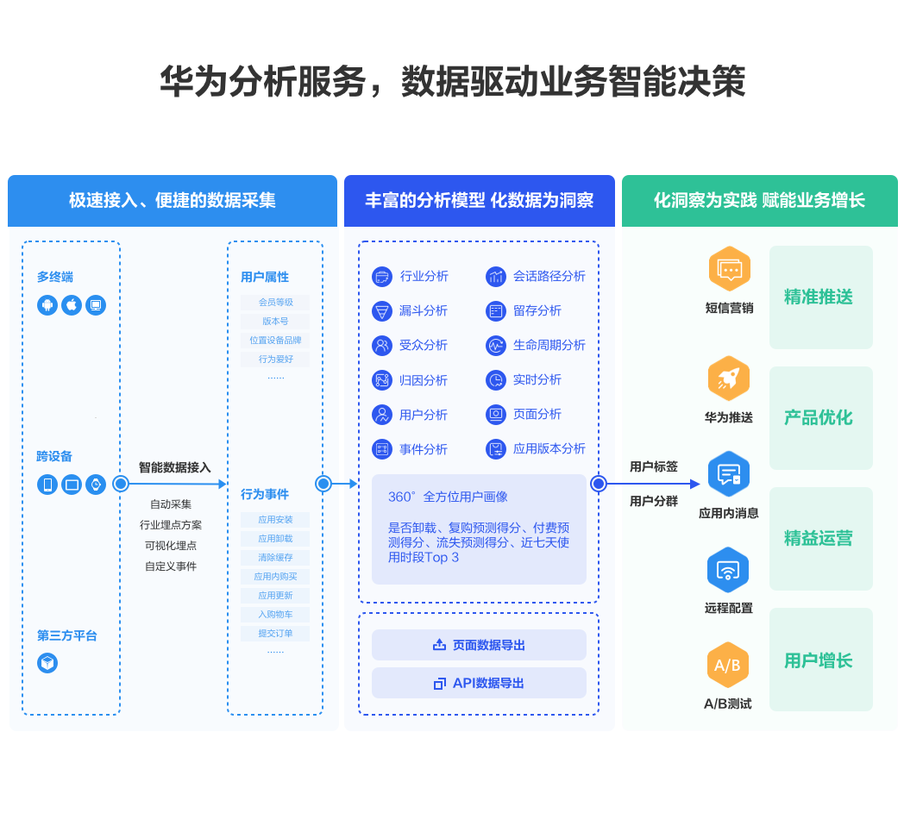
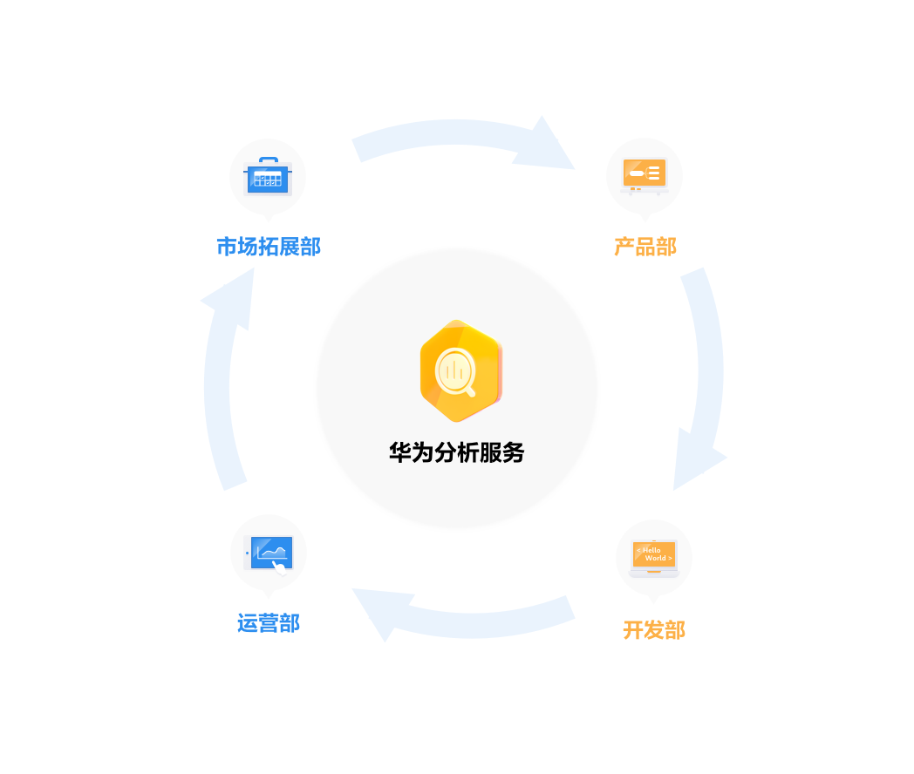

# 分析服务 (HMS)

## 业务介绍

华为分析服务（Analytics Kit）是针对移动应用、Web、小程序等产品的一站式用户行为分析平台，贴合业务场景，提供数据采集、数据管理、数据分析、数据应用的一体化解决方案，驱动企业实现精准拉新、产品优化、精益运营、业务增长。



**提供给跨部门、跨角色人员的一站式数智化分析平台**

基于SDK自动采集的用户事件、用户属性及开发者上报的用户行为数据，华为分析服务可自动生成数据看板、留存分析报告、用户分析报告、行为分析报告、用户生命周期报告、版本分析报告、崩溃分析报告等，支持多维度下钻与对比分析能力，全面支撑市场拓展人员、产品经理、活动运营、用户运营、技术开发等不同人员的日常数据分析需求，驱动业务智能分析与决策。



## Unity项目集成设置

### 注册认证

在开始之前，首先您需要创建华为开发者账号，项目，以及App。请参考[华为HMS文档](https://developer.huawei.com/consumer/cn/doc/development/HMS-Guides/Preparations) 


我们默认您已经创建并拥有了华为HMS项目，以及对应的App信息

### 创建应用

在您的Unity项目中完成以下构建环境的设置，以便使用华为HMS SDK构建安卓 APK。


进入 **Editor -> Build Settings -> Platform -> Andriod**， 点击 **Switch Platform** 切换到安卓平台。


进入 **Player Settings -> Publishing Settings**，勾选以下环境配置项目。


### 开发准备

按照[华为HMS 集成开发指南介绍](https://developer.huawei.com/consumer/cn/codelab/HMSPreparation/index.html#6)，我们仍需要对这些Gradle文件做进一步开发准备的设置。


您可以根据[华为HMS Core集成准备](https://developer.huawei.com/consumer/cn/codelab/HMSPreparation/index.html#6)对自己对文件进行配置。您也可以从我们的[示例项目](https://github.com/Unity-Technologies/HMSSDKSample/tree/master/Assets/Plugins/Android)中的具体参数设置，进行参考与对比，完成以下一系列的开发准备配置。

1. 启用并对 `AndroidManifest.xml` 做以下配置

   进入 **Edit -> Project Settings -> Player -> Android(icon) -> Publishing Settings -> Build**，启用 **Custom Main Manifest**

   当使用“推送服务” 和“定位服务” 的时候，我们需要启用 **AndroidManifest**。

   如果您的Unity版本低于**2019.2（含）**，上述设置界面中并没有 **AndroidManifest** 选项，但您可以将`AndroidManifest.xml`文件手动放置到`Assets/Plugins/Android` 路径下。

   ```
    <?xml version="1.0" encoding="utf-8"?>
       <!-- GENERATED BY UNITY. REMOVE THIS COMMENT TO PREVENT OVERWRITING WHEN EXPORTING AGAIN-->
       <manifest
           xmlns:android="http://schemas.android.com/apk/res/android"
           package="com.unity3d.player"
           xmlns:tools="http://schemas.android.com/tools">
           <uses-permission android:name="android.permission.ACCESS_COARSE_LOCATION"/>
           <uses-permission android:name="android.permission.ACCESS_FINE_LOCATION"/>
           <uses-permission android:name="android.permission.ACCESS_BACKGROUND_LOCATION" />
           <uses-permission android:name="com.huawei.hms.permission.ACTIVITY_RECOGNITION" />
           <uses-permission android:name="android.permission.ACTIVITY_RECOGNITION" />
           <uses-permission android:name="android.permission.ACCESS_MOCK_LOCATION" />
           <application>
               <activity android:name="com.hms.hms_analytic_activity.HmsAnalyticActivity"
                       android:theme="@style/UnityThemeSelector">
                   <intent-filter>
                       <action android:name="android.intent.action.MAIN" />
                       <category android:name="android.intent.category.LAUNCHER" />
                   </intent-filter>
                   <meta-data android:name="unityplayer.UnityActivity" android:value="true" />
               </activity>
               <service
                   android:name="com.unity.hms.push.MyPushService"
                   android:exported="false">
                   <intent-filter>
                       <action android:name="com.huawei.push.action.MESSAGING_EVENT"/>
                   </intent-filter>
               </service>
               <receiver
                       android:name="com.unity.hms.location.LocationBroadcastReceiver"
                       android:exported="true">
                   <intent-filter>
                       <action android:name="com.huawei.hmssample.location.LocationBroadcastReceiver.ACTION_PROCESS_LOCATION" />
                   </intent-filter>
               </receiver>
               <receiver
                       android:name="com.unity.hms.location.GeoFenceBroadcastReceiver"
                       android:exported="true">
                   <intent-filter>
                       <action android:name="com.huawei.hmssample.geofence.GeoFenceBroadcastReceiver.ACTION_PROCESS_LOCATION" />
                   </intent-filter>
               </receiver>
           </application>
       </manifest>
   ```


2. 启用并对project gradle文件添加配置

   进入 **Edit -> Project Settings -> Player -> Android(icon) -> Publishing Settings -> Build** ，启用 **Custom Base Gradle Template** 并在文件中添加 AppGallery Connect plugin 和 Maven repository。路径是`Assets/Plugins/Android/baseProjectTemplate.gradle`。

   如果您的Unity版本低于**2019.2（含）**，则需要在 <code>MainGradleTemplate.gradle</code> 中添加配置。

   ```
       allprojects {
           buildscript {
               repositories {**ARTIFACTORYREPOSITORY**
                   google()
                   jcenter()
                   maven { url 'https://developer.huawei.com/repo/' }
               }
   
               dependencies {
                   // If you are changing the Android Gradle Plugin version, make sure it is compatible with the Gradle version preinstalled with Unity
                   // See which Gradle version is preinstalled with Unity here https://docs.unity3d.com/Manual/android-gradle-overview.html
                   // See official Gradle and Android Gradle Plugin compatibility table here https://developer.android.com/studio/releases/gradle-plugin#updating-gradle
                   // To specify a custom Gradle version in Unity, go do "Preferences > External Tools", uncheck "Gradle Installed with Unity (recommended)" and specify a path to a custom Gradle version
                   classpath 'com.android.tools.build:gradle:3.6.4'
                   classpath 'com.huawei.agconnect:agcp:1.6.1.300'
                   **BUILD_SCRIPT_DEPS**
               }
           }
   
           repositories {**ARTIFACTORYREPOSITORY**
               google()
               jcenter()
               flatDir {
                   dirs "${project(':unityLibrary').projectDir}/libs"
               }
               maven { url 'https://developer.huawei.com/repo/' }
           }
       }
   
       task clean(type: Delete) {
           delete rootProject.buildDir
       }
   ```
   
3. 启用并对app gradle文件添加配置

   进入 **Edit -> Project Settings -> Player -> Android(icon) -> Publishing Settings -> Build**，启用 **Custom Launcher Gradle Template** 并在 `launcherTemplate.gradle` 中添加依赖。路径为 `Assets/Plugins/Android/LauncherTemplate.gradle`。

    如果您的Unity版本低于**2019.2（含）**， 则需要在 <code>MainGradleTemplate.gradle</code>中添加配置。
   
   ```
       dependencies {
           implementation project(':unityLibrary')
           implementation 'com.huawei.hms:ads-lite:13.4.29.303'
           implementation 'com.huawei.hms:ads-consent:3.4.30.301'
           implementation 'com.huawei.hms:push:4.0.3.301'
           implementation 'com.huawei.hms:hianalytics:5.1.0.300'
           implementation 'com.android.support:appcompat-v7:28.0.0'
           implementation 'com.huawei.hms:hianalytics:5.0.0.301'
           implementation 'com.huawei.agconnect:agconnect-core:1.6.1.300'
           implementation 'com.huawei.hms:hwid:6.1.0.303'
           implementation 'com.huawei.hms:game:6.1.0.301'
           }
   ```

4. 使用并对unity library gradle文件进行以下设置

    进入 **Edit -> Project Settings -> Player -> Android(icon) -> Publishing Settings -> Build**，启用 **Custom Main Gradle Template** 并在 `mainTemplate.gradle` 中添加依赖。路径为 `Assets/Plugins/Android/mainTemplate.gradle.gradle`。
    
    如果您的Unity版本低于**2019.2（含）**， 则需要在 <code>MainGradleTemplate.gradle</code>中添加配置。
    
    ```
        dependencies {
            implementation fileTree(dir: 'libs', include: ['*.jar'])
            implementation 'com.huawei.hms:hianalytics:5.0.0.301'
            implementation 'com.huawei.agconnect:agconnect-core:1.6.1.300'
            implementation 'com.huawei.hms:hwid:6.1.0.303'
            implementation 'com.huawei.hms:game:6.1.0.301'
        **DEPS**}
    ```
5. 创建Signature

   进入 **Edit -> Project Settings -> Player -> Android(icon) -> Publishing Settings -> Keystore Manager**， 点击 **Keytore... -> create new**

   

   您需要在打开unity时设定并输入密码，否则将无法构建。无需在 gradle 中添加signature。

6. 签署证书指纹

   参照华为[HMS Core集成准备 Step4](https://developer.huawei.com/consumer/cn/codelab/HMSPreparation/index.html#3) 生成SHA256证书指纹

   

   参照华为[HMS Core集成准备 Step5](https://developer.huawei.com/consumer/cn/codelab/HMSPreparation/index.html#4)在AppGAllery Connect里添加指纹。

   

7. 设置package name，及其他设置

   进入 **Edit -> Project Settings -> Player**设置package name。

   package name格式为 `com.${Company Name}.${Product Name}`

   同时也可以在此步骤完成其余的所需设置，比如您的应用版本号、应用的图标、设置显示的分辨率等。

   

8. `Agconnect-services.json`

   我们还需要从华为开发者账号内下载这个json文件，加入所需信息后，放到 `Assets/Plugins/Android` 路径下。

   从华为开发者账号内下载此json 文件并在其中加以下信息。同样的，您可以在我们的[示例项目文件](https://github.com/Unity-Technologies/HMSSDKSample/blob/master/Assets/Plugins/Android/agconnect-services.json)中直接参考！

   ```
   "agcgw":{
   "backurl":"connect-drcn.dbankcloud.cn",
   "url":"connect-drcn.hispace.hicloud.com"
   },
   ```

   当我们使用“分析服务”、“推送服务”、或“定位服务”时，必须配置 `agconnect-services.json` 文件。

   参考 [链接](https://developer.huawei.com/consumer/cn/doc/development/HMSCore-Guides/android-config-agc-0000001050170137) 以创建`agconnect-services.json`

   

9. 配置混淆脚本 （[参考](https://developer.huawei.com/consumer/cn/doc/development/HMSCore-Guides/android-appendix-d-0000001050167398)）
    - （可选）当您启用R8资源缩减（项目级“build.gradle”文件中“shrinkResources”属性为“true”）和严格引用检查（“res/raw/keep.xml”文件中的“shrinkMode”为“strict”）时，请您配置“keep.xml”文件手动保留layout资源，确保应用正常通过华为应用市场上架审核。
    
    ```
    <?xml version="1.0" encoding="utf-8"?>
    <resources xmlns:tools="http://schemas.android.com/tools"
    tools:keep="@layout/hms_download_progress,@drawable/screen_off,@layout/upsdk*"
    tools:shrinkMode="strict" />
    ```

10. 获取activity

   可以用 `Common.GetActivity()`函数来获取activity。

## SDK集成开发
### SDK开发

HMS 套件中共包括4个功能服务，在[示例项目](https://github.com/Unity-Technologies/HMSSDKSample)中都有相应的示例场景。 为了进行测试，您需要通过HMS将其构建到Android移动版上。 确保已创建HMS帐户和项目。 然后，您就可以更改配置并测试不同的功能。


在示例项目中，分析服务对应的场景是： `Assets/HuaweiServiceDemo/Scenes/HmsAnalyticSampleScene.unity` 而对应的代码是： `Assets/HuaweiServiceDemo/demo/test/AnalyticTest.cs`.

分析服务的初始化必须在第一个活动的 `onCreate` 上初始化。
您可以扩展UnityPlayerActivity文件，并将Java文件放在`Plugins / Android`

```
public class HmsAnalyticActivity extends UnityPlayerActivity{
    @Override
    protected void onCreate(Bundle savedInstanceState) {
        super.onCreate(savedInstanceState);
        HiAnalyticsTools.enableLog();//analytic initialize
        HiAnalytics.getInstance(this);
    }
}
```
然后您还需要设置`AndroidManifest.xml`的activity
```
 <application>
    <activity android:name="com.hms.hms_analytic_activity.HmsAnalyticActivity"
              android:theme="@style/UnityThemeSelector">
        <intent-filter>
            <action android:name="android.intent.action.MAIN" />
            <category android:name="android.intent.category.LAUNCHER" />
        </intent-filter>
        <meta-data android:name="unityplayer.UnityActivity" android:value="true" />
    </activity>
    ...
</application>
```
如果您初始化了分析服务，则还需要在` mainTemplate.gradle` 中添加分析功能。


### 测试与发布
参考华为 [HMS Core集成流程](https://developer.huawei.com/consumer/cn/doc/start/hitHMSCore) for testing and releasing.


