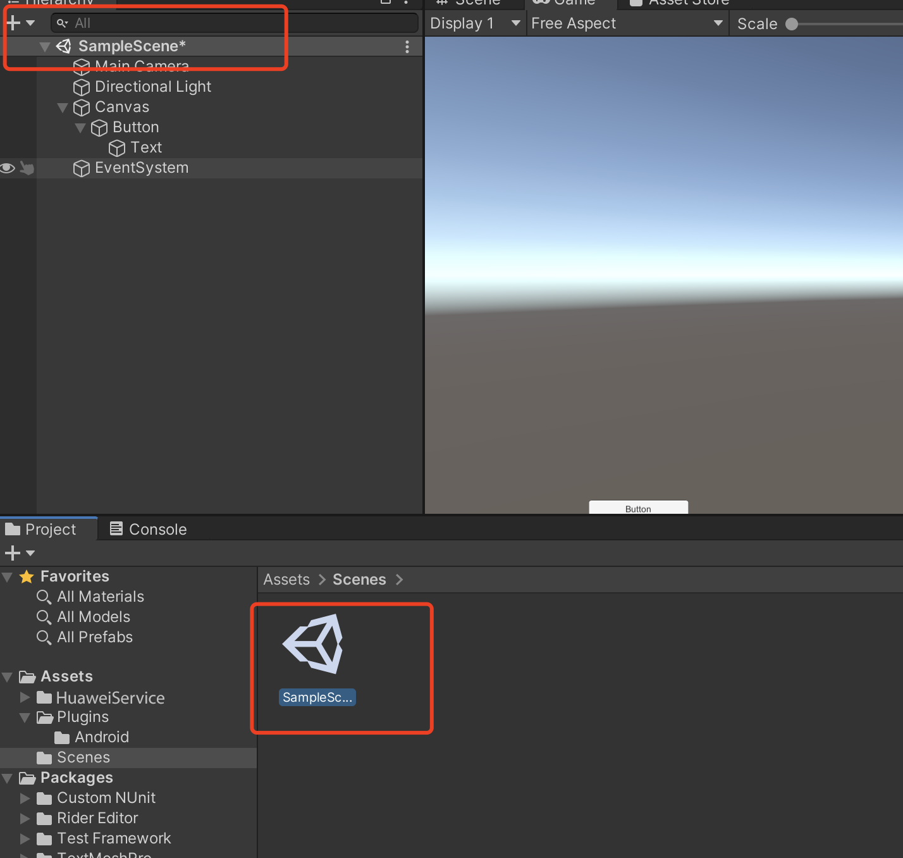
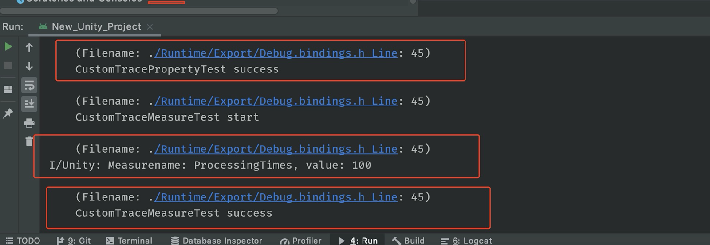

# 性能管理（AGC）


## 业务介绍

华为AppGallery Connect（简称AGC）的[性能管理](https://developer.huawei.com/consumer/cn/doc/development/AppGallery-connect-Guides/agc-apms-introduction)（APM，App Performance Management）服务提供分钟级应用性能监控能力，您可以在AGC查看和分析APM收集到的应用性能数据，实时全面掌握应用在线的性能表现，帮助您快速修复应用的性能问题，持续提升应用的用户体验。

### 主要功能

| <div style="width:140px">主要功能</div> | 功能描述 |
| :-------------------------- | :-------------------------------- |
| 自动收集有关应用程序启动，应用程序屏幕渲染和HTTP/HTTPS网络请求的性能数据。| APM SDK自动收集有关应用程序启动，应用程序屏幕渲染和HTTP / HTTPS网络请求的关键性能数据。<br>1.应用启动：冷启动和暖启动模式下的应用启动时间。<br>2. 应用程序屏幕渲染：应用程序屏幕渲染期间慢帧和冻结帧的数量。<br>3. HTTP / HTTPS网络请求：诸如响应持续时间，成功率和响应大小之类的指标。|
| 支持查看和分析应用性能数据，快速发现应用性能瓶颈。 |APM通过多个维度（版本号、国家/地区、设备型号、一级区域、系统版本、运营商和网络等）向您展示应用的性能表现，帮助您快速了解应用在哪些方面可优化改进。|
| 支持创建自定义跟踪记录，监控应用在特定场景下的性能。 |借助APM SDK，您可以：<br/>1.创建自定义跟踪记录来监控应用在自定义场景（如用户登录和场景加载）下的性能。<br/>为自定义跟踪记录添加指标（如登录次数）和属性（如登录是否成功）。|


## Unity项目设置


### 1. 集成AGC SDK

集成APM SDK前，请确认您的应用已集成AGC SDK和AGC插件，详细步骤请参考[AppGallery Connect服务使用入门](https://developer.huawei.com/consumer/cn/doc/development/AppGallery-connect-Guides/agc-get-started)。

**注意**：

1. 拷贝`agconnect-services.json`文件到`Assets/Plugins/Android/ `目录中

2. 在`Assets/Plugins/Android/` 目录中打开`launcherTemplate.gradle `。

   在 `apply plugin: 'com.android.application'` 下面添加以下信息：

   ```
   apply plugin: 'com.android.application’
   apply plugin: 'com.huawei.agconnect'
   ```

   构建依赖关系：
   ```
   dependencies {      
        implementation 'com.huawei.agconnect:agconnect-core:1.4.2.302'    
       }
   ```


3. 在`Assets/Plugins/Android/` 目录中打开`baseProjectTemplate.gradle`文件
	
	添加以下配置：
   ```
   allprojects {  
              repositories {  
                  google()  
                  jcenter()  
                  maven {url 'https://developer.huawei.com/repo/'}  
              }  
          }
   
   buildscript {  
              repositories {  
                  google()  
                  jcenter()  
                  maven {url 'https://developer.huawei.com/repo/'}  
              }  
   }
   
   buildscript {  
              dependencies {  
               classpath 'com.huawei.agconnect:agcp:1.4.2.301'
              }  
   }
   ```


### 2. 集成APM SDK

步骤请参考 [集成APM SDK](https://developer.huawei.com/consumer/cn/doc/development/AppGallery-connect-Guides/agc-apms-apmssdk) 

集成APM SDK后，APM SDK将自动采集应用的[启动性能数据](https://developer.huawei.com/consumer/cn/doc/development/AppGallery-connect-Guides/agc-apms-appstart)、[屏幕性能数据](https://developer.huawei.com/consumer/cn/doc/development/AppGallery-connect-Guides/agc-apms-appscreen)。

将APM SDK依赖项添加到`launcherTemplate.gradle`文件中（通常在app目录中）。

```
dependencies {
// ...
// Add APM SDK library dependency
implementation 'com.huawei.agconnect:agconnect-apms:1.5.2.300'
implementation 'com.huawei.agconnect:agconnect-apms-game:1.5.2.303'
}

```


### 3. 集成APM插件

步骤请参考 [集成APM插件](https://developer.huawei.com/consumer/cn/doc/development/AppGallery-connect-Guides/agc-apms-apmsplugin) 

APM插件利用检测（instrumentation）技术，实现[HTTP/HTTPS网络请求性能数据](https://developer.huawei.com/consumer/cn/doc/development/AppGallery-connect-Guides/agc-apms-appnetwork)的无侵入采集。请按如下步骤将APM插件添加到您的应用：

1. 将APM插件添加到`launcherTemplate.gradle`文件中。

   ```
   apply plugin: 'com.android.application'
   // Apply the APM plugin
   apply plugin: 'com.huawei.agconnect.apms'
   // Apply the AGC plugin
   apply plugin: 'com.huawei.agconnect'
   
   dependencies {
    // ..
   }
   
   ```

2. 将APM插件添加到`baseProjectTemplate.gradle`文件中。

   ```
   buildscript {
      repositories {
        // Add the maven repository
        maven { url 'https://developer.huawei.com/repo/' }
      }
      dependencies {
        // ...
        // To benefit from the latest APM feaures, update your Android Gradle Plugin dependency to at least v3.3.2
        classpath 'com.android.tools.build:gradle:3.3.2'
        // Add the dependency for the APM plugin
        classpath 'com.huawei.agconnect:agconnect-apms-plugin:1.4.1.303'
      }
   }
   
   ```

## SDK集成开发

### 查看性能监控数据

请参考[查看性能监控数据](https://developer.huawei.com/consumer/cn/doc/development/AppGallery-connect-Guides/agc-apms-viewdata) 


### 可选：使用APM

1、[添加自定义跟踪记录](https://developer.huawei.com/consumer/cn/doc/development/AppGallery-connect-Guides/agc-apms-addtrace)

2、[使用@AddCustomTrace跟踪方法耗时](https://developer.huawei.com/consumer/cn/doc/development/AppGallery-connect-Guides/agc-apms-addcustomtrace)

3、[添加针对特定网络请求的监控指标](https://developer.huawei.com/consumer/cn/doc/development/AppGallery-connect-Guides/agc-apms-addnetworkmeasure)

4、[查看调试日志](https://developer.huawei.com/consumer/cn/doc/development/AppGallery-connect-Guides/agc-apms-viewlog)

5、[配置AndroidManifest文件](https://developer.huawei.com/consumer/cn/doc/development/AppGallery-connect-Guides/agc-apms-configuremanifest)


### 设置场景

1. 新建一个场景

   

2. 右键单击并选择UI，然后选择button:

   

3. 将Component添加到button并开发脚本：

   

   

4. 编辑脚本:

   

    双击脚本文件，然后您将在VS code中打开它

   

5. 定义接口
   ```
   void Start()
   {
     
   }
   
   // Update is called once per frame
   void Update()
   {
     
   }
    public void CustomTraceMeasureTest(CustomTrace customTrace) {
              UnityEngine.Debug.Log("CustomTraceMeasureTest start");
    
              customTrace.putMeasure("ProcessingTimes", 0);
              for (int i = 0; i < 100; i++) {
                  customTrace.incrementMeasure("ProcessingTimes", 1);
              }
    
              long value = customTrace.getMeasure("ProcessingTimes");
              Debug.Log("Measurename: ProcessingTimes, value: "+ value);
    
              UnityEngine.Debug.Log("CustomTraceMeasureTest success");
          }
   ```
   
   创建函数
   
6. 绑定脚本中的按钮和界面

   

   - 步骤1：点击“+”添加功能
   
   - 步骤2：选择具有您要使用的界面的对应场景
   
   - 步骤3：单击“No Function”以选择脚本，然后选择相应的函数

      

### 演示项目

如何使用演示项目？

- 步骤1：从以下位置创建repo：https://github.com/Unity-Technologies/unity-hms_sdk/tree/apm 并checkout到“apm”分支。

- 步骤2：从远程项目中替换`agconnect-services.json`文件并配置gradle文件，请参阅第2部分，步骤1至步骤3。

- 步骤3：打开Unity Hub，添加HuaweiServiceDemo项目（Unity版本2019.3）。

- 步骤4：将平台切换到Android并打开性能测试场景：`Assets / HuaweiHmsDemo / HmsPerformanceSampleTest`

  如果有以下的编译错误：

  > Microsoft (R) Visual C# Compiler version 2.9.1.65535 (9d34608e)
  >
  > Copyright (C) Microsoft Corporation. All rights reserved.
  >
  > error CS0009: Metadata file '/Users/yanmeng/Desktop/unity_agc_new/unity-hms_sdk/hmsDemo/Library/ScriptAssemblies/Unity.Timeline.Editor.dll' could not be opened -- Image is too small.
  >
  > Assets/HuaweiHms/src/hms/Wrapper/fundation/HmsClass.cs(72,25): warning CS0693: Type parameter 'T' has the same name as the type parameter from outer type 'HmsClass&lt;T>'

  尝试重新打开项目，总是能解决此问题。

- 步骤5：在 **Build Settings -> Android -> PlayerSettings-> Publish Settings** 中设置Android build keystore。如下所示。 hhmm的密码为123456。

  

- 步骤6：构建android apk并在Android设备上运行。使用logcat检查测试用例是否成功执行。

  

