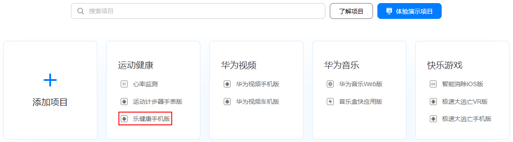
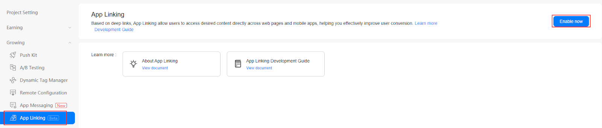

# App Linking（AGC）


## 业务介绍

[App Linking](https://developer.huawei.com/consumer/cn/doc/development/AppGallery-connect-Guides/agc-applinking-introduction)是一种无论应用是否已经安装都可以按照所需方式工作的跨平台链接，创建App Linking后将链接地址多渠道分发，用户点击链接后即可跳转到链接指定的内容，有长链接和短链接之分。

为了区分用户来源的渠道，在创建App Linking时可针对不同渠道设置不同的跟踪参数用于流量跟踪，将链接地址多平台多渠道分发投放，根据数据点击来查看哪个营销平台或广告系列最适合您。


### 典型应用场景


#### 唤醒沉默用户/提高某个页面访问量

结合运营-活动管理-用户召回功能，策划用户唤醒活动并以此为内容创建链接，通过社交、邮件、短信或push等方式，将此链接发送给用户。用户因活动内容吸引点击链接时，可拉起APP并直达此内容页面，引导用户完成转发或付费等，促活的同时增加了此页面的访问量。


#### 将移动网页用户转化成原生应用用户

在不使用App Linking链接的情况下，当移动网页用户通过分享打开链接时，必须先安装应用，再导航回其原先位置打开链接内容。但使用App Linking链接，用户就可在安装应用后，直接打开应用内对应的页面，提高应用安装率及用户体验。


#### 用于日常营销场景，跟踪用户来源，查看营销平台的有效性

用公司日常促销活动创建App Linking，在多个渠道进行投放，通过设置参数跟踪各个渠道的点击浏览数据，来查看哪些渠道的引流效果好，以测试这个渠道的用户是否切近应用的用户画像。


#### 鼓励用户分享

与[云函数](https://developer.huawei.com/consumer/cn/doc/development/AppGallery-connect-Guides/agc-cloudfunction-introduction)、[云数据库](https://developer.huawei.com/consumer/cn/doc/development/AppGallery-connect-Guides/agc-clouddb-introduction)结合使用，制定激励政策，创建App Linking链接，鼓励用户分享链接，邀请自己的朋友下载应用，给予分享者一定的激励，从而促进用户快速增长。


### 主要功能

<table>
  <tr>
   <td><strong><div style="width:120px">主要功能</div></strong>
   </td>
   <td><strong>功能描述</strong>
   </td>
  </tr>
  <tr>
   <td>支持延迟深度链接
   </td>
   <td>即使用户还未安装您的应用，也可以先被跳转到应用市场，在安装您的应用后，即可从他们原先所在的位置继续，而不用重新导航回到原先的位置。
   </td>
  </tr>
  <tr>
   <td>支持社交卡片的适配
   </td>
   <td>通过分享标识可以将App Linking呈现为卡片，实现更加丰富的呈现效果。
   </td>
  </tr>
  <tr>
   <td>数据统计
   </td>
   <td>记录链接里所有相关事件数据，比如点击次数、首次打开次数、重复打开次数等，便于数据分析。
   </td>
  </tr>
</table>

### 创建Applinking链接

App Linking支持3种方式创建链接：

1. 在AGC管理台中创建。

2. 在应用客户端创建。

3. 手动构造App Linking链接。

   创建的链接包括**长链接**和**短链接**。前两种创建方法可以创建长/短链接，而第三种方法只能创建长链接。


#### 长链接

长链接是指包含App Linking所有链接信息的地址，一个典型的App Linking长链接地址的格式如下：

**链接前缀+[深度链接地址]+[Android应用参数]+[广告跟踪参数]+[iOS应用参数]+[预览类型]+[社交分享标识参数]+[站点编号]**

*   链接前缀：链接前缀是指App Linking链接地址中包含的网址，为“https://域名”格式，您可以使用AGC提供的免费域名地址。

*   深度链接地址：深度链接地址是您自行设置的需要用户跳转到的应用内部的地址。当用户点击链接跳转到您的应用后，您如果需要让用户进入应用的某个具体页面，可以将深度链接地址配置为应用内部的具体页面地址。

*   Android应用参数：定义应用包名、未安装应用时需要打开的链接地址等信息。

*   广告跟踪参数：在链接中增加跟踪参数，可用于广告和流量跟踪。

*   iOS应用参数：定义iOS深度链接、iOS应用包名、未安装iOS应用时需要打开的链接地址、iPad应用包名、未安装iPad应用时需要打开的链接地址、App Store广告参数等信息。

*   预览类型：App Linking在浏览器中打开时展示的预览页类型。

*   社交分享标识参数：定义App Linking在社交工具中展示的信息。当前支持的社交网站和应用包括Facebook、Facebook Messenger、Twitter、WhatsApp和Telegram。

*   站点编号：用于标记向应用提供App Linking服务的站点信息，站点编号根据应用设置的数据存储位置确定。

有关长链接地址的详细说明，请参见[手动构造Applinking](https://developer.huawei.com/consumer/cn/doc/development/AppGallery-connect-Guides/agc-applinking-createlinks-defined)


#### 短链接

短链接地址是指为了防止链接地址过长不利于分享，将长链接地址包含的信息缩短成随机字符串后缀。短链接地址格式如下：

**链接前缀+随机字符串后缀**

*   链接前缀：与长链接描述一致。

*   短链接的字符串后缀分为**LONG**和**SHORT**两种。

    *   LONG为固定17位字符。

    *   SHORT为4位字符开始，当4位字符的随机字符串使用完后自动增加1位，依次累加。


### 打开Applinking链接

您可以指定链接打开方式为在**浏览器**中打开或在**应用**中打开。

*   如果设置为在浏览器中打开，无论用户在**移动端**或者**PC端**均可通过浏览器打开查看内容。

*   如果设置为在应用中打开：

    *   如果用户尚未安装应用，则会跳转到应用市场（或自定义网址）提示用户安装应用然后展示内容。

    *   如果用户已安装应用，则直接打开应用原生页面来展示内容。


## 华为账号设置


### 使用入门

App Linking服务提供App Linking SDK。您必须先将SDK集成到您的应用中，然后您的应用才能创建和接收应用链接的链接。将应用程序与App Linking SDK集成后，当用户点击App Linking的链接时，App Linking服务会自动报告事件数据。您可以根据报告的事件数据分析链接的效果。本节介绍了启用App Linking服务和集成App Linking SDK的过程。


### 集成 AppGallery Connect SDK

您需要先集成AppGallery Connect SDK和插件，然后再将App Linking SDK集成到您的应用程序中。详细信息请参阅[AppGallery Connect服务入门](https://developer.huawei.com/consumer/en/doc/development/AppGallery-connect-Guides/agc-get-started)。


### 启动App Linking服务

1. 登录[AppGallery Connect网站](https://developer.huawei.com/consumer/cn/service/josp/agc/index.html)，点击“我的项目”。

2. 在项目列表中找到您的项目，在项目下的应用列表中选择需要启用App Linking的应用。

   

3. 在左侧导航栏中点击 **增长 > App Linking** ，进入App Linking页面。

   **注意：**

   启动服务时，如果尚未设置数据存储位置，设置后会刷新`agconnect-services.json`文件里的配置。因此，您需要重新下载`agconnect-services.json`文件并集成到您的工程中，具体操作参见[添加配置文件](https://developer.huawei.com/consumer/cn/doc/development/AppGallery-connect-Guides/agc-get-started#addjson)。

   

4. 配置json文件

   将`agconnect-services.json`文件复制到Unity项目的`Assets/Plugins/Android`文件夹。

   


## Unity项目设置

### 设置 unity 自定义Android manifest and gradle

1. 在player setting中将平台切换到android

2. 在player setting中启用 custom manifest and gradle. 以下版本是unity **2019.4**

   
   
   安卓的结构在 Unity **2019.3 **版本进行了更新, manifest 和 gradle 被分到了多个文件 (Main, Launcher & Base)。
   
3. 设置Package name

   在  **Edit -> Project Settings -> Player ->  Android(icon) -> other settings -> Identification -> Package Name** 中设置Package name。

   Package Name即为华为项目中应用程序的Package Name。
   
   

### 集成华为分析服务

要收集有关App Linking的统计数据，您需要使用华为分析服务。请参考**[https://docs.unity.cn/cn/Packages-cn/com.unity.hms@1.2/manual/](https://docs.unity.cn/cn/Packages-cn/com.unity.hms@1.2/manual/)**


### 集成AppLinking套件

1. 启用并对project gradle文件添加配置

   进入 **Edit -> Project Settings -> Player -> Android(icon) -> Publishing Settings -> Build**

   启用 **Custom Base Gradle Template** 并在文件中添加 AppGallery Connect plugin 和 Maven repository。路径是`Assets/Plugins/Android/baseProjectTemplate.gradle`。

   如果您的Unity版本低于**2019.2（含）**，则需要在 <code>MainGradleTemplate.gradle</code> 中添加配置。

   ```
       allprojects {
           buildscript {
               repositories {
   ...
                   maven { url 'https://developer.huawei.com/repo/' }
   ...
               }
   ...
           }
   ...
           repositories {
   ...
               maven { url 'https://developer.huawei.com/repo/' }
   ...
           }
       }
   ```

2. 启用并对app gradle文件添加配置

   进入 **Edit -> Project Settings -> Player -> Android(icon) -> Publishing Settings -> Build**，启用 **Custom Launcher Gradle Template** 并在 `launcherTemplate.gradle` 中添加依赖。路径为 `Assets/Plugins/Android/LauncherTemplate.gradle`。

    如果您的Unity版本低于**2019.2（含）**， 则需要在 <code>MainGradleTemplate.gradle</code>中添加配置。

   ```
     dependencies {
   …
      implementation 'com.huawei.agconnect:agconnect-applinking:1.4.1.300'
   ...
   }
   ```

3. 可选: 更新manifest以启动其他服务

   在 `Assets/Plugins/Android/AndroidManifest.xml`中，将intent filter加入到activity中来进行重定向。

   ```
   <manifest ...>
       ...
       <application>
           <activity ...>
               ...
                <intent-filter>
                   <action android:name="android.intent.action.VIEW" />
   
                   <category android:name="android.intent.category.DEFAULT" />
                   <category android:name="android.intent.category.BROWSABLE" />
   
                   <data
                       android:host="unity.cn"
                       android:scheme="https" />
               </intent-filter>
               ...
           </activity>
           ...
       </application>
       ...
   </manifest>
   ```

4. 可选：更新manifest以读取剪贴板上的内容

   在 `Assets/Plugins/Android/AndroidManifest.xml`中，将元数据加入到activity中来进行重定向。

   ```
   <manifest ...>
       ...
       <application>
          ...
          <meta-data android:name="com.huawei.agconnect.applinking.READ_CLIPBOARD_PERMISSION"   android:value="xxxx"/>
           ...
       </application>
       ...
   </manifest>
   ```

   - 如果value可用，则每次启动应用程序时，App Linking SDK都会在剪贴板上读取内容。

   - 如果value不可用，则App Linking SDK不会读取剪贴板上的内容。

   - 如果未配置元数据，则App Linking SDK仅在首次启动应用程序时才读取剪贴板上的内容。

## SDK集成开发

### 示例

1. 新建一个场景

    

2. 右键单击并选择UI，然后选择按钮:

    

3. 将组件添加到按钮并开发脚本：

    

    

4. 编辑脚本:

    

    双击脚本文件，您将在VS code中打开它。

    

5. 定义代码创建短链接

   ```
   using System;
   using HuaweiAuthDemo;
   using HuaweiService;
   using HuaweiService.AppLinking;
   using UnityEngine;
   using Uri = HuaweiService.Uri;
   
   public class AppLinkingTest : MonoBehaviour
   {
      private const string URI_PREFIX = "https://unity.drcn.agconnect.link";
      private const string TITLE = "Unity test app";
      private const string DESCRIPTION = "This is description.";
   
      private const string IMAGE_URI =
          "https://unity.com/sites/default/files/styles/16_9_l_scale_width/public/2019-11/Unity-TheHeretic-hero-dark.jpg";
   
      private const string DEEP_LINK = "https://unity.cn/detail?id=123";
   
      public delegate void SuccessCallBack<T>(T o);
   
      public class HmsSuccessListener<T> : OnSuccessListener
      {
          public SuccessCallBack<T> CallBack;
   
          public HmsSuccessListener(SuccessCallBack<T> c)
          {
              CallBack = c;
          }
   
          public void onSuccess(T arg0)
          {
              Debug.Log("OnSuccessListener onSuccess");
              if (CallBack != null)
              {
                  CallBack.Invoke(arg0);
              }
          }
   
          public override void onSuccess(AndroidJavaObject arg0)
          {
              Debug.Log("OnSuccessListener onSuccess");
              if (CallBack != null)
              {
                  Type type = typeof(T);
                  IHmsBase ret = (IHmsBase) Activator.CreateInstance(type);
                  ret.obj = arg0;
                  CallBack.Invoke((T) ret);
              }
          }
      }
   
      public delegate void FailureCallBack(HuaweiService.Exception e);
   
      public class HuaweiOnFailureListener : OnFailureListener
      {
          public FailureCallBack CallBack;
   
          public HuaweiOnFailureListener(FailureCallBack c)
          {
              CallBack = c;
          }
   
          public override void onFailure(HuaweiService.Exception arg0)
          {
              if (CallBack != null)
              {
                  CallBack.Invoke(arg0);
              }
          }
      }
   
   // function for create link
      public void CreateAppLinking()
      {
          AppLinking.Builder builder = AppLinking.newBuilder()
              .setPreviewType(AppLinking.LinkingPreviewType.AppInfo)
              .setUriPrefix(URI_PREFIX)
              .setDeepLink(Uri.parse(DEEP_LINK))
              .setAndroidLinkInfo(
                  AppLinking.AndroidLinkInfo.newBuilder()
                      .setFallbackUrl(IMAGE_URI)
                      .setOpenType(AppLinking.AndroidLinkInfo.AndroidOpenType.CustomUrl)
                      .build())
              .setSocialCardInfo(
                  AppLinking.SocialCardInfo.newBuilder().setTitle(TITLE)
                      .setImageUrl(IMAGE_URI)
                      .setDescription(DESCRIPTION)
                      .build())
              .setCampaignInfo(
                  AppLinking.CampaignInfo.newBuilder()
                      .setName("name")
                      .setSource("AGC")
                      .setMedium("App")
                      .build())
              .setExpireMinute(2);
          builder.buildShortAppLinking(ShortAppLinking.LENGTH.SHORT).addOnSuccessListener(
              new HmsSuccessListener<ShortAppLinking>((shortAppLinking) =>
              {
                  string link = shortAppLinking.getShortUrl().toString();
                  Debug.Log("short link:" + link);
                  GUIUtility.systemCopyBuffer = link; // Copy link to clipboard
              })).addOnFailureListener(new HuaweiOnFailureListener((e) =>
          {
              Error error = new Error();
              error.message = "Login failed" + e.ToString();
              //------ Log Error for debug -----------
          }));
      }
   }
   ```
   用上述代码创建函数
   
6. 绑定脚本中的按钮和接口

   

   - 步骤1：点击“ +”添加功能
   
   - 步骤2：选择具有您要使用的界面的对应场景
   
   - 步骤3：单击“No Function”以选择脚本，然后选择相应的函数

        

### 演示项目

如何使用这个演示项目？

集成后，您可以像编写Android代码一样使用它们。参考文件：

[https://developer.huawei.com/consumer/en/doc/development/AppGallery-connect-Guides/agc-applinking-createlinks-bysdk](https://developer.huawei.com/consumer/en/doc/development/AppGallery-connect-Guides/agc-applinking-createlinks-bysdk).

如果仍有不清楚的地方，可以查看github上的demo，对应的appLinking用法是：[AppLinkingTest.cs](https://github.com/Unity-Technologies/HMSSDKSample/blob/master/Assets/HuaweiHmsDemo/Scripts/test/AppLinkingTest.cs) 

