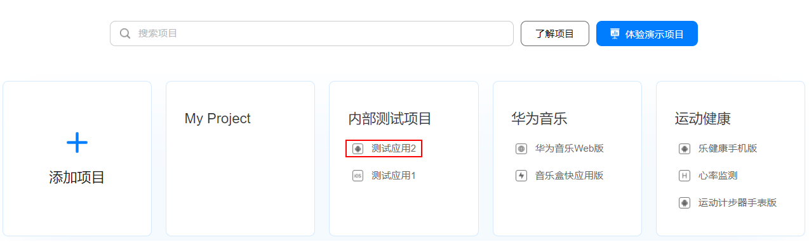
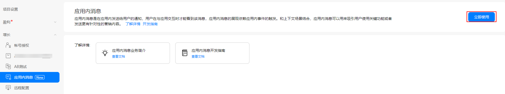
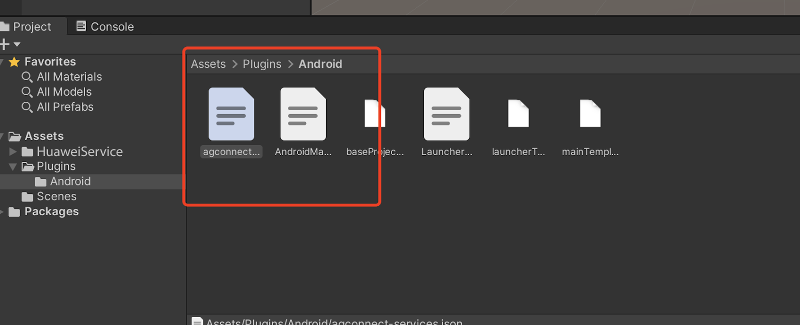
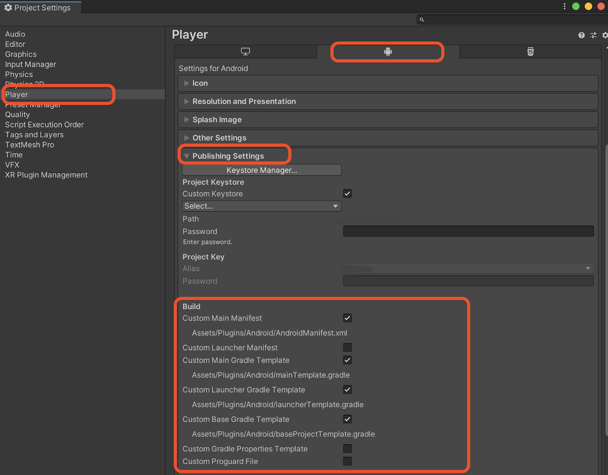

# 应用内消息（AGC）


## 业务介绍

通过AppGallery Connect（简称AGC）的[应用内消息服务](https://developer.huawei.com/consumer/cn/doc/development/AppGallery-connect-Guides/agc-appmessage-introduction)（App Messaging），您可以在用户使用应用时，向目标用户发送相关消息来鼓励用户使用应用的关键功能，从而吸引这些用户。例如，通过应用内消息，您可以鼓励用户订阅、给出某个关卡的通过提示，或者推荐某个餐厅活动。

您还可以定制这些消息的外观和发送方式，并定义事件以在适当的时候触发向用户发送消息。


### 消息类型

当前App Messaging支持弹框消息、图片消息和Banner消息，每种消息包含的内容和展示布局都有差异，您可以根据实际的需求，来创建具体的消息内容。

*   弹框消息类似于系统的弹框，包括图片、主题、正文和按钮（最多两个按钮）。如果您需要展示较多的消息内容，弹框消息无疑是一个很好的选择。

    

*   Banner消息类似于消息通知，显示在手机的顶部，包括Banner缩略图、正文和标题，点击Banner弹框可以跳转到指定设置的地址的页面。

    

*   图片消息只在界面上显示一张图片，比如您可以制作一个精美的活动海报作为图片，用户点击图片的时候跳转到相应的活动详情界面。

    

### 工作原理

App Messaging提供了客户端SDK，应用集成App Messaging SDK后，SDK会自动同步AGC服务端已经发布的应用内消息，通过消息的开始结束时间、触发事件等判断是否需要在应用内展示，达到消息展示条件时App Messaging SDK将在应用内使用默认布局向用户展示消息。开发者也可以使用App Messaging SDK提供的API自定义消息的展示布局。

用户查看到消息后可以点击消息跳转到创建消息时设置的跳转链接，App Messaging SDK最终将消息的展示结果上报给AGC。您可以在AGC上查看消息的展示、点击和事件转换情况。


### 版本更新说明

[https://developer.huawei.com/consumer/en/doc/development/AppGallery-connect-Guides/agc-appmessage-sdkchangenotes](https://developer.huawei.com/consumer/en/doc/development/AppGallery-connect-Guides/agc-appmessage-sdkchangenotes)


## 华为账号设置

### 集成SDK

在将App Messaging SDK集成到您的应用程序之前，您必须先集成AppGallery Connect SDK和插件。 有关详细信息，请参阅 [AppGallery Connect使用入门](https://developer.huawei.com/consumer/cn/doc/development/AppGallery-connect-Guides/agc-get-started)。

### 启用服务

1. 登录[AppGallery Connect网站](https://developer.huawei.com/consumer/cn/service/josp/agc/index.html)，点击 **我的项目** 。

2. 在项目列表中找到您的项目，在项目下的应用列表中选择需要启用App Messaging服务的应用。

   


3. 在左侧导航栏中点击 **增长 > 应用内消息**，进入App Messaging页面，点击 **立即启用**。

   **注意**：

   启用App Messaging时，您可能需要设置数据存储位置。 然后，`agconnect-services.json`中的设置将相应地自动更新。 如果在启用App Messaging时设置了数据存储位置，则需要再次下载`agconnect-services.json`文件，并在启用服务后将它集成到您的项目中。具体细节请参阅[添加配置文件](https://developer.huawei.com/consumer/cn/doc/development/AppGallery-connect-Guides/agc-get-started#addjson)。

   

4. 配置`agconnect-services.json`文件

   将`agconnect-services.json`文件复制到`Assets/Plugins/Android` 目录下。

   

## Unity项目设置

### 设置 unity 自定义Android manifest and gradle

1. 在player setting中将平台切换到android

2. 在player setting中启动custom manifest and gradle. 以下版本是unity **2019.4**。

   
   
   安卓的结构在 Unity **2019.3** 版本进行了更新, manifest 和 gradle 被分到了多个文件 (Main, Launcher & Base)。
   
3. 设置Package name

   在  **Edit -> Project Settings -> Player ->  Android(icon) -> other settings -> Identification -> Package Name** 中设置Package name。

   Package Name即为华为项目中应用程序的Package Name。
   
   

### 集成华为分析服务

要收集有关App Message事件的统计信息，您需要使用HUAWEI Analytics Kit。请参考[https://docs.unity.cn/cn/Packages-cn/com.unity.hms@1.2/manual/](https://docs.unity.cn/cn/Packages-cn/com.unity.hms@1.2/manual/)

### 集成应用内消息套件

1. 启用并对project gradle文件添加配置

   进入 **Edit -> Project Settings -> Player -> Android(icon) -> Publishing Settings -> Build**

   启用 **Custom Base Gradle Template** 并在文件中添加 AppGallery Connect plugin 和 Maven repository。路径是`Assets/Plugins/Android/baseProjectTemplate.gradle`。

   如果您的Unity版本低于**2019.2（含）**，则需要在 <code>MainGradleTemplate.gradle</code> 中添加配置。

   ```
       allprojects {
           buildscript {
               repositories {
   ...
                   maven { url 'https://developer.huawei.com/repo/' }
   ...
               }
   ...
           }
   ...
           repositories {
   ...
               maven { url 'https://developer.huawei.com/repo/' }
   ...
           }
       }
   ```

2. 启用并对app gradle文件添加配置

   进入 **Edit -> Project Settings -> Player -> Android(icon) -> Publishing Settings -> Build**，启用 **Custom Launcher Gradle Template** 并在 `launcherTemplate.gradle` 中添加依赖。路径为 `Assets/Plugins/Android/LauncherTemplate.gradle`。

    如果您的Unity版本低于**2019.2（含）**， 则需要在 <code>MainGradleTemplate.gradle</code>中添加配置。
   
   ```
     dependencies {
   …
        implementation "com.huawei.agconnect:agconnect-appmessaging:1.6.1.300"
   …
   }
   ```

3. 使用并对base gradle 文件进行以下配置

   进入 **Edit -> Project Settings -> Player -> Android(icon) -> Publishing Settings -> Build**，启用 **Custom Main Gradle Template** 并在 `mainTemplate.gradle` 中添加依赖。路径为 `Assets/Plugins/Android/mainTemplate.gradle.gradle`。

   如果您的Unity版本低于**2019.2（含）**， 则需要在 <code>MainGradleTemplate.gradle</code>中添加配置。

   ```
     dependencies {
   …
        implementation "com.huawei.agconnect:agconnect-appmessaging:1.6.1.300"
   …
   }
   ```

4. 自定义AndroidManifest并添加自定义`Activity.java`

   在`Assets/Plugins/Android/AndroidManifest.xml`中更新AndroidManifest以设置应用内消息
   
   ```
   <?xml version="1.0" encoding="utf-8"?>
   <!-- GENERATED BY UNITY. REMOVE THIS COMMENT TO PREVENT OVERWRITING WHEN EXPORTING AGAIN-->
   <manifest
      xmlns:android="http://schemas.android.com/apk/res/android"
      package="com.unity3d.player"
      xmlns:tools="http://schemas.android.com/tools">
   ...
      <application>
          <activity android:name="com.hms.hms_activity.HmsActivity"
                    android:theme="@style/UnityThemeSelector">
   …
          </activity>
   ...
      </application>
   </manifest>
   ```
   
   在`Assets/Plugins/Android/HmsActivity.java`中添加相应的`Activity.java`
   
   ```
   package com.hms.hms_activity;
   
   import android.os.Bundle;
   
   import com.huawei.hms.analytics.HiAnalytics;
   import com.huawei.hms.analytics.HiAnalyticsTools;
   import com.unity3d.player.UnityPlayerActivity;
   
   import com.huawei.agconnect.appmessaging.AGConnectAppMessaging;
   import com.huawei.hms.aaid.HmsInstanceId;
   
   public class HmsActivity extends UnityPlayerActivity {
     private AGConnectAppMessaging appMessaging;
   
      @Override
      protected void onCreate(Bundle savedInstanceState) {
          super.onCreate(savedInstanceState);
          HiAnalyticsTools.enableLog();
          HiAnalytics.getInstance(this);
          appMessaging = AGConnectAppMessaging.getInstance();
          appMessaging.setFetchMessageEnable(true);
          appMessaging.setDisplayEnable(true);
          appMessaging.setForceFetch();
      }
   }
   ```

## SDK集成开发


### 创建应用内消息

[https://developer.huawei.com/consumer/en/doc/development/AppGallery-connect-Guides/agc-appmessage-create](https://developer.huawei.com/consumer/en/doc/development/AppGallery-connect-Guides/agc-appmessage-create)


### 启用和禁用相应的应用消息传递

在“自定义AndroidManifest并添加自定义Activity.java”步骤之后，如果您在agc中添加应用程序消息，在打开应用程序时将显示该消息。


### 示例：强制获取应用消息

设置场景

1. 新建一个场景

   

2. 右键单击并选择UI，然后选择button:

   

3. 将Component添加到button并开发脚本：

   
   
   


4. 编辑脚本:

   
   
   双击脚本文件，然后您将在VS code中打开它
   
   
   
5. 定义接口

   ```
   using HuaweiService;
   ...
   public class ... 
   {
   ...
   public void ForceFetch()
   {
       var appMessaging = AGConnectAppMessaging.getInstance();
       appMessaging.setForceFetch();
   }
   ...
   }
   ```

   创建函数

6. 绑定脚本中的按钮和界面

   

   - 步骤1：点击“ +”添加功能

   - 步骤2：选择具有您要使用的界面的对应场景

   - 步骤3：单击“No Function”以选择脚本，然后选择相应的函数

       

### 演示项目

如果仍有不清楚的地方，可以参考github上的demo，对应的appMessaging用法是 [AppMessageTest.cs](https://github.com/Unity-Technologies/HuaweiServiceSample/blob/8a72eb9b34a2d6f1cfe3a8d3340dbf2c6ae1eb4b/Assets/HuaweiServiceDemo/Scripts/test/appmessage/AppMessageTest.cs ) 。

