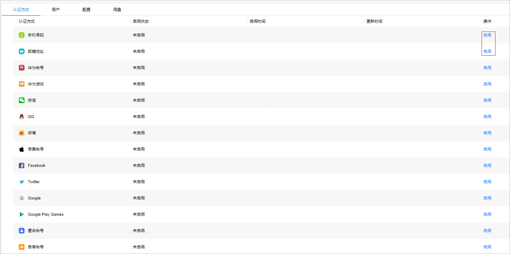
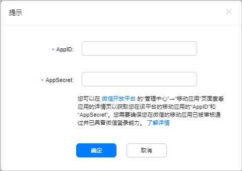
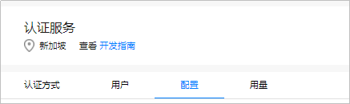
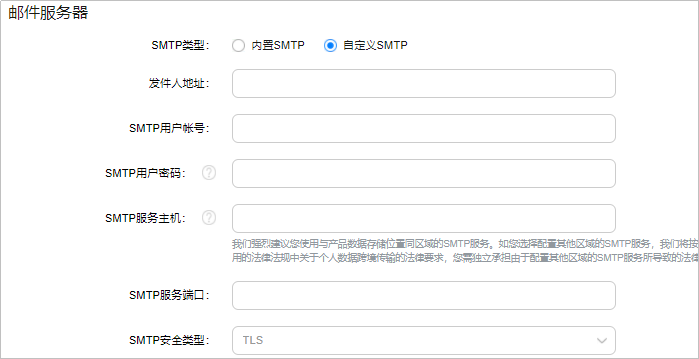
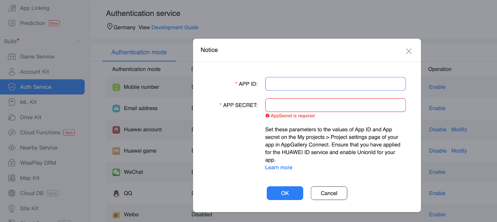
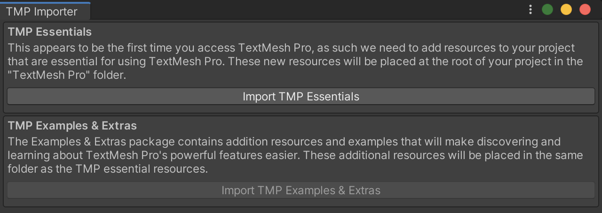
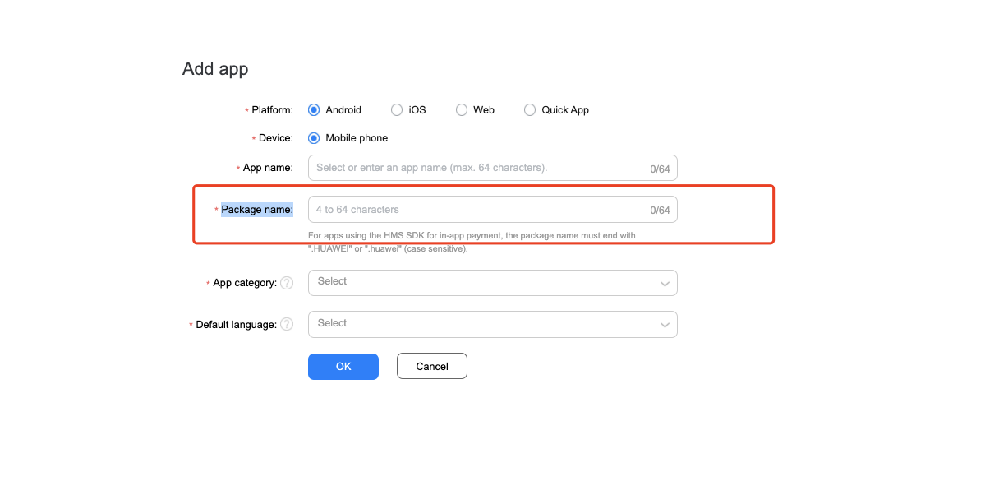
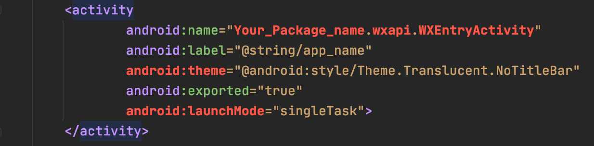

# 认证服务 (AGC)

## 业务介绍

华为 AppGallery Connect（简称 AGC）[认证服务](https://developer.huawei.com/consumer/cn/doc/development/AppGallery-connect-Guides/agc-auth-introduction-0000001053732605)，提供了云侧服务和 SDK，可以为应用快速构建安全可靠的用户认证系统，以便应用可以对用户进行身份认证。

认证服务支持多种认证方式，并与其他 Serverless 服务紧密集成，开发者可以通过简单的规则定义来保护用户的数据安全。

### 主要功能

使用认证服务可将以下的一种或多种认证方式集成到应用中，方便用户轻松快速地注册和登录应用。

- 自有帐号：用于支撑开发者已有的认证系统的接入，以便存量用户能够以安全的方式访问其他 Serverless 服务。

- 匿名帐号：可以支撑应用的游客访问方式。认证服务可以为游客分配用户标识，以便游客可以以安全的方式访问其他 Serverless 服务。游客后续可通过注册来转化为正式用户，并保留其原来的用户标识，以使其业务保持连贯。

- 第三方账号：通过对接第三方认证服务对用户进行身份认证。认证服务支持用户使用他们对应的帐号进行身份认证。目前支持以下几种第三方认证方式：

  - 华为帐号
  - 华为游戏帐号
  - 手机
  - 邮箱
  - 微信
  - 微博
  - QQ

  以下几种海外认证方式 **仅支持海外站点**，例如数据存储位置为德国、新加坡或俄罗斯时。其中 **Google 帐号** 和 **Google Play Game 帐号** 这两种认证方式仅支持在安装了 GMS（Google Mobile Services）服务的设备上使用。

  - Google
  - Google Play Game
  - Facebook
  - Twitter

### 工作原理

- 获取认证凭据

  认证方式不同，其认证凭据的获取方式也不相同。

  - 对于第三方帐号认证，认证凭据是第三方认证服务颁发的 OAuth 令牌。
  
  - 对于匿名帐号，认证凭据是认证服务 SDK 为该应用安装实例生成的唯一标识。
  
  - 对于自有帐号，认证凭据是开发者已有认证系统通过 Server SDK 生成 Token。

- 上报认证凭据

  应用将认证凭据通过认证服务 SDK 上报给认证服务。

- 验证认证凭据

  认证服务在云侧对认证凭据进行验证。

- 返回认证结果

  认证服务将认证结果返回给应用。此时应用可以访问和维护该用户的基本个人资料信息（昵称、头像），也可以访问和操作其他 Serverless 服务中的受安全规则保护的数据。

## 华为账号设置


### 环境准备

集成APM SDK前，请确认您的应用已集成AGC SDK和AGC插件，详细步骤请参考[AppGallery Connect服务使用入门](https://developer.huawei.com/consumer/cn/doc/development/AppGallery-connect-Guides/agc-get-started)。


### 启用服务

1. 登录[AppGallery Connect](https://developer.huawei.com/consumer/cn/service/josp/agc/index.html)，单击 **我的项目** 。

2. 在项目列表中找到需要开通认证服务的项目。

3. 单击 **构建 > 认证服务** ，进入认证服务的页面。如果首次使用认证服务，请点击 **立即开通** 开通服务。

   

4. 单击需要启动的认证方式所在行的 **启用**。

   

   多种认证方式在开启时需要在弹出框中配置应用所需的相关信息，相关认证方式和配置信息获取方式如下表所示。

   

   **注意**

   *星号标记的帐号类型仅在海外站点支持，当您选择数据存储位置为德国、新加坡或俄罗斯时可以使用这些认证方式。

   <table>
     <tr>
      <td><strong>认证方式</strong>
      </td>
      <td><strong>获取信息</strong>
      </td>
      <td><strong>获取方式</strong>
      </td>
     </tr>
     <tr>
      <td>华为账号
      </td>
      <td>App ID和APP SECRET
      </td>
      <td><a href="https://developer.huawei.com/consumer/en/doc/development/HMS-Guides/appgallery_queryappinfo">查看应用消息</a>
      </td>
     </tr>
     <tr>
      <td>华为游戏
      </td>
      <td>游戏公钥和游戏私钥
      </td>
      <td><a href="https://developer.huawei.com/consumer/en/doc/development/HMS-Guides/appgallery_querygameinfo">查询游戏服务信息</a>
      </td>
     </tr>
     <tr>
      <td>微信
      </td>
      <td>App ID和App Secret
      </td>
      <td><a href="https://open.weixin.qq.com/">微信接入指导</a>
      </td>
     </tr>
     <tr>
      <td>QQ
      </td>
      <td>App ID和AppKey
      </td>
      <td><a href="https://connect.qq.com/">QQ 接入指导</a>
      </td>
     </tr>
     <tr>
      <td>微博
      </td>
      <td>App Key和App Secret
      </td>
      <td><a href="https://open.weibo.com/index.php">微博接入指导</a>
      </td>
     </tr>
     <tr>
      <td>Facebook*
      </td>
      <td>应用编码和应用密钥
      </td>
      <td><a href="https://developers.facebook.com/docs/facebook-login/android">Facebook接入指导</a>
      </td>
     </tr>
     <tr>
      <td>Twitter*
      </td>
      <td>API key和API secret key
      </td>
      <td><a href="https://console.developers.google.com/apis/dashboard">Google接入指导</a>
      </td>
     </tr>
     <tr>
      <td>Google*
      </td>
      <td>客户端ID和客户端密钥
      </td>
      <td><a href="https://console.developers.google.com/apis/dashboard">Google接入指导</a>
      </td>
     </tr>
     <tr>
      <td>Google Play Games*
      </td>
      <td>客户端ID和客户端密钥
      </td>
      <td><a href="https://play.google.com/apps/publish">Google Play Games接入指导</a>
      </td>
     </tr>
     <tr>
      <td>自有账号
      </td>
      <td>签名公钥
      </td>
      <td><a href="https://developer.huawei.com/consumer/en/doc/development/AppGallery-connect-Guides/agc-auth-server-obtainjwt-0000001054048961">获取JWTs</a>
      </td>
     </tr>
   </table>

5. （可选）如果开启邮箱验证码认证，进入 **配置** 页签配置邮箱服务器相关信息。

   

   您可以选择使用“内置SMTP”或者“自定义SMTP”。

    *   使用“内置SMTP”时固定“发件人名称”为项目名称，“发件人地址”为_product_id_@mail.agconnect.link。

    *   使用“自定义SMTP”时配置如下信息：

        *   发件人地址：邮件发送方的邮箱地址

        *   SMTP用户帐号和SMTP用户密码：登录发送邮件服务器所需的用户名和密码

        *   SMTP服务主机：提供SMTP发件服务的主机名称，例如：qq的企业发送邮件服务主机为smtp.exmail.qq.com

        * SMTP服务端口和SMTP安全类型：端口和安全类型存在对应关系,TLS对应465端口
        
          

6. 配置json文件

   **注意：**

   拷贝agconnect-services.json文件到**Assets/Plugins/Android**目录下

   

## Unity项目设置

### 设置 unity 自定义Android manifest and gradle

1. 在player setting中将平台切换到android

2. 在player setting中启动custom manifest and gradle. 以下版本是unity 2019.4

   

   安卓的结构在 Unity **2019.3 **版本进行了更新, manifest 和 gradle 被分到了多个文件 (Main, Launcher & Base)。

3. 设置Package name

   在  **Edit -> Project Settings -> Player ->  Android(icon) -> other settings -> Identification -> Package Name** 中设置Package name。

   Package Name即为华为项目中应用程序的Package Name。
   
   

### 集成认证套件

#### 1. 启用并对project gradle文件添加配置

进入 **Edit -> Project Settings -> Player -> Android(icon) -> Publishing Settings -> Build**

启用 **Custom Base Gradle Template** 并在文件中添加 AppGallery Connect plugin 和 Maven repository。路径是`Assets/Plugins/Android/baseProjectTemplate.gradle`。

如果您的Unity版本低于**2019.2（含）**，则需要在 <code>MainGradleTemplate.gradle</code> 中添加工具和其他配置。

1. 转到 allprojects > repositories 库，然后为AppGallery Connect SDK配置Maven存储库地址。

   ```
    allprojects {
           buildscript {
               repositories {
   ...
                   maven { url 'https://developer.huawei.com/repo/' }
   ...
               }
   ...
           }
           
       }
   ```

2. 转到 buildscript > repositories，并为AppGallery Connect SDK配置Maven存储库地址。

   ```
       allprojects {
           buildscript {
               repositories {
   ...
                   maven { url 'https://developer.huawei.com/repo/' }
   ...
               }
   ...
           }
       }
   ```

3. 转到 buildscript > dependencies，并配置AppGallery Connect插件地址。

   ```
   buildscript {  
              dependencies {  
               classpath 'com.huawei.agconnect:agcp:1.4.2.301'
              }  
   }
   ```

#### 2. 启用并对launcher gradle文件进行以下配置

进入 **Edit -> Project Settings -> Player -> Android(icon) -> Publishing Settings -> Build**

启用 **Custom Launcher Gradle Template** 并在 `launcherTemplate.gradle` 中添加依赖。路径为 `Assets/Plugins/Android/LauncherTemplate.gradle`。

如果您的Unity版本低于**2019.2（含）**， 则需要在 <code>MainGradleTemplate.gradle</code>中添加配置。

1. 在文件头中应用插件：`'com.huawei.agconnect' `：

   ```
    ...
   apply plugin: 'com.huawei.agconnect'
   ```
   
2. 配置构建依赖

   ```
    dependencies { 
          ...     
       implementation 'com.huawei.agconnect:agconnect-core:1.4.2.301'
        implementation 'com.huawei.agconnect:agconnect-credential:1.6.1.300'
        implementation 'com.huawei.agconnect:agconnect-auth:1.6.1.300'
   ...    
   }
   ```

#### 3. 启用并对MainTemplate gradle文件进行以下配置

进入 **Edit -> Project Settings -> Player -> Android(icon) -> Publishing Settings -> Build**

启用 **Custom Main Gradle Template** 并在  `mainTemplate.gradle`中添加依赖。路径为 `Assets/Plugins/Android/mainTemplate.gradle`。

如果您的Unity版本低于**2019.2（含）**， 则需要在 <code>MainGradleTemplate.gradle</code>中添加配置。

1. 在文件头中应用插件：`'com.huawei.agconnect' `：

   ```
   ...
   apply plugin: 'com.huawei.agconnect'
   
   **APPLY_PLUGINS**
   ```

2. 配置依赖

   ```
    dependencies { 
          ...     
        implementation 'com.huawei.agconnect:agconnect-credential:1.6.1.300'
        implementation 'com.huawei.agconnect:agconnect-auth:1.6.1.300'
   ...    
   }
   ```

#### 4. 启用gradle属性

进入 **Edit -> Project Settings -> Player -> Android(icon) -> Publishing Settings -> Build**

启用 **Custom Gradle Properties Template** 并在 `gradleTemplate.gradle`中添加依赖. 路径为`Assets/Plugins/Android/gradleTemplate.gradle`.

添加

```
android.useAndroidX=true
android.enableJetifier=true
```

## SDK集成开发

### 集成第三方登录


#### 1. 扩展UnityActivity Java代码

如果您使用第三方登录，则应该遵循手册[扩展UnityActivity Java代码](https://docs.unity3d.com/cn/current/Manual/AndroidUnityPlayerActivity.html)，编写一个扩展UnityPlayerActivity的Java类。

1. 导入com.unity3d.player.UnityPlayerActivity,android.content.Intent, android.os.Bundle,androidx.annotation.Nullable 和 LoginManager服务

   ```
    ...
   import android.content.Intent;
   import com.hw.unity.Agc.Auth.ThirdPartyLogin.LoginManager;
   import com.unity3d.player.UnityPlayerActivity;
   import android.os.Bundle;
              import androidx.annotation.Nullable;
   ...     
   ```

2. 在onCreate函数中添加我们的登录服务函数LoginManager.getInstance().initialize(this)，并在onActivityResult函数中添加函数LoginManager.getInstance().onActivityResult(requestCode，resultCode，data)

   ```
    protected void onCreate( Bundle savedInstanceState) {
     ...
      LoginManager.getInstance().initialize(this);
   ...
   }
   
   @Override
   protected void onActivityResult(int requestCode, int resultCode, Intent data) {
     ...
      LoginManager.getInstance().onActivityResult(requestCode, resultCode, data);
   ...
   }
   ```
   
   以整个类为例
   
   ```
      package xxxxx;
            
      import android.content.Intent;
      import android.os.Bundle;
      import androidx.annotation.Nullable;
      import com.hw.unity.Agc.Auth.ThirdPartyLogin.LoginManager;
      import com.unity3d.player.UnityPlayerActivity;
      
      public class xxxxxx extends UnityPlayerActivity {
      
         @Override
         protected void onCreate(@Nullable Bundle savedInstanceState) {
             ...
             LoginManager.getInstance().initialize(this);
             ...
         }
      
         @Override
         protected void onActivityResult(int requestCode, int resultCode, @Nullable Intent data) 
      {
            ...
             LoginManager.getInstance().onActivityResult(requestCode, resultCode, data);
            ...
         }
      }
   ```
3. 将Java文件放入 `Assets/Plugins/Android`目录下

#### 2. 修改AndroidManifest.xml

1. 首先您需要启用`AndroidManifest.xml`

    进入 **Edit -> Project Settings -> Player -> Android(icon) -> Publishing Settings -> Build**，启用 **Custom Main Manifest** ，文件在 `Assets/Plugins/Android/AndroidManifest.xml`路径下

2. 修改Activity名称，您应该将com.unity3d.player.UnityPlayerActivity修改为您的Activity（您在[扩展UnityActivity Java代码](#heading=h.igtj2l4qcpp9)中创建的Java文件）

    ```
    <activity android:name="your activity"
             android:theme="@style/UnityThemeSelector">
       <intent-filter>
           <action android:name="android.intent.action.MAIN" />
           <category android:name="android.intent.category.LAUNCHER" />
       </intent-filter>
       <meta-data android:name="unityplayer.UnityActivity" android:value="true" />
    </activity>
    ```


3. 添加INTERNET用户权限

   ```
   <uses-permission android:name="android.permission.INTERNET"/>
   <application>
     ...
   </application>
   ```


#### 3. 第三方集成

如果要启用第三方登录，则首先需要[AppGallery Connect](https://developer.huawei.com/consumer/en/service/josp/agc/index.html)，启用提供程序并输入APP ID和APP Secret。




- **华为账号**

  请参阅[AppGallery Connect中的“配置应用程序信息”](https://developer.huawei.com/consumer/en/doc/development/HMSCore-Guides/config-agc-0000001050196065)，[集成HMS Core SDK](https://developer.huawei.com/consumer/en/doc/development/HMSCore-Guides/integrate-as-sdk-0000001050435953)，在`MainTemplate.gradle`中配置有关{version}的构建依赖项，您可以在AppGallery Connect中查找文档“[配置应用程序信息](https://developer.huawei.com/consumer/en/doc/development/HMSCore-Guides/config-agc-0000001050196065)”。

  ```
    dependencies { 
         ...     
      implementation 'com.huawei.hms:base:{version}'
      implementation 'com.huawei.hms:hwid:{version}'     
      implementation 'com.huawei.hms:game:{version}' 
  ...    
  }
  ```

- **华为GameCentre帐户**

  请参阅[AppGallery Connect中的“配置应用程序信息”](https://developer.huawei.com/consumer/en/doc/development/HMSCore-Guides/config-agc-0000001050196065)，[集成HMS Core SDK](https://developer.huawei.com/consumer/en/doc/development/HMSCore-Guides/integrate-as-sdk-0000001050435953)，在`MainTemplate.gradle`中配置有关{version}的构建依赖项，您可以在AppGallery Connect中查找文档“[配置应用程序信息](https://developer.huawei.com/consumer/en/doc/development/HMSCore-Guides/config-agc-0000001050196065)”。

  ```
    dependencies { 
         ...     
      implementation 'com.huawei.hms:base:{version}'
      implementation 'com.huawei.hms:hwid:{version}'     
      implementation 'com.huawei.hms:game:{version}' 
  ...    
  }
  ```

- 微信

  请参照[微信文档](https://developers.weixin.qq.com/doc/oplatform/Mobile_App/Resource_Center_Homepage.html?action=dir_list&t=resource%2Fres_list)。

  1) 在 `MainTemplate.gradle` 中配置构建依赖

  ```
    dependencies { 
        ...     
      api 'com.tencent.mm.opensdk:wechat-sdk-android-without-mta:+'
  ...    
  }
  ```

  添加如下依赖：

  ```
    dependencies { 
        ...     
    implementation 'com.squareup.retrofit2:retrofit:2.9.0'
  implementation 'com.squareup.retrofit2:converter-gson:2.1.0'
  ...    
  }
  ```

  2) 在Asset文件夹下创建一个 **Resources** 文件夹 (文件夹名必须为 **Resources**)，然后打开 **HuaweiService->Auth->WxApi->WXEntryActivity.txt** ，将这个文件拷贝到 **Resources** 文件夹下.。它将被自动打包到您的Android项目中。

  3) 在 `AndroidManifest.xml`中添加 `WXEntryActivity`，package name 和 **Edit -> Project Settings -> Player ->  Android(icon) -> other settings -> Identification -> Package Name** 一致

  ```
  <activity
         android:name="your package name.wxapi.WXEntryActivity"
         android:label="@string/app_name"
         android:theme="@android:style/Theme.Translucent.NoTitleBar"
         android:exported="true"
         android:launchMode="singleTask">
  </activity>
  ```

- Facebook

  1）请参照[Facebook文档](https://developers.facebook.com/docs/facebook-login/android)，在 `MainTemplate.gradle` 中配置构建依赖。

  ```
    dependencies { 
        ...     
      implementation 'com.facebook.android:facebook-android-sdk:4.20.0'
  ...    
  }
  ```

  2）在 `AndroidManifest.xml`中添加`meta-data`，将"Your Facebook APP id"和"Your_Facebook_Login_protocol_scheme" 替换为您的app_id和protocol scheme。
  
  ```
  <meta-data android:name="com.facebook.sdk.ApplicationId" android:value="Your Facebook APP id"/> 
  <activity android:name="com.facebook.FacebookActivity" android:configChanges= "keyboard|keyboardHidden|screenLayout|screenSize|orientation" android:label="@string/app_name" /> 
  <activity android:name="com.facebook.CustomTabActivity" android:exported="true"> <intent-filter> <action android:name="android.intent.action.VIEW" /> <category android:name="android.intent.category.DEFAULT" /> <category android:name="android.intent.category.BROWSABLE" /> <data android:scheme="Your_Facebook_Login_protocol_scheme" /> </intent-filter> 
  </activity>
  ```

- Twitter

  请参照[Twitter文档](https://developer.huawei.com/consumer/cn/doc/development/AppGallery-connect-Guides/agc-auth-android-twitter-0000001053492677)，在 `MainTemplate.gradle` 中配置构建依赖。
  
  ```
    dependencies { 
        ...     
      implementation 'com.twitter.sdk.android:twitter-core:3.3.0'
  ...    
  }
  ```

- 微博

  请参照[微博文档](https://developer.huawei.com/consumer/cn/doc/development/AppGallery-connect-Guides/agc-auth-android-weibo-0000001053732641)，下载SDK，并将此SDK放入 `Assets/Plugins/Android`目录。添加如下配置到 `baseProjectTmeplate.gradle`文件。
  
  ```
    buildscript {
     repositories {**ARTIFACTORYREPOSITORY**
         google()
         jcenter()
        ...
         maven { url "https://dl.bintray.com/thelasterstar/maven/" }
     }
  ```

- QQ

    请参照[QQ文档](https://developer.huawei.com/consumer/cn/doc/development/AppGallery-connect-Guides/agc-auth-android-qq-0000001053852632)，下载SDK，并将此SDK放入 `Assets/Plugins/Android`目录。添加如下Activity到  `AndroidManifest.xml`文件。

    ```
    <uses-permission android:name="android.permission.ACCESS_NETWORK_STATE" />
    <application>
    ...
     <activity
           android:name="com.tencent.tauth.AuthActivity"
           android:noHistory="true"
           android:launchMode="singleTask" >
        <intent-filter>
            <action android:name="android.intent.action.VIEW" />
            <category android:name="android.intent.category.DEFAULT" />
            <category android:name="android.intent.category.BROWSABLE" />
            <data android:scheme="Your tencent APP ID" />
        </intent-filter>
     </activity>
    <activity
          android:name="com.tencent.connect.common.AssistActivity"
       	 android:configChanges="orientation|keyboardHidden"
          android:screenOrientation="behind" 
    android:theme="@android:style/Theme.Translucent.NoTitleBar" />
    ...
    <application>
    ```

- Google

   请参照[Google文档](https://developer.huawei.com/consumer/cn/doc/development/AppGallery-connect-Guides/agc-auth-android-google-0000001053372648)，在  `MainTemplate.gradle` 中配置构建依赖。

  ```
  dependencies { 
        ...     
   implementation 'com.google.android.gms:play-services-auth:19.0.0'
  ...    
  }
  ```

- Google Play game

  1）请参照[Google Play Game文档](https://developer.huawei.com/consumer/cn/doc/development/AppGallery-connect-Guides/agc-auth-android-googlegame-0000001053253973)。并在 `MainTemplate.gradle` 中配置构建依赖项

  ```
  dependencies { 
        ...     
   implementation 'com.google.android.gms:play-services-games:17.0.0'
  ...    
  }
  ```

  2）在 `AndroidManifest.xml` 中添加以下Activity

  ```
  <meta-data
         tools:replace="android:value"
         android:name="com.google.android.gms.games.APP_ID"
         android:value="@string/google_game_app_id" />
  <meta-data
         tools:replace="android:value"
         android:name="com.google.android.gms.version"
         android:value="@integer/google_play_services_version" />
  ```

  3）在 `HuaweiService/Android/res/Auth/strings.xml` 中将Google游戏应用ID修改为您自己的ID

  ```
  <?xml version="1.0" encoding="utf-8"?>
  <resources>
      <string name="google_game_app_id">Replace me</string>
      <string name="facebook_app_id">Replace me</string>
      <string name="fb_login_protocol_scheme">Replace me</string>
      <string name="tecent_app_id">Replace me</string>
  
  </resources>
  ```

  注意：要登录Google游戏，您必须在 `strings.xml` 中修改 `google_game_app_id`，请勿直接在`AndroidManifest.xml`中输入您的游戏应用ID，会引发error。


#### 4. 登陆您的Android App

转到 **Edit->project settings->player->Android(icon)->Publishing Settings**，自定义您自己的密钥库，并确保您的Android应用密钥库与第三方平台标志相同。


### 如何从第三方获取Access Token信息

**注意**：您可以直接使用 `HuaweiOnsuccessListener` 和 `HuaweiOnFailureListener` 类，或者在需要使用回调函数时编写继承 `OnSuccessListener` 或 `OnFailureListener` 的新类。

#### 华为账户

1. 使用HUAWEI帐户启动登录，使用`LoginManager.getInstance().startHWID(OnSuccessListener sucessCallback，OnFailureListener failCallback)` 获取Token访问Json

2. 然后使用 `HWIDGetBack obj=JsonAuthorizeData<HWIDGetBack>.FromJson()` 解析Json以获取Token

   ```
   LoginManager.getInstance().startHWID(new HuaweiOnsuccessListener<string>((Token) =>{
   HWIDGetBack obj = JsonAuthorizeData<HWIDGetBack>.FromJson(Token.ToString());
   	AGConnectAuthCredential credential =HwIdAuthProvider.credentialWithToken(obj.Token);
   	AGConnectAuth.getInstance().signIn(credential)
              .addOnSuccessListener(new HuaweiOnsuccessListener<SignInResult>((signresult) =>
              {
                  ...
                     
              }))
              .addOnFailureListener(new HuaweiOnFailureListener((exception) =>
              {
                  ...
                     
              }));
      }), new HuaweiOnFailureListener((exception)=>
      {
          ...
   
      }));
   ```

#### 华为游戏账户

1. 使用华为帐号登录，使用`LoginManager.getInstance().startHWGame(OnSuccessListener sucessCallback，OnFailureListener failCallback)` 以获取Token访问Json

2. 然后使用 `HWGameGetBack player=JsonAuthorizeData<HWGameGetBack>.FromJson()` 解析Json以获取玩家信息。

   ```
   LoginManager.getInstance().startHWGame(new HuaweiOnsuccessListener<string>((Token) =>{
   
      HWGameGetBack player=JsonAuthorizeData<HWGameGetBack>.FromJson(Token
      );
      AGConnectAuthCredential credential = new HWGameAuthProvider.Builder()
          .setPlayerSign(player.PlayerSign)
          .setPlayerId(player.PlayerId)
          .setDisplayName(player.DisplayName)
          .setImageUrl(player.ImageUrl)
          .setPlayerLevel(player.PlayerLevel)
          .setSignTs(player.SignTs)
          .build();
   
      AGConnectAuth.getInstance().signIn(credential)
          .addOnSuccessListener(new HuaweiOnsuccessListener<SignInResult>((signresult) =>
          {
            ...
          })).addOnFailureListener(new HuaweiOnFailureListener((exception) =>
          {
            ...
          }));
   }), new HuaweiOnFailureListener((exception)=>
   {
         ...
   }));
   ```

#### 微信

1. 使用微信登录，使用LoginManager.getInstance().startWechatLogin（string APP_ID，string APP_SECRET，OnSuccessListener successCallback，OnFailureListener failCallback），然后获取Token和openID Json，

2. 使用 `WechatGetBack obj= JsonAuthorizeData<WechatGetBack>.FromJson()` 解析Json以获取令牌和openID

   ```
   LoginManager.getInstance().startWechatLogin("Your APP ID", "Your APP Secret",
      new HuaweiOnsuccessListener<string>((Token) =>
      {
          WechatGetBack obj=JsonAuthorizeData<WechatGetBack>.FromJson(Token.ToString());
          AGConnectAuthCredential credential =
              WeixinAuthProvider.credentialWithToken(obj.Token, obj.OpenId);
          AGConnectAuth.getInstance().signIn(credential)
              .addOnSuccessListener(new HuaweiOnsuccessListener<SignInResult>((signresult) =>
              {
                  ...
              })).addOnFailureListener(new HuaweiOnFailureListener((exception) =>
              {
                  ...
              }));
      }), new HuaweiOnFailureListener((exception)=>
      {
          ...
      }));
   ```

#### Facebook

1. 使用Facebook帐户登录，使用LoginManager.getInstance().startFacebook（string APP_ID，OnSuccessListener successCallback，OnFailureListener failCallback）获取访问令牌Json

2. 使用 FacebookGetBack obj=JsonAuthorizeData<FacebookGetBack>.FromJson(JsonObject.ToString()) 解析Token

   ```
   LoginManager.getInstance().startFacebook("Your App Id",new HuaweiOnsuccessListener<string>((JsonObject) =>
   {
      FacebookGetBack obj=JsonAuthorizeData<FacebookGetBack>.FromJson(JsonObject.ToString());
   
      AGConnectAuthCredential credential = FacebookAuthProvider.credentialWithToken(obj.Token);
   
      AGConnectAuth.getInstance().signIn(credential)
          .addOnSuccessListener(new HuaweiOnsuccessListener<SignInResult>((signresult) =>
          {
              ...
          })).addOnFailureListener(new HuaweiOnFailureListener((exception) =>
          {
              ...
          }));
   }), new HuaweiOnFailureListener((exception)=>
   {
      ...
   }));
   ```

#### Twitter

1. 使用Twitter帐户登录，使用LoginManager.getInstance().startTwitter（string App_id，string App_secret，OnSuccessListener successCallback，OnFailureListener failCallback）获取Token访问Json，

2. 用 `TwitterGetBack obj=JsonAuthorizeData<TwitterGetBack>.FromJson(JsonObject.ToString())` 解析Json

   ```
   LoginManager.getInstance().startTwitter("Your APP ID", "Your APP secret",
      new HuaweiOnsuccessListener<string>((Token) =>
      {
          TwitterGetBack obj=JsonAuthorizeData<TwitterGetBack>.FromJson(Token.ToString());
          AGConnectAuthCredential credential =
              TwitterAuthProvider.credentialWithToken(obj.Token, obj.Secret);
   
          AGConnectAuth.getInstance().signIn(credential)
              .addOnSuccessListener(new HuaweiOnsuccessListener<SignInResult>((signresult) =>
              {
                  ...
              })).addOnFailureListener(new HuaweiOnFailureListener((exception) =>
              {
                  ...
              }));
      }), new HuaweiOnFailureListener((exception)=>
      {
          ...
      }));
   ```

#### 微博

1. 使用Weibo帐户登录，使用LoginManager.getInstance().startWeibo（string APP_ID，OnSuccessListener successCallback，OnFailureListener failCallback）获取Token和Uid Json，

2. 使用 WeiboGetBack obj=JsonAuthorizeData<WeiboGetBack>.FromJson(JsonObject.ToString()) 解析Json

   ```
   LoginManager.getInstance().startWeibo("Your APP ID",
      new HuaweiOnsuccessListener<string>((JsonObject) =>
      {
          WeiboGetBack obj=JsonAuthorizeData<WeiboGetBack>.FromJson(JsonObject.ToString());
   
          AGConnectAuthCredential credential =
              WeiboAuthProvider.credentialWithToken(obj.Token, obj.Uid);
   
          AGConnectAuth.getInstance().signIn(credential)
              .addOnSuccessListener(new HuaweiOnsuccessListener<SignInResult>((signresult) =>
              {
                  ...
              })).addOnFailureListener(new HuaweiOnFailureListener((exception) =>
              {
                  ...
              }));
      }), new HuaweiOnFailureListener((exception)=>
      {
          ...
      }));
   ```

#### QQ

1. 使用QQ帐户登录，使用 LoginManager.getInstance().startQQ（string app_id，OnSuccessListener successCallback，OnFailureListener failCallback）获取Token和OpenId Json

2. QQGetBack QQGetBack obj=JsonAuthorizeData<QQGetBack>.FromJson(Token.ToString()) 以解析Json

   ```
   LoginManager.getInstance().startQQ("Your APP ID",
      new HuaweiOnsuccessListener<string>((JsonObject) =>
      {
          QQGetBack obj=JsonAuthorizeData<QQGetBack>.FromJson(JsonObject.ToString());
          AGConnectAuthCredential credential =
              QQAuthProvider.credentialWithToken(obj.Token, obj.OpenId);
          AGConnectAuth.getInstance().signIn(credential)
              .addOnSuccessListener(new HuaweiOnsuccessListener<SignInResult>((signresult) =>
              {
                  ...
              })).addOnFailureListener(new HuaweiOnFailureListener((exception) =>
              {
                  ...
              }));
      }), new HuaweiOnFailureListener((exception)=>
      {
          ...       
      }));
   ```

#### 谷歌

1. 使用Google帐户登录，使用LoginManager.getInstance().startGoogle（string client_id，OnSuccessListener successCallback，OnFailureListener failCallback）获取Token Json

2. GoogleGetBack GoogleGetBack obj=JsonAuthorizeData<GoogleGetBack>.FromJson(string json) 以解析json

   ```
   LoginManager.getInstance().startGoogle("Your client id",
   new HuaweiOnsuccessListener<string>((JsonObject) =>
   {
      GoogleGetBack obj=JsonAuthorizeData<GoogleGetBack>.FromJson(JsonObject.ToString());
      AGConnectAuthCredential credential =
          GoogleAuthProvider.credentialWithToken(obj.Token);
      AGConnectAuth.getInstance().signIn(credential)
          .addOnSuccessListener(new HuaweiOnsuccessListener<SignInResult>((signresult) =>
          {
   
          })).addOnFailureListener(new HuaweiOnFailureListener((exception) =>
          {
   
          }));
   }), new HuaweiOnFailureListener((exception)=>
   {
         
   }));
   ```

#### Google Play game

1. 使用Google Play游戏帐户登录，使用LoginManager.getInstance().startGooglePlay（string client_id，OnSuccessListener successCallback，OnFailureListener failCallback）获取Token Json

2. GooglePlayGetBack GooglePlayGetBack obj=JsonAuthorizeData<GooglePlayGetBack>.FromJson(string json) 以解析json

   ```
   LoginManager.getInstance().startGooglePlay("Your client id",
   new HuaweiOnsuccessListener<string>((JsonObject) =>
   {
      GooglePlayGetBack obj=JsonAuthorizeData<GooglePlayGetBack>.FromJson(JsonObject.ToString());
      AGConnectAuthCredential credential =
          GoogleAuthProvider.credentialWithToken(obj.Token);
      AGConnectAuth.getInstance().signIn(credential)
          .addOnSuccessListener(new HuaweiOnsuccessListener<SignInResult>((signresult) =>
          {
           ...
          })).addOnFailureListener(new HuaweiOnFailureListener((exception) =>
          {
           ...
          }));
   }), new HuaweiOnFailureListener((exception)=>
   {
         
   }));
   ```

### 演示文件

注意：验证演示代码在HuaweiServiceDemo-> HuaweiAuthDemo中


#### 1. 导入TMP

如果使用 AgcUnityAuth.unity demo，请单击 **Import TMP Essentials**。



#### 2. 添加agconnect-services.json

从AppGallery Connect下载 `agconnect-services.json` 并将其放到 `Assets/Plugins/Android` 文件夹中（替换原始文件）。


#### 3. 更换为您自己的ID

修改 `HuaweiService/Android/res/Auth/strings.xml`，请将 `google_game_app_id`，`facebook_app_id`，`fb_login_protocol_scheme`，`tecent_app_id`替换为您自己的ID。

```
<?xml version="1.0" encoding="utf-8"?>
<resources>
    <string name="google_game_app_id">Replace me</string>
    <string name="facebook_app_id">Replace me</string>
    <string name="fb_login_protocol_scheme">Replace me</string>
    <string name="tecent_app_id">Replace me</string>

</resources>
```

#### 4. 修改您的包名

确保您的软件包名称与[AppGallery Connect](https://developer.huawei.com/consumer/en/service/josp/agc/index.html)和其他第三方开发者平台中的名称相同（**Edit -> Project Settings -> Player ->  Android(icon) -> other settings -> Identification -> Package Name**, 包名是华为项目中的应用程序的包名。）



#### 5. 在演示中替换App ID和App Secret

转到 `HuaweiAuthDemo-> panel-> DetailLogin.cs`，将您的Appid和AppSecret替换为所需的第三方登录名。（替换字符串“ Replace me”）


#### 6. 在AndroidManifest.xml中修改Activity名称

如果使用微信登录，请修改`AndroidManifest.xml`（`plugins/Android/AndroidManifest.xml`），将 "Your_Package_name"替换为您自己的Package名称。



#### 7. 生成 JWToken

如果在演示中使用“自助登录”，则首先需要生成JWT Token（如果使用我们的生成工具，Token的有效时间为48小时），或者可以由您自己的认证服务器生成JWT。

1. 请参阅[下载身份验证凭据](https://developer.huawei.com/consumer/cn/doc/development/AppGallery-connect-Guides/agc-get-started-server#initsdk)，在[AppGallery Connect](https://developer.huawei.com/consumer/cn/service/josp/agc/index.html)中启用服务并下载agc-apiclient凭据文件。

2. 我们的工具在HuaweiServiceDemo-> HuaweiAuthDemo-> GenJWTokenGradle.zip中，解压缩，进入该目录运行命令 

   `./gradlew run--args ='Your_Credential_file_path Need_Generate _RSA_Pair Your_user_id Your_display_name'`

   **注意**：第二个参数（1表示需要生成新的RSA密钥对，0表示不需要生成新的RSA密钥对）

   **例如**：`./gradlew run --args ='/ Users / XXX / Desktop / agc-apiclient-507787480892715392-6901174904591909948.json 1 123321 zzz'`

3. 将公钥复制到您的 [AppGallery Connect](https://developer.huawei.com/consumer/en/service/josp/agc/index.html)，然后转到HuaweiServiceDemo-> HuaweiAuthDemo-> panel-> DetailLogin.cs，将JWT Token复制到startSelf_own Token。

#### 8. 登陆您的Android APP

转到 **Edit->project settings->player->Android(icon)->Publishing Settings**，自定义您自己的密钥库，并确保您的Android应用密钥库与第三方平台标志相同。
