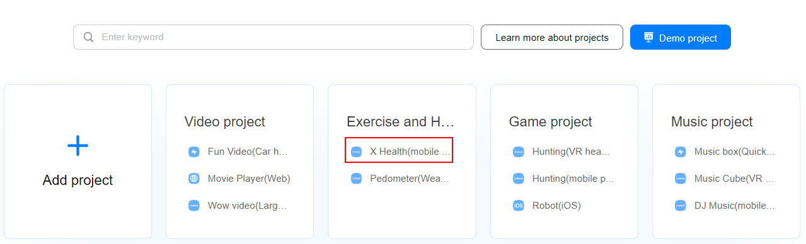
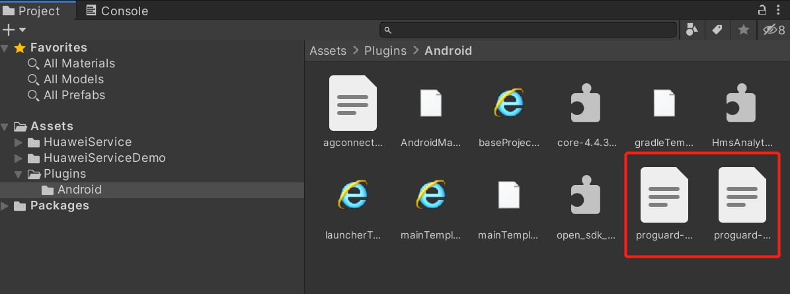
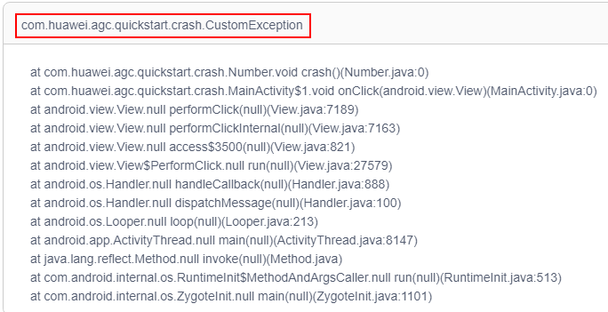
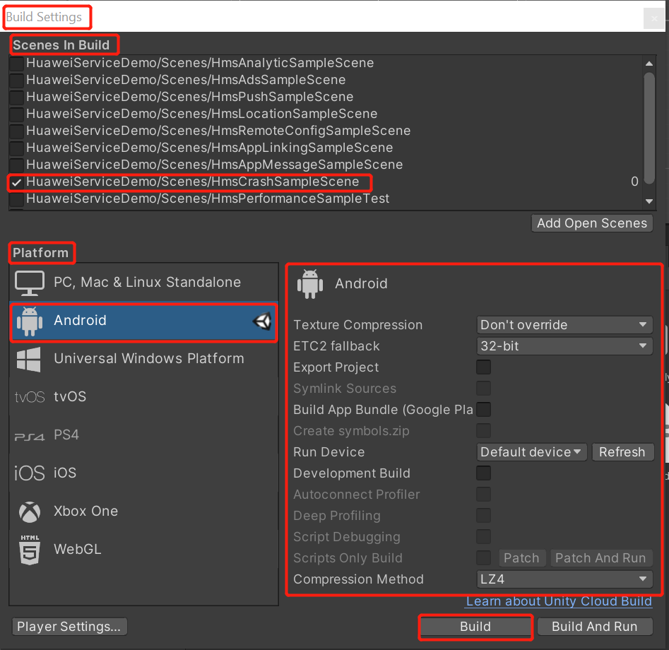
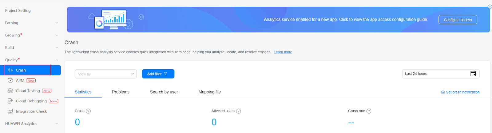
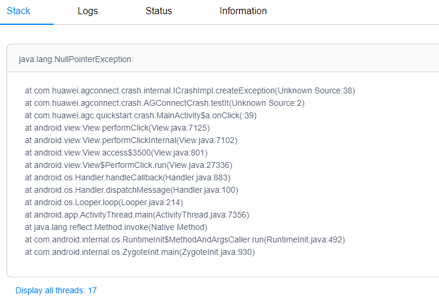
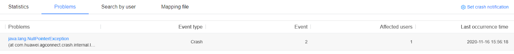
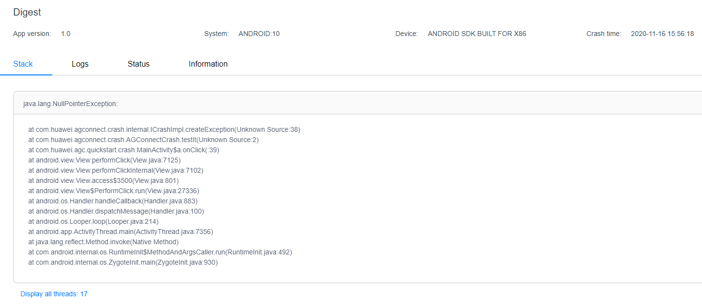
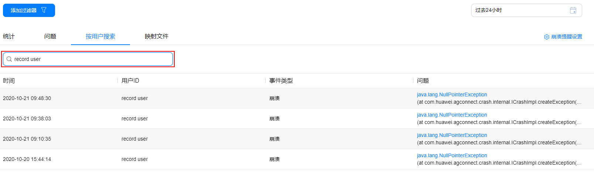
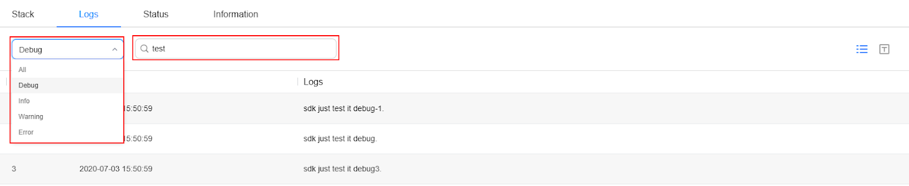

# 崩溃服务（AGC）


## 业务介绍

华为AppGallery Connect（简称AGC）[崩溃服务](https://developer.huawei.com/consumer/en/doc/development/AppGallery-connect-Guides/agc-crash-introduction)是一种轻量级的崩溃分析服务，提供了一种可快速集成到您的应用中的Crash SDK，而无需进行编程。

频繁的崩溃给用户带来非常糟糕的体验，将直接影响到用户对应用的评价。较高的崩溃率长时间得不到解决将可能阻碍您的商业成功。

应用发布后，您可能并不知道用户在什么场景下遇到了什么崩溃问题。少量用户可能会通过应用市场评论等方式反馈崩溃问题，您要解决这些崩溃问题往往需要获取崩溃发生时的应用、操作系统、设备、堆栈等信息，而向用户获取这些信息困难重重。

您可以通过崩溃报告了解您的应用崩溃情况，我们提供最近24小时的实时报告，您可以实时监测应用质量。

另外，崩溃服务会将崩溃问题自动分类，您可以通过各崩溃问题的指标数据判断优先解决哪些问题。您还可以查看某个崩溃问题的数据，分析崩溃发生在哪个应用版本，哪个Android系统等。您可以具体查看某次崩溃发生时应用、操作系统、设备的相关信息，以及崩溃堆栈。以上这些数据报告和信息将会帮助您快速、高效的定位、解决崩溃问题。

崩溃服务还可以实时检测重大崩溃问题，您开启崩溃提醒后AppGallery Connect可以在发生重大崩溃问题时向您发送邮件提醒。

### 典型应用场景

#### 定位应用/游戏的闪退问题

应用质量对于用户体验至关重要，如果应用发生闪退等问题，可能直接导致应用评分下降。通过崩溃服务订阅崩溃提醒，当应用发生崩溃事件时及时得到通知并利用崩溃服务提供的丰富的崩溃问题的详细信息进行处理，可以帮助您分析问题根因，快速修复，提升应用质量和用户体验。


### 主要功能


<table>
  <tr>
   <td><strong>主要功能</strong>
   </td>
   <td><strong>功能描述</strong>
   </td>
  </tr>
  <tr>
   <td>可视化实时报告
   </td>
   <td>无需编写任何代码，即可自动生成包含堆栈及其他相关信息的可视化数据报告，助您快速解决崩溃问题。
   </td>
  </tr>
  <tr>
   <td>可自定义报告
   </td>
   <td>除自动生成的报告内容外，还提供了用户标识符、日志和键值对三种机制增强报告，助您解决崩溃问题更快速、准确。
   </td>
  </tr>
  <tr>
   <td>智能分类
   </td>
   <td>大量崩溃会按照异常类型、代码位置自动分类，您可以根据对用户的影响程度对崩溃进行排序，确定优先级别。
   </td>
  </tr>
  <tr>
   <td>实时监测和提醒
   </td>
   <td>分钟级实时报告让您可以实时跟踪应用稳定性。同时，当发生重大崩溃时，系统也会及时提醒您。
   </td>
  </tr>
  <tr>
   <td>支持NDK崩溃
   </td>
   <td>如果应用中包含原生库，您只需要增加崩溃SDK中的NDK包，即可监测原生库中发生的崩溃，对游戏类应用非常有帮助。
   </td>
  </tr>
  <tr>
   <td>支持跨平台
   </td>
   <td>支持Android、iOS平台，并提供<a href="https://flutter.dev/docs/get-started/install">Flutter</a>、<a href="https://cordova.apache.org/#getstarted">Cordova</a>、<a href="https://reactnative.dev/docs/getting-started">React Native</a>、<a href="https://ionicframework.com/docs/appflow/quickstart">lonic</a>在内的常用跨平台框架插件，简化集成。
   </td>
  </tr>
</table>

## 华为账号设置

### 入门指南

Crash服务提供了Crash SDK。使用Crash服务之前，您需要将Crash SDK集成到您的应用中。在测试阶段，您可以有意触发崩溃并检查集成的Crash SDK是否可以报告崩溃数据。

集成Crash SDK后，您的应用程序崩溃时可以自动向AppGallery Connect报告相关数据。您可以根据报告的信息来分析崩溃原因。本节介绍了启用崩溃服务和集成崩溃SDK的步骤。

### 集成 AppGallery Connect SDK

您需要先集成AppGallery Connect SDK和插件，然后再将Crash SDK集成到您的应用程序中。详细信息请参阅[AppGallery Connect服务入门](https://developer.huawei.com/consumer/en/doc/development/AppGallery-connect-Guides/agc-get-started)。

### 启用崩溃服务

首先，您需要根据文档创建一个项目和应用程序，然后配置`agconnect-services.json`文件。

1. 登录[ AppGallery Connect 网站](https://developer.huawei.com/consumer/cn/service/josp/agc/index.html)，选择 **我的项目**。

2. 在项目列表中找到您的项目，在项目下的应用列表中选择您需要启用崩溃服务的应用。

      

3. 点击 **质量 > 崩溃**，进入崩溃服务的页面。

   **说明**：

   使用崩溃服务需启用华为分析服务。如果您尚未启用，请点击 **启动分析服务**，或前往华为分析服务进行启动，具体操作请参考[开通华为分析](https://developer.huawei.com/consumer/cn/doc/development/HMSCore-Guides/service-enabling-0000001050745155)。

   

   **注意**：

   启用服务时，如果尚未设置数据存储位置，设置后会刷新`agconnect-services.json`文件里的配置。因此，您需要重新下载`agconnect-services.json`文件并集成到您的工程中，具体操作参见[添加配置文件](https://developer.huawei.com/consumer/cn/doc/development/AppGallery-connect-Guides/agc-get-started#addjson)。

4. 配置json文件。

   将`agconnect-services.json`文件拷贝到`Assets/Plugins/Android`文件夹下。

   

## Unity项目设置

### 设置 unity Custom Android gradle and Proguard

1. 在player setting中将平台切换到android

2. 在player setting中启动custom gradle and Proguard。将 **Minify > release** 设置为Proguard，以下版本是unity **2019.4**。

   

   安卓的结构在 Unity **2019.3 **版本进行了更新, manifest 和 gradle 被分到了多个文件 (Main, Launcher & Base)。

3. 设置Package name

   在  **Edit -> Project Settings -> Player ->  Android(icon) -> other settings -> Identification -> Package Name** 中设置Package name。

   Package Name即为华为项目中应用程序的Package Name。

   


### 集成华为分析服务

为了上报崩溃事件，您需要集成Analytics Kit，具体操作参见[https://docs.unity.cn/cn/Packages-cn/com.unity.huaweiservice@1.3/manual/](https://docs.unity.cn/cn/Packages-cn/com.unity.huaweiservice@1.3/manual/)。


### 集成崩溃服务

1. 启用并对project gradle文件添加配置

   进入 **Edit -> Project Settings -> Player -> Android(icon) -> Publishing Settings -> Build**

   启用 **Custom Base Gradle Template** 并在文件中添加 AppGallery Connect plugin 和 Maven repository。路径是`Assets/Plugins/Android/baseProjectTemplate.gradle`。

   如果您的Unity版本低于**2019.2（含）**，则需要在 <code>MainGradleTemplate.gradle</code> 中添加配置。
   
   ```
       allprojects {
           buildscript {
               repositories {
   ...
                   maven { url 'https://developer.huawei.com/repo/' }
   ...
               }
               dependencies{
                    classpath 'com.huawei.agconnect:agcp:1.6.1.300'
   …        }
   
           }
   ...
           repositories {
   ...
               maven { url 'https://developer.huawei.com/repo/' }
   ...
           }
       }
   ```

2. 启用并对app gradle文件添加配置

   进入 **Edit -> Project Settings -> Player -> Android(icon) -> Publishing Settings -> Build**，启用 **Custom Launcher Gradle Template** 并在 `launcherTemplate.gradle` 中添加依赖。路径为 `Assets/Plugins/Android/LauncherTemplate.gradle`。
   
   如果您的Unity版本低于**2019.2（含）**， 则需要在 <code>MainGradleTemplate.gradle</code>中添加配置。
   
   ```
     dependencies {
   …
      implementation 'com.huawei.agconnect:agconnect-crash:1.6.1.300'
   ...
   }
   ```
   
   您需要按如下所示配置`launcherTemplate.gradle`。
   
   ```
   apply plugin: 'com.huawei.agconnect' 
   
    dependencies {
   …
      //AGC SDK and Crash SDK integrated configuration
      implementation 'com.huawei.hms:hianalytics:5.0.5.300'
      implementation 'com.huawei.agconnect:agconnect-crash:1.6.1.300'
      implementation 'com.huawei.agconnect:agconnect-core:1.4.2.300' 
   ...
   }
   android {
   …
      buildTypes{
            Release{
                 //The following configuration is used for code obfuscation
                 minifyEnabled true
                 useProguard true
                 proguardFiles getDefaultProguardFile('proguard-android.txt'),
                 'Proguard-unity.txt','proguard-user.txt'
                 //The following is the signingConfig configuration for build release
                  signingConfig signingConfigs.release
             }
          }
   }
   ```

3. 创建proguard文件

   如下创建和自定义 `proguard-unity.txt` 和`proguard-user.txt`。
   ```
   -keepattributes *Annotation*
   -keepattributes SourceFile,LineNumberTable
   -keep public com.crashlytics.** { *; }
   ```

   

## SDK集成开发

### 设置场景

1. 新建一个场景

   

2. 右键单击并选择UI，然后选择按钮:

   

3. 将组件添加到按钮并开发脚本：

   

   

4. 编辑脚本:

   

    双击脚本文件，您将在VS code中打开它。

   

5. 定义代码

   ```
    void Start()
    {
      
    }
    
    // Update is called once per frame
    void Update()
    {
      
    }
    
    public void aaronButtonTest()
    {
       AGConnectCrash.getInstance().setUserId("TestUserId");
    }
    
   ```

   创建函数

6. 绑定脚本中的按钮和界面

   

   - 步骤1：点击“ +”添加功能
   
   - 步骤2：选择具有您要使用的界面的对应场景
   
   - 步骤3：单击“No Function”以选择脚本，然后选择相应的函数

    

### 获取经过反混淆处理的崩溃报告

当使用ProGuard或DexGuard在编译时将代码中的类名、字段和方法等混淆处理为不可阅读的代码时，您可以通过将混淆Mapping文件上传到AGC的方式获取经过反混淆处理的崩溃报告。

如上所述，在`launcherTemplate.gradle`中设置ProGuard代码混淆配置，然后在项目设置中设置代码混淆设置。构建项目后，我们将在apk的同一目录中获得一个`mapping.txt`文件。

   


您可以像这样上传您的`mapping.txt`文件。

1. 在您的工程目录中找到您的混淆Mapping文件。

2. 登录[AppGallery Connect网站](https://developer.huawei.com/consumer/cn/service/josp/agc/index.html)，点击 **我的项目**。

3. 在项目列表中找到您的项目，在项目下的应用列表中选择您的应用。

4. 点击 **质量 > 崩溃**，进入崩溃服务的页面。

5. 选择 **映射文件 > 混淆Mapping文件**，在需要上传混淆mapping文件的应用版本中点击 **上传**。

   

6. 点击对话框中的 **上传** 按钮，上传混淆Mapping文件。

   **注意：**<br>
   此方式支持上传zip和txt格式的混淆Mapping文件。
   
    *   zip大小不超过5MB，zip中的混淆Mapping文件必须为txt格式，必须放在zip包的根目录下，且根目录下只能包含1个txt的混淆Mapping文件。解压后的大小不超过40MB和60万行。

    *   txt大小不超过10MB和60万行，超过10MB需压缩后上传，两次上传的间隔应大于60秒。

下图展示了反混淆处理前后的崩溃报告。

还原前：

   


还原后：

   

### **如何在Unity中构建apk？**

在项目设置中进行设置后，在 **File->Build Settings->Scenes In Build** 中选中要构建的场景，在 **Platform** 中选择 **Android**。

如果要构建发行版apk，请进行如下设置。



如果要构建调试apk，请进行如下设置。


然后点击 **Build**。


### 分析崩溃问题

在发生崩溃后，崩溃服务会将崩溃数据上报到AGC，您可以在AGC中查看崩溃问题的详细信息，分析崩溃发生的原因。本章节以测试崩溃时制造的崩溃为例，介绍崩溃问题的基本定位方法。


#### 前提条件

1. 您需要在AGC控制台[启用崩溃服务](https://developer.huawei.com/consumer/cn/doc/development/AppGallery-connect-Guides/agc-crash-getstarted-0000001055260538#ZH-CN_TOPIC_0000001055260538__section0780913181619)。

2. 您需要打开崩溃服务开关并上报至少一次崩溃数据，详情请参见[测试崩溃实现](https://developer.huawei.com/consumer/cn/doc/development/AppGallery-connect-Guides/agc-crash-test-0000001055420516)。


#### 进入崩溃服务页面

1. 登录[AppGallery Connect网站](https://developer.huawei.com/consumer/cn/service/josp/agc/index.html)，点击 **我的项目**。

2. 在项目列表中找到您的项目，在项目下的应用列表中选择您的应用。

3. 点击 **质量 > 崩溃**，进入崩溃服务页面。

   

#### 打开崩溃问题详情

1. 在崩溃服务的 **统计** 页面，您可以通过添加过滤器和设置右上角的时间选择器过滤您的崩溃数据。例如，过去24小时内您曾在多个设备上点击按钮测试崩溃，便可以在统计页面上选择浏览过去24小时内的崩溃数据，确认您测试时的崩溃是否已经上报。

   

2. 确认崩溃已经上报后，您可以选择 **问题**，通过设置时间选择器查看指定时间范围内该应用累计发生的崩溃问题及其次数。例如，您的崩溃是过去24小时内发生的，您便可以选择浏览“过去24小时”的崩溃问题。根据发生时间和次数，您可以找到您测试崩溃时的崩溃问题。如下图中， **java.lang.NullPointerException** 即为测试崩溃时制造的崩溃问题。点击问题名称 **java.lang.NullPointerException** 进入问题详情页面。

   

   **注意**：
   关于崩溃服务页面的更多操作详情，请参见[崩溃统计概览](https://developer.huawei.com/consumer/cn/doc/development/AppGallery-connect-Guides/agc-crash-appendix-statistics-0000001058516327#ZH-CN_TOPIC_0000001058516327__section196772618248)。

#### 分析崩溃问题

1. 在问题详情页面，您可以通过图表查看您在不同时间测试崩溃时的实际崩溃次数，分析应用出现崩溃问题的趋势。

   

2. 在问题堆栈信息中，您可以大概了解崩溃发生的原因。例如，从“at com.huawei.agconnect.crash.AGConnectCrash.testIt(Unknown Source:2)” 可以分析出崩溃是在客户端测试时发生的。

   

#### 崩溃问题概览

在崩溃问题页面，您可以查看所有崩溃问题列表，点击问题后可查看问题详情。

1. 崩溃问题列表

   通过添加过滤器和时间段，可以快速筛选查看条件，查看筛选条件下所有问题列表及基本信息，包括崩溃数、受影响用户数、最近一次发生时间。

   

2. 崩溃问题详情

   在问题列表页点击问题名称，可进入问题详情，包括异常发生时的堆栈、相关信息（设备、操作系统、应用版本）。支持按日/周/月维度查看崩溃问题详情。

     


上图中对应区域的说明如下表所示。

<table>
  <tr>
   <td><div style="width:50px"></div><strong>序号</strong>
   </td>
   <td><strong>说明</strong>
   </td>
  </tr>
  <tr>
   <td>1
   </td>
   <td>展示了该问题的概况，包括崩溃次数、受影响用户数、最近一次发生时间。
   </td>
  </tr>
  <tr>
   <td>2
   </td>
   <td>查看条件，您可根据“查看依据”“过滤器”“时间选择器”快速筛选查看条件。
   </td>
  </tr>
  <tr>
   <td>3
   </td>
   <td>问题趋势图，展示了筛选条件下问题的发生趋势，点击图标可以切换折线图、柱状图。
   </td>
  </tr>
  <tr>
   <td>4
   </td>
   <td>问题信息摘要，展示了问题涉及的应用版本、系统、设备型号、最近一次发生时间等信息。
   </td>
  </tr>
  <tr>
   <td>5
   </td>
   <td>展示问题发生时的所有堆栈信息。
   </td>
  </tr>
  <tr>
   <td>6
   </td>
   <td>展示问题的基本信息，包括应用信息、操作系统信息、设备信息。
   </td>
  </tr>
</table>

### 获取自定义崩溃报告


#### 根据用户标识符获取

1. 登录[AppGallery Connect网站](https://developer.huawei.com/consumer/cn/service/josp/agc/index.html)，点击 **我的项目**。

2. 在项目列表中找到您的项目，在项目下的应用列表中选择您的应用。

3. 在左侧导航栏选择 **质量 > 崩溃**。

4. 选择 **按用户搜索**，在搜索框输入用户ID进行搜索，可快速定位该用户遇到的特定的崩溃问题。

   

5. 在列表的 **问题** 列点击具体的崩溃问题，通过右上角的时间设置，可查看指定时间范围内该用户累计发生的崩溃次数以及每一次的崩溃详情。 

#### 根据自定义日志获取

1. 选择 **问题**，在列表的 **问题** 列点击您的崩溃问题。

2. 选择 **日志**，可通过选取日志级别和在搜索框输入关键词的方式进行双重过滤，快速查找崩溃发生前的日志详情。

   

#### 根据自定义键值对获取

1. 选择 **问题**，在列表的 **问题** 列点击您的崩溃问题。

2. 选择 **状态**，可通过在搜索框输入关键词，了解崩溃发生前后应用及用户的状态，以进一步评估此次崩溃发生给用户带来的影响。

   

### 演示项目

如何使用这个演示项目？

集成后，您可以创建崩溃并报告该崩溃以进行测试，请参考：

[https://developer.huawei.com/consumer/cn/doc/development/AppGallery-connect-Guides/agc-crash-test](https://developer.huawei.com/consumer/cn/doc/development/AppGallery-connect-Guides/agc-crash-test)

如果仍有不清楚的地方，可以查看github上的演示。相应的crash用法是：

[https://github.com/Unity-Technologies/unity-hms_sdk/blob/upload/hmsDemo/Assets/HuaweiHmsDemo/Scripts/test/location/CrashTest.cs](https://github.com/Unity-Technologies/unity-hms_sdk/blob/upload/hmsDemo/Assets/HuaweiHmsDemo/Scripts/test/location/CrashTest.cs)

根据此演示项目编写并测试代码后，您创建的崩溃信息将被上传到崩溃服务页面，如下所示：[https://developer.huawei.com/consumer/cn/doc/development/AppGallery-connect-Guides/agc-crash-locate](https://developer.huawei.com/consumer/cn/doc/development/AppGallery-connect-Guides/agc-crash-locate)

您还可以根据我们的API设置自定义用户标识符，添加自定义日志，添加自定义键值对等来设置用户ID。根据您设置的自定义信息，您可以获得自定义崩溃报告。用法如下：

[https://developer.huawei.com/consumer/cn/doc/development/AppGallery-connect-Guides/agc-crash-customreport](https://developer.huawei.com/consumer/cn/doc/development/AppGallery-connect-Guides/agc-crash-customreport)