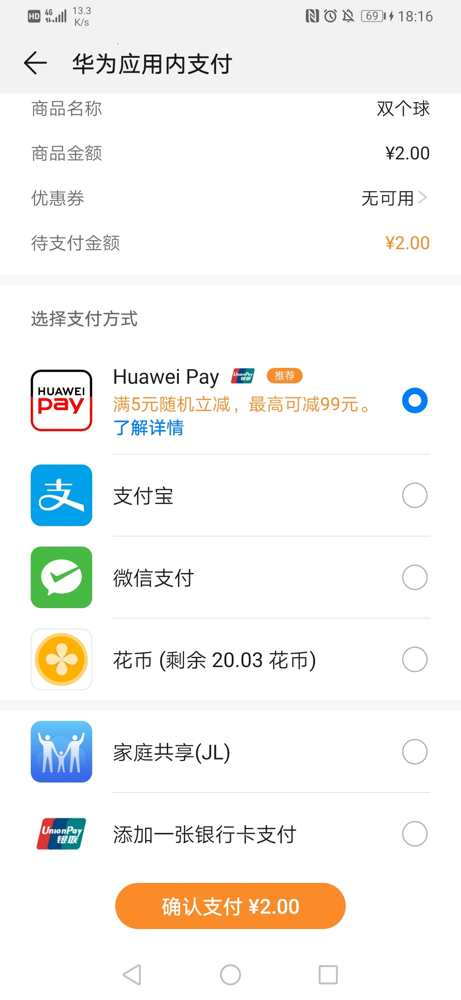
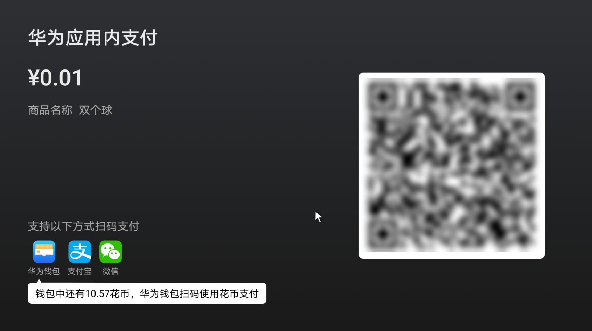
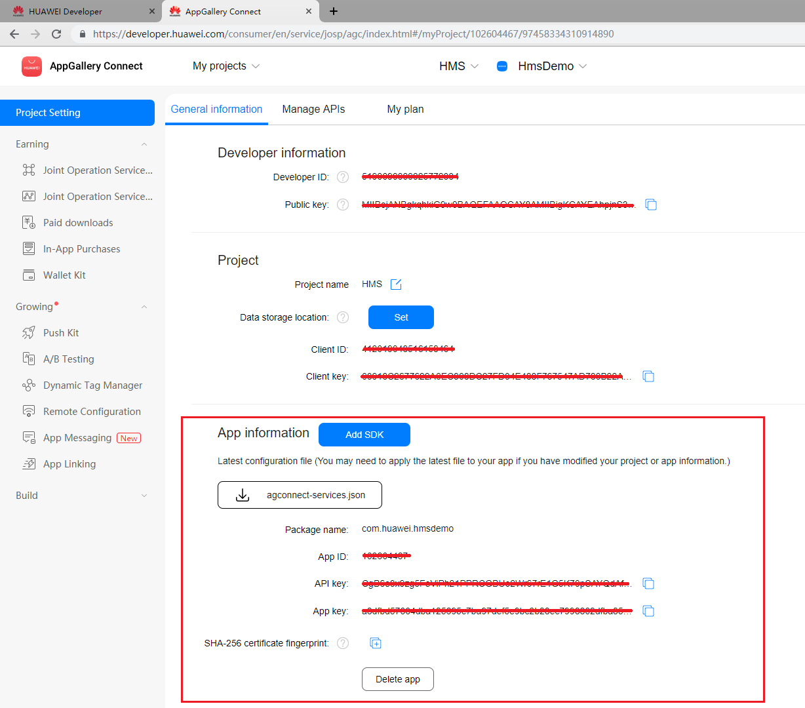
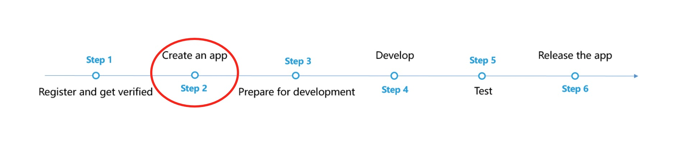
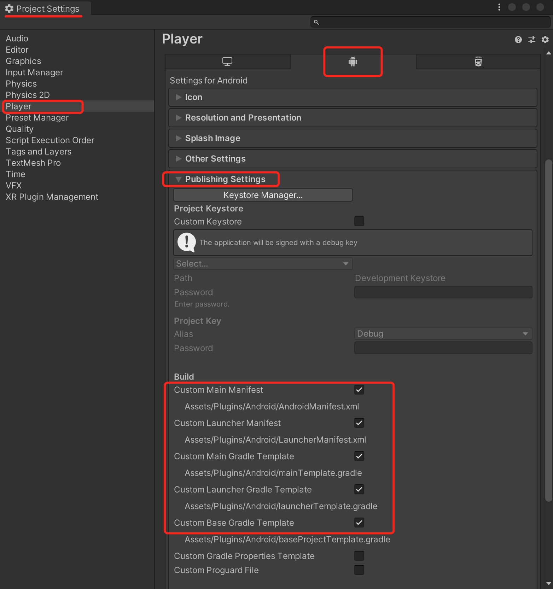
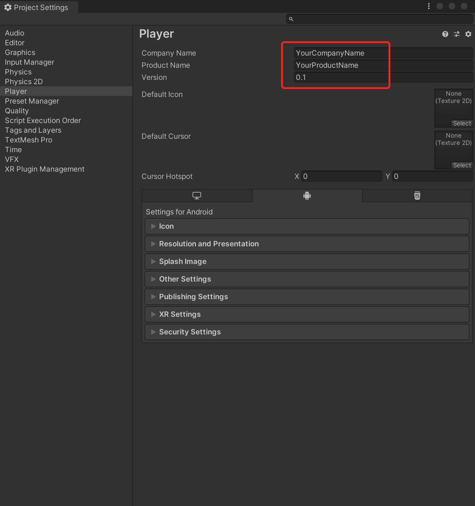
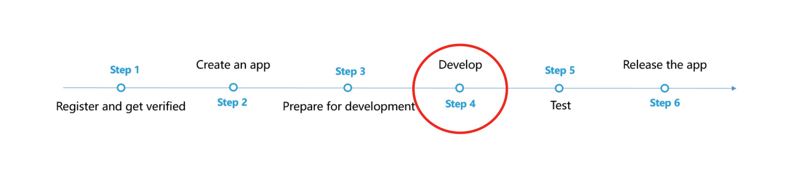
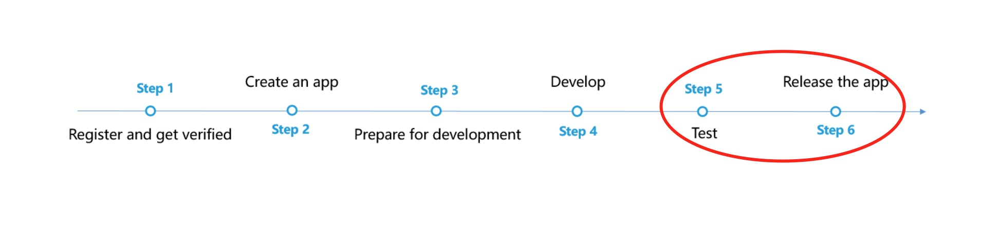

# 应用内支付服务(HMS)

## 业务介绍

华为应用内支付服务（In-App Purchases，IAP）为App提供便捷的应用内支付体验和简便的接入流程。您的App通过集成IAP SDK，再调用IAP SDK接口启动IAP收银台，即可实现应用内支付。

更多视频，请查看开发者学院的[HMS Core精品实战课](https://developer.huawei.com/consumer/cn/training/detail/101583014939716180)。

通过应用内支付服务，用户可以在您的App内购买各种类型的虚拟商品，包括一次性商品和订阅型商品。
- 一次性商品：用户以一次性付款方式购买的商品，包括消耗型商品和非消耗型商品。
  - 消耗型商品：使用一次后即消耗掉，随使用减少，需要再次购买的商品。例：游戏货币，游戏道具等。
  - 非消耗型商品：一次性购买，永久拥有，无需消耗。例：游戏中额外的游戏关卡、应用中无时限的高级会员等。
- 订阅型商品：用户购买后在一段时间内允许访问增值功能或内容，周期结束后自动续期购买下一期的服务。例：应用中有时限的高级会员，如视频月度会员。
  
### 支持的设备

 | <div style="width:80px">设备类型</div>                       | OS版本                | HMS Core（APK）版本                                                     |
  | ------------------------------------------------------------ | ----------------------- | ------------------------------------------------------------ |
  | 华为手机、华为平板 | EMUI 3.0及以上版本                    | 3.0.0及以上 |
  | 非华为Android手机 | Android 4.4及以上（API Level 19及以上）             | 3.0.0及以上                         |
  | 华为智慧屏| HarmonyOS                    | 5.0.0及以上 |

### IAP收银台展示

- 手机收银台<br>
  
- 智慧屏收银台<br>
  
  
### 业务特点

- 接入便捷，沙盒测试更方便<br>
完善的接入流程指导和配套沙盒环境测试，帮助您快速轻松接入华为应用内支付。
- 全球发布便捷，本地化语言和货币展示<br>
应用内购买商品时根据用户帐号服务地所在国家/地区自动展示本地化的语言和货币价格。您只需发布一个应用，即可在所有[华为IAP覆盖范围](https://developer.huawei.com/consumer/cn/doc/development/HMSCore-Guides/huawei-iap-coverage-0000001050438753)中的国家/地区推广，实现本地化语言和价格展示。
- 聚合多种支付通道，提供全球支付服务<br>
支持银行卡、支付宝、微信支付、运营商话费以及华为虚拟币-花币等多种支付方式，其中银行卡支持国内绝大多数主流银行和Visa、Mastercard等海外银行卡组织，话费支付支持多个海外大型运营商。支持将银行卡、手机号码绑定到用户的华为帐号上，支付时用户只需输入其设置的华为支付密码便能完成支付，省去输入银行卡信息、手机号码的麻烦，支付更加简单便捷。
目前支持的支付渠道见下表：

| <div style="width:80px">地区</div> | 支持的支付方式                                                     |
| -------------------------------------- | ------------------------------------------------------------ |
| 中国大陆                               | 银行卡<br>支付宝<br>微信<br>华为虚拟币-花币 |
| 中国香港、中国澳门、中国台湾及海外区域                               | 银行卡<br>运营商话费支付<br>华为虚拟币-花币<br>第三方支付<br>|

  
- 安全可靠，监控有保障
 - 采用业界标准的TLS协议加密传输数据，通过RSA算法签名保护用户消息，保证不会被截取和篡改。数据在后台采用加密和匿名化方式存储，保证用户数据存储安全
 - 后台服务器采用集群部署和冗余设计，7*24小时实时监控系统运行

### 场景介绍
#### 场景一：购买PMS商品
华为应用内支付服务包含商品管理系统（Product Management System，PMS），您在华为AppGallery Connect网站录入商品ID和定价之后，即可托管商品。您的应用需使用[createPurchaseIntent](https://developer.huawei.com/consumer/cn/doc/development/HMSCore-References/iapclient-0000001050137587#section1255302563115)接口发起此类商品的购买，发起购买时只需传入此处配置的商品ID和商品类型， IAP会根据地区和汇率展示本地化的语言和货币价格，从而实现全球发布。

当前最新版本支持以下功能：
- 应用（含游戏）发布：一个应用（含游戏）包发布、支持多个国家/地区应用内商品的价格和语言管理。PMS可支持的国家/地区以配置商品价格时的页面提示为准。
- 币种与语言：华为为每个国家/地区指定一个默认币种和一个默认语言，不支持一个国家/地区配置多种语言。
- 商品定价：华为根据您设置的汇率换算价格（含税）和汇率提供已上线华为支付各国参考价，您可自行修改各国价格。例如，假设您输入的是1欧元，会根据汇率自动设置其他国家/地区的价格，如果欧元和人民币之间的汇率是7.88，会自动将中国的价格设置为7.88元，您可在此基础上修改价格。
- 汇率：固定汇率，此汇率非实时汇率，华为将根据此汇率更新货币价格。华为更新汇率不会影响您的商品价格。如需变更商品价格，您可手动修改。
- 使用对象：全球开发者。若您准备将应用（含游戏）发布到多个国家/地区，则需要对应用内商品的价格和语言进行管理以实现本地化语言和价格展示。
#### 场景二：购买非PMS商品
若您的应用仅在中国大陆发布，您也可使用IAP提供的[createPurchaseIntentWithPrice](https://developer.huawei.com/consumer/cn/doc/development/HMSCore-References/iapclient-0000001050137587#section16712634155213)接口自行完成商品的定价及支付，而不需要在华为AppGallery Connect网站上录入商品信息。支付的时候需要您传入商品的价格，商品名称、币种等信息。需要注意，该非PMS支付接口仅支持消耗型和非消耗型商品，若您需要使用订阅服务，请使用[createPurchaseIntent](https://developer.huawei.com/consumer/cn/doc/development/HMSCore-References/iapclient-0000001050137587#section1255302563115)。

### 功能使用限制
| <div style="width:80px">功能</div> | 地域要求                                                     |
| -------------------------------------- | ------------------------------------------------------------ |
| 智慧屏沙盒测试                               | 仅海外收银台支持。 |
| 购买非PMS商品                               | 仅中国大陆支持。|

### 支持的国家/地区
请参见[华为IAP范围覆盖](https://developer.huawei.com/consumer/cn/doc/development/HMSCore-Guides/huawei-iap-coverage-0000001050438753)。

### 隐私声明
业务集成使用华为应用内支付服务能力，需要先签订《[华为开发者服务协议](https://developer.huawei.com/consumer/cn/doc/start/agreement-0000001052728169)》、《[华为APIs使用协议](https://developer.huawei.com/consumer/cn/doc/distribution/app/20209)》。您理解并承诺，您的下载或使用相应Kits的行为，视为您同意前述所有协议，且您将基于这些协议承担相应的法律责任与义务。
## Unity项目集成设置

### 注册认证

在开始之前，首先您需要创建华为开发者账号，项目，以及App。请参考[华为HMS文档](https://developer.huawei.com/consumer/cn/doc/development/HMS-Guides/Preparations) 





我们默认您已经创建并拥有了华为HMS项目，以及对应的App信息

### 创建应用

在您的Unity项目中完成以下构建环境的设置，以便使用华为HMS SDK构建安卓 APK。



进入 **Editor -> Build Settings -> Platform -> Andriod**， 点击 **Switch Platform** 切换到安卓平台。


进入 **Player Settings -> Publishing Settings**，勾选以下环境配置项目。



### 开发准备

按照[华为HMS 集成开发指南介绍](https://developer.huawei.com/consumer/cn/codelab/HMSPreparation/index.html#6)，我们仍需要对这些Gradle文件做进一步开发准备的设置。


您可以根据[华为HMS Core集成准备](https://developer.huawei.com/consumer/cn/codelab/HMSPreparation/index.html#6)对自己对文件进行配置。您也可以从我们的[示例项目](https://github.com/Unity-Technologies/HMSSDKSample/tree/master/Assets/Plugins/Android)中的具体参数设置，进行参考与对比，完成以下一系列的开发准备配置。

1. 启用并对 `AndroidManifest.xml` 做以下配置

   进入 **Edit -> Project Settings -> Player -> Android(icon) -> Publishing Settings -> Build**，启用 **Custom Main Manifest**

   如果您的Unity版本低于**2019.2（含）**，上述设置界面中并没有 **AndroidManifest** 选项，但您可以将`AndroidManifest.xml`文件手动放置到`Assets/Plugins/Android` 路径下。

   ```
    <?xml version="1.0" encoding="utf-8"?>
       <!-- GENERATED BY UNITY. REMOVE THIS COMMENT TO PREVENT OVERWRITING WHEN EXPORTING AGAIN-->
       <manifest
           xmlns:android="http://schemas.android.com/apk/res/android"
           package="com.unity3d.player"
           xmlns:tools="http://schemas.android.com/tools">
           <uses-permission android:name="android.permission.ACCESS_COARSE_LOCATION"/>
           <uses-permission android:name="android.permission.ACCESS_FINE_LOCATION"/>
           <uses-permission android:name="android.permission.ACCESS_BACKGROUND_LOCATION" />
           <uses-permission android:name="com.huawei.hms.permission.ACTIVITY_RECOGNITION" />
           <uses-permission android:name="android.permission.ACTIVITY_RECOGNITION" />
           <uses-permission android:name="android.permission.ACCESS_MOCK_LOCATION" />
           <uses-permission android:name="android.permission.FOREGROUND_SERVICE" />
           <application>
               <activity android:name="com.hms.hms_analytic_activity.HmsAnalyticActivity"
                       android:theme="@style/UnityThemeSelector">
                   <intent-filter>
                       <action android:name="android.intent.action.MAIN" />
                       <category android:name="android.intent.category.LAUNCHER" />
                   </intent-filter>
                   <meta-data android:name="unityplayer.UnityActivity" android:value="true" />
               </activity>
               <service
                   android:name="com.unity.hms.push.MyPushService"
                   android:exported="false">
                   <intent-filter>
                       <action android:name="com.huawei.push.action.MESSAGING_EVENT"/>
                   </intent-filter>
               </service>
               <receiver
                       android:name="com.unity.hms.location.LocationBroadcastReceiver"
                       android:exported="true">
                   <intent-filter>
                       <action android:name="com.huawei.hmssample.location.LocationBroadcastReceiver.ACTION_PROCESS_LOCATION" />
                   </intent-filter>
               </receiver>
               <receiver
                       android:name="com.unity.hms.location.GeoFenceBroadcastReceiver"
                       android:exported="true">
                   <intent-filter>
                       <action android:name="com.huawei.hmssample.geofence.GeoFenceBroadcastReceiver.ACTION_PROCESS_LOCATION" />
                   </intent-filter>
               </receiver>
               <meta-data     
                android:name="com.huawei.hms.client.channel.androidMarket"  
                android:value="false" />
           </application>
       </manifest>
   ```


2. 启用并对project gradle文件添加配置

   进入 **Edit -> Project Settings -> Player -> Android(icon) -> Publishing Settings -> Build** ，启用 **Custom Base Gradle Template** 并在文件中添加 AppGallery Connect plugin 和 Maven repository。路径是`Assets/Plugins/Android/baseProjectTemplate.gradle`。

   如果您的Unity版本低于**2019.2（含）**，则需要在 <code>MainGradleTemplate.gradle</code> 中添加配置。

   ```
       allprojects {
           buildscript {
               repositories {**ARTIFACTORYREPOSITORY**
                   google()
                   jcenter()
                   maven { url 'https://developer.huawei.com/repo/' }
               }
   
               dependencies {
                   // If you are changing the Android Gradle Plugin version, make sure it is compatible with the Gradle version preinstalled with Unity
                   // See which Gradle version is preinstalled with Unity here https://docs.unity3d.com/Manual/android-gradle-overview.html
                   // See official Gradle and Android Gradle Plugin compatibility table here https://developer.android.com/studio/releases/gradle-plugin#updating-gradle
                   // To specify a custom Gradle version in Unity, go do "Preferences > External Tools", uncheck "Gradle Installed with Unity (recommended)" and specify a path to a custom Gradle version
                   classpath 'com.android.tools.build:gradle:3.6.4'
                   classpath 'com.huawei.agconnect:agcp:1.6.1.300'
                   **BUILD_SCRIPT_DEPS**
               }
           }
   
           repositories {**ARTIFACTORYREPOSITORY**
               google()
               jcenter()
               flatDir {
                   dirs "${project(':unityLibrary').projectDir}/libs"
               }
               maven { url 'https://developer.huawei.com/repo/' }
           }
       }
   
       task clean(type: Delete) {
           delete rootProject.buildDir
       }
   ```
   
3. 启用并对app gradle文件添加配置

   进入 **Edit -> Project Settings -> Player -> Android(icon) -> Publishing Settings -> Build**，启用 **Custom Launcher Gradle Template** 并在 `launcherTemplate.gradle` 中添加依赖。路径为 `Assets/Plugins/Android/LauncherTemplate.gradle`。

    如果您的Unity版本低于**2019.2（含）**， 则需要在 <code>MainGradleTemplate.gradle</code>中添加配置。
   
   ```
       dependencies {
           implementation project(':unityLibrary')
           implementation 'com.huawei.hms:ads-lite:13.4.49.301'
           implementation 'com.huawei.hms:ads-consent:3.4.49.301'
           implementation 'com.huawei.hms:push:6.1.0.300'
           implementation 'com.huawei.hms:hianalytics:6.3.2.300'
           implementation 'com.huawei.hms:location:6.2.0.300'
           implementation 'com.android.support:appcompat-v7:28.0.0'
           implementation 'com.huawei.agconnect:agconnect-core:1.6.1.300'
           implementation 'com.huawei.hms:hwid:6.1.0.303'
           implementation 'com.huawei.hms:iap:6.3.0.300'
           implementation 'com.huawei.hms:game:6.1.0.301'
           }
   ```

4. 使用并对unity library gradle文件进行以下设置

    进入 **Edit -> Project Settings -> Player -> Android(icon) -> Publishing Settings -> Build**，启用 **Custom Main Gradle Template** 并在 `mainTemplate.gradle` 中添加依赖。路径为 `Assets/Plugins/Android/mainTemplate.gradle.gradle`。
    
    如果您的Unity版本低于**2019.2（含）**， 则需要在 <code>MainGradleTemplate.gradle</code>中添加配置。
    
    ```
        dependencies {
            implementation fileTree(dir: 'libs', include: ['*.jar'])
            implementation 'com.huawei.hms:hianalytics:6.3.2.300'
            implementation 'com.huawei.agconnect:agconnect-core:1.6.1.300'
            implementation 'com.huawei.hms:hwid:6.1.0.303'
            implementation 'com.huawei.hms:iap:6.3.0.300'
            implementation 'com.huawei.hms:game:6.1.0.301'
        **DEPS**}
    ```
5. 创建Signature

   进入 **Edit -> Project Settings -> Player -> Android(icon) -> Publishing Settings -> Keystore Manager**， 点击 **Keytore... -> create new**

   

   您需要在打开unity时设定并输入密码，否则将无法构建。无需在 gradle 中添加signature。

6. 签署证书指纹

   参照华为[HMS Core集成准备 Step4](https://developer.huawei.com/consumer/cn/codelab/HMSPreparation/index.html#3) 生成SHA256证书指纹

   

   参照华为[HMS Core集成准备 Step5](https://developer.huawei.com/consumer/cn/codelab/HMSPreparation/index.html#4)在AppGAllery Connect里添加指纹。

   

7. 设置package name，及其他设置

   进入 **Edit -> Project Settings -> Player**设置package name。

   package name格式为 `com.${Company Name}.${Product Name}`

   同时也可以在此步骤完成其余的所需设置，比如您的应用版本号、应用的图标、设置显示的分辨率等。

   

8. `Agconnect-services.json`

   我们还需要从华为开发者账号内下载这个json文件，加入所需信息后，放到 `Assets/Plugins/Android` 路径下。

   从华为开发者账号内下载此json 文件并在其中加以下信息。同样的，您可以在我们的[示例项目文件](https://github.com/Unity-Technologies/HMSSDKSample/blob/master/Assets/Plugins/Android/agconnect-services.json)中直接参考！

   ```
   "agcgw":{
   "backurl":"connect-drcn.dbankcloud.cn",
   "url":"connect-drcn.hispace.hicloud.com"
   },
   ```

   当我们使用当前服务时，必须配置 `agconnect-services.json` 文件。

   参考 [链接](https://developer.huawei.com/consumer/cn/doc/development/HMSCore-Guides/android-config-agc-0000001050170137) 以创建`agconnect-services.json`

   

9. 配置混淆脚本

    编译APK前需要配置混淆配置文件，避免混淆HMS Core SDK导致功能异常。（[参考文档](https://developer.huawei.com/consumer/cn/doc/development/HMSCore-Guides/android-config-obfuscation-scripts-0000001050176973)）
    - 在您的Unity项目里打开混淆配置文件，加入排除HMS Core SDK的混淆配置。

    ```
    -ignorewarnings
    -keepattributes *Annotation*
    -keepattributes Exceptions
    -keepattributes InnerClasses
    -keepattributes Signature
    -keepattributes SourceFile,LineNumberTable
    -keep class com.huawei.hianalytics.**{*;}
    -keep class com.huawei.updatesdk.**{*;}
    -keep class com.huawei.hms.**{*;}
    ```

    - （可选）当您启用R8资源缩减（项目级“build.gradle”文件中“shrinkResources”属性为“true”）和严格引用检查（“res/raw/keep.xml”文件中的“shrinkMode”为“strict”）时，请您配置“keep.xml”文件手动保留layout资源，确保应用正常通过华为应用市场上架审核。
    
    ```
    <?xml version="1.0" encoding="utf-8"?>
    <resources xmlns:tools="http://schemas.android.com/tools"
        tools:keep="@layout/hms_download_progress,@drawable/screen_off,@layout/upsdk*"
        tools:shrinkMode="strict" />
    ```

10. 获取activity

   可以用 `Common.GetActivity()`函数来获取activity。

11. 打开相关服务
    
    需要使用华为支付功能的应用必须[打开应用内支付服务开关](https://developer.huawei.com/consumer/cn/doc/distribution/app/agc-help-enabling-service-0000001146598793#ZH-CN_TOPIC_0000001146598793__zh-cn_topic_0000001064950324_section135355454314)。

12. 配置支付服务参数
    
    如需使用华为内应用支付功能，您需要[配置支付服务参数](https://developer.huawei.com/consumer/cn/doc/development/HMSCore-Guides/config-agc-0000001050033072)。


## SDK集成开发
### SDK开发

HMS 套件中共包括4个功能服务，在[示例项目](https://github.com/Unity-Technologies/HMSSDKSample)中都有相应的示例场景。 为了进行测试，您需要通过HMS将其构建到Android移动版上。 确保已创建HMS帐户和项目。 然后，您就可以更改配置并测试不同的功能。



在示例项目中，应用内支付服务对应的场景是： `Assets/HuaweiServiceDemo/Scenes/HmsIAPSampleScene.unity` 而对应的代码是： `Assets/HuaweiServiceDemo/Scripts/test/iap/IAPTest.cs`.

我们需要自定义`AndroidManifest`并且添加自定义`HmsIapActivity.java`。

**IAP Kit**需要在`onActivityResult`中接收购买结果信息，该方法不能在c#代码中重写，因此我们需要一个自定义activity作为代理来接收和传输结果。为了接收结果，您需要在代理activity中获得购买商品的id和类型以及 `getIapIntent`，但是在`unityPlayerActivity`中没有重写`onActivityResult`，因此需要`startActivityForResult`并在代理activity的`onActivityResult`中接收购买结果信息。为了传送结果信息，您可以在c#代码中编写自定义的`MyOnActivityResult`,把它传递给代理activity，在代理activity的`onActivityResult`中调用该回调，然后您可以在 c# 代码中处理结果。

我们提供了[IapActivity.cs](https://github.com/Unity-Technologies/HuaweiServiceSample/blob/test2022/Assets/HuaweiService/iap/IapActivity.cs)，其中封装了常用功能。您可以在[IAPTest.cs](https://github.com/Unity-Technologies/HuaweiServiceSample/blob/test2022/Assets/HuaweiServiceDemo/Scripts/test/IAPTest.cs)中找到示例。

更新**Assets/Plugins/Android/AndroidManifest.xml**中的HmsIapActivity。

```
<?xml version="1.0" encoding="utf-8"?>
<!-- GENERATED BY UNITY. REMOVE THIS COMMENT TO PREVENT OVERWRITING WHEN EXPORTING AGAIN-->
<manifest
   xmlns:android="http://schemas.android.com/apk/res/android"
   package="com.unity3d.player"
   xmlns:tools="http://schemas.android.com/tools">
...
   <application>
        <activity android:name="com.unity.hms.iap.HmsIapActivity" 
                  android:theme="@android:style/Theme.Translucent.NoTitleBar">
        </activity>
...
   </application>
</manifest>
```

您可以在**Assets/Plugins/Android/HmsIapActivity.java**中添加相应的自定义HmsIapActivity.java

```
package com.unity.hms.iap;

import android.app.Activity;
import android.content.Intent;
import android.os.Bundle;
import com.huawei.hms.iap.Iap;
import com.huawei.hmf.tasks.Task;
import com.huawei.hms.iap.entity.PurchaseIntentResult;
import com.huawei.hmf.tasks.OnSuccessListener;
import com.huawei.hmf.tasks.OnFailureListener;
import com.huawei.hms.support.api.client.Status;
import com.huawei.hms.iap.IapApiException;
import android.content.IntentSender;
import android.util.Log;
import com.huawei.hms.iap.entity.PurchaseIntentReq;

public class HmsIapActivity extends Activity {

    private static IIapCallback mCallback;
    private static String mIntent = "test";
    private static String mId = "test";
    private static int mType = 0;
    private String TAG = "ResolutionForResult: ";
    public static void setCallback(IIapCallback callback){
        mCallback=callback;
    }
    public static void setIntent(String intent){
        mIntent=intent;
    }
    public static void setConProductId(String id){
        mId=id;
    }
    public static void setPriceType(int type){ mType=type;}

    @Override
    protected void onCreate(Bundle savedInstanceState) {
        super.onCreate(savedInstanceState);
        switch (mIntent) {
            case "Consumables":
                purchase("Consumables");
                break;
            case "Non-Consumables":
                purchase("Non-Consumables");
                break;
            case "Subscription":
                purchase("Subscription");
                break;
            default:
                break;
        }
    }

    public static void start(Activity activity){
        Intent intent = new Intent(activity, HmsIapActivity.class);
        activity.startActivity(intent);
    }

    public Activity getActivity() {
        return this;
    }

    public void purchase(String type) {
        PurchaseIntentReq req = new PurchaseIntentReq();
        if (type == "Consumables"){
            req.setProductId(mId);
            req.setPriceType(mType);
        }else if(type == "Non-Consumables"){
            req.setProductId(mId);
            req.setPriceType(mType);
        }else{
            req.setProductId(mId);
            req.setPriceType(mType);
        }
        req.setDeveloperPayload("test");
        final Activity activity = getActivity();
        Task<PurchaseIntentResult> task = Iap.getIapClient(activity).createPurchaseIntent(req);
        task.addOnSuccessListener(new OnSuccessListener<PurchaseIntentResult>() {
            @Override
            public void onSuccess(PurchaseIntentResult result) {
                Status status = result.getStatus();
                if (status.hasResolution()) {
                    try {
                        status.startResolutionForResult(activity,6666);
                    } catch (IntentSender.SendIntentException exp){
                        Log.e(TAG, exp.getMessage());
                    }
                }
            }
        }).addOnFailureListener(new OnFailureListener() {
            @Override
            public void onFailure(Exception e) {
                if (e instanceof IapApiException) {
                    IapApiException apiException = (IapApiException) e;
                    Status status = apiException.getStatus();
                    int returnCode = apiException.getStatusCode();
                    Log.e(TAG, e.getMessage());
                } else {
                    Log.e(TAG, e.getMessage());
                }
            }
        });
    }

    @Override
    protected void onActivityResult(int requestCode, int resultCode, Intent data) {
        super.onActivityResult(requestCode, resultCode, data);
        if(mCallback!=null){
            mCallback.onActivityResult(requestCode, resultCode,data);
        }
        finish();
    }
}

 ```

### 测试与发布
参考华为 [HMS Core集成流程](https://developer.huawei.com/consumer/cn/doc/start/hitHMSCore) for testing and releasing.




