# Crash

## Service Introduction

[Crash](https://developer.huawei.com/consumer/en/doc/development/AppGallery-connect-Guides/agc-crash-introduction) Service of AppGallery Connect is a lightweight crash analysis service, in which Huawei provides a Crash SDK that can be quickly integrated into your app, without the need for coding.

If your app crashes frequently, users will have a poor experience on your app, and be inclined to give negative reviews. If the crash rate for your app stays high for an extended period of time, it can severely harm your business.

After your app has been released, you may be unaware about what the presence of crashes, and in which scenarios they occur. Some users may report crashes by posting comments in AppGallery. To resolve this type of case, you will need to obtain the relevant information, such as the app, operating system, device, and stack involved when the crashes occurred, which can be challenging.

The Crash service provides crash reports that are easy to reference and analyze. The 24-hour crash report allows you to monitor the quality of your app in real time.

In addition, the Crash service automatically categorizes crashes, and provides indicator data of the crashes, allowing you to prioritize the most important crashes. You can view information about a specific crash, and analyze the app and Android versions with the crash. You can also view information about the app, operating system, and device corresponding to a specific crash, as well as the crashed stack. All the information is enormously helpful in locating and resolving crashes.

The Crash service can also detect major crashes in real time. After you enable crash notifications, AppGallery Connect can send you an email when a major crash occurs.

### Use Cases

#### Locating an App/Game Crash

App quality is critical to user experience. If an app crashes frequently, it is not going to get good reviews. You can subscribe to crash notifications. Once your app crashes, the Crash service will send a notification to you, so you can analyze and resolve the crash in a timely manner based on detailed information that the Crash service provides, continuously improving your app quality and user experience.

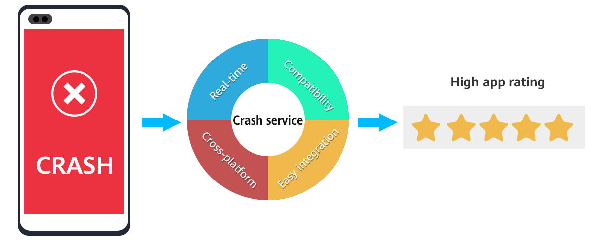


### Key Functions

| <div style="width:150px">Function</div> | Description |
| ---|---|
| Readable, real-time reports | Generates highly readable data reports containing stack and other relevant information for your reference, without requiring any code.|
| Custom reports | Enables you to add custom traces in the form of user IDs, logs, and key-value pairs, generating customized crash reports that provide for accurate tracking.|
| Intelligent crash classification | Automatically classifies a large number of crashes by type or code location, and allows you to prioritize crashes according to their severity.|
| Real-time tracking and alerts | Reflects whether your app is running stably by generating minute-by-minute reports. In addition, when a major crash occurs, the Crash service will notify you in a timely manner.|
| Cross-platform support | Supports the Android and iOS platforms and provides common cross-platform framework plug-ins, such as [Flutter](https://flutter.dev/docs/get-started/install), [Cordova](https://cordova.apache.org/#getstarted), [React Native](https://reactnative.dev/docs/getting-started), and [lonic](https://ionicframework.com/docs/appflow/quickstart) to simplify service integration.|

## Setting up in Huawei AppGallery Connect

### Getting Started

The Crash service provides the Crash SDK. Before using the Crash service, you will need to integrate the Crash SDK into your app. In the test phase, you can intentionally trigger a crash and check whether the integrated Crash SDK can report crash data.

After integrating the Crash SDK, your app can automatically report relevant data to AppGallery Connect when it crashes. You can analyze the crash cause based on the reported information. This section describes the procedures for enabling the Crash service and integrating the Crash SDK.

### Integrating the AppGallery Connect SDK

You need to integrate the AppGallery Connect SDK and plug-in before integrating the Crash SDK into your app. For details, please refer to [AppGallery Connect Service Getting Started.](https://developer.huawei.com/consumer/en/doc/development/AppGallery-connect-Guides/agc-get-started)

### Enabling the Crash Service

First, you need to create a project and app according to the document,and then config the `agconnect-services.json` file.

1. Sign in to [AppGallery Connect](https://developer.huawei.com/consumer/en/service/josp/agc/index.html) and select **My projects**.

2. Find your project from the project list and click the app for which you need to enable the Crash service on the project card.

   

3. Go to **Quality > Crash**. The Crash page is displayed.

   **Note**:<br>To use the Crash service, you need to enable HUAWEI Analytics first. If you have not enabled HUAWEI Analytics, click Enable now, or go to HUAWEI Analytics to enable the service. For details, please refer to [Enabling HUAWEI Analytics](https://developer.huawei.com/consumer/en/doc/development/HMSCore-Guides/service-enabling-0000001050745155).

   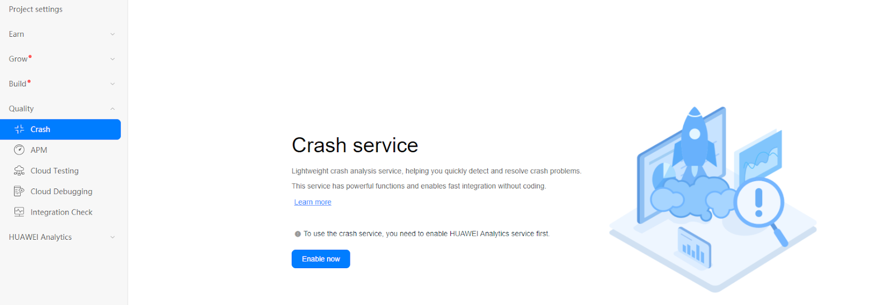

   **Note**:<br>You need to set the data storage location when enabling the Crash service. Then, the setting in `agconnect-services.json` will be automatically updated accordingly. Therefore, you need to download the `agconnect-services.json` file again and integrate it into your project. For details, please refer to [Adding the Configuration File](https://developer.huawei.com/consumer/en/doc/development/AppGallery-connect-Guides/agc-get-started#addjson).

4. Config the json file

   Copy the` agconnect-services.json` file to the `Assets/Plugins/Android` folder.

   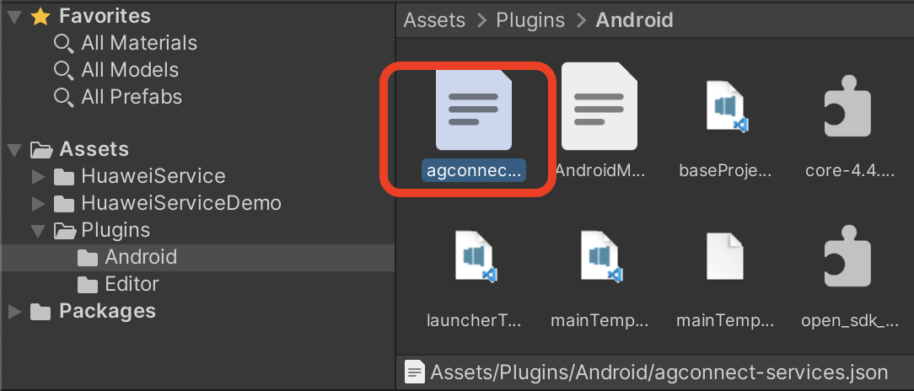

## Setting up in Unity

### Setting up unity Custom Android gradle and Proguard

1. Switch platform to android in **Player setting**.

2. Enable custom gradle and Proguard file in player setting. Set Proguard in **Minify > release**. The following is in unity **2019.4**.

   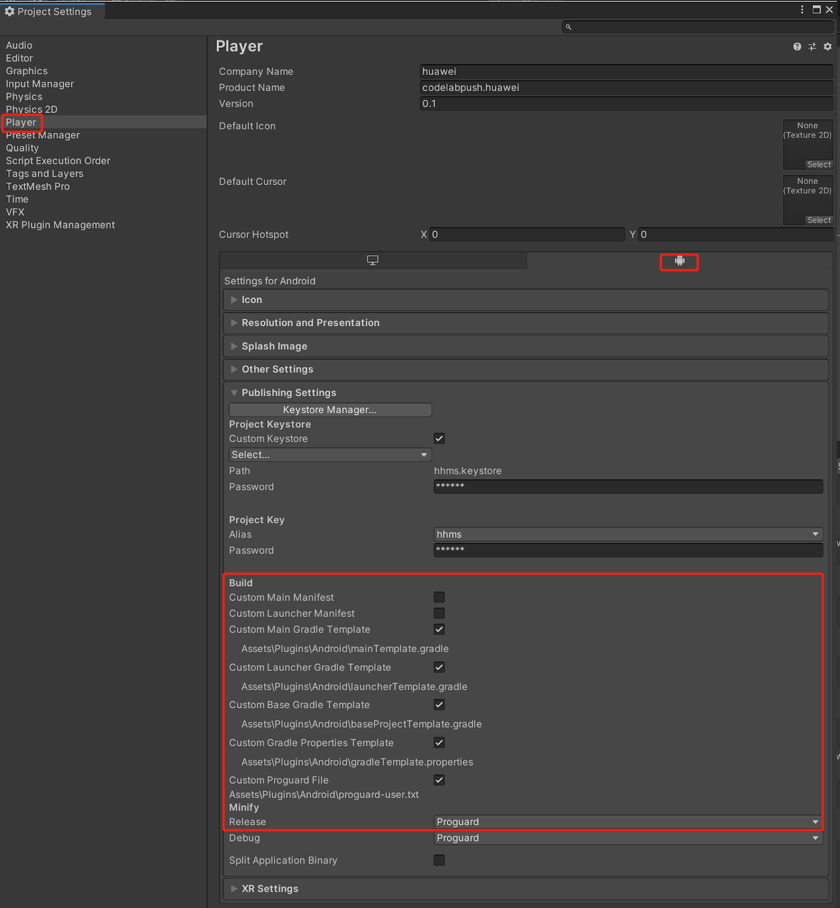

   The android struct is updated after unity **2019.3**. Manifest and Gradle are separated into multiple files (Main, Launcher & Base).  

3. Set the package name in **Edit -> Project Settings -> Player ->  Android(icon) -> other settings -> Identification -> Package Name**.

     The package name is the package name of app in huawei project.
     
     


### Integrating HUAWEI Analytics Kit

To report crash events. you need to use HUAWEI Analytics Kit. Please refer to the
[https://docs.unity.cn/cn/Packages-cn/com.unity.huaweiservice@1.3/manual/](https://docs.unity.cn/cn/Packages-cn/com.unity.huaweiservice@1.3/manual/)

In the example project, the corresponding scene is `Assets/HuaweiHmsDemo/Scenes/HmsCrashSampleScene.unity` and the code is `Assets/HuaweiHmsDemo/demo/test/CrashTest.cs`.

### Integrating Crash Kit

1. Enable and add configurations to project gradle

   Go to **Edit -> Project Settings -> Player -> Android(icon) -> Publishing Settings -> Build**, enable **Custom Base Gradle Template** and add the configuration to the Maven repository which path is `Assets/Plugins/Android/baseProjectTemplate.gradle`.

   If your unity version is **2019.2 or before**, you should add implement and other configuration on `MainGradleTemplate.gradle`. 

   And the repository is:

   ```
       allprojects {
           buildscript {
   
               repositories {
   ...
                   maven { url 'https://developer.huawei.com/repo/' }
   ...
               }
               dependencies{
                    classpath 'com.huawei.agconnect:agcp:1.4.1.300'
   …        }
           }
   ...
           repositories {
   ...
               maven { url 'https://developer.huawei.com/repo/' }
   ...
           }
       }
   
   ```

2. Enable and add configurations to app gradle
   
   Go to **Edit -> Project Settings -> Player -> Android(icon) -> Publishing Settings -> Build**

   Enable **Custom Launcher Gradle Template** and add build dependencies in `launcherTemplate.gradle`. The path is `Assets/Plugins/Android/launcherTmeplate.gradle`.

   If unity version is **2019.2 or before**, you should add implement and other configuration on MainGradleTemplate.
   
   To add crash Kit, you should add implementation as follow.
   
   ```
   dependencies {
             implementation 'com.huawei.agconnect:agconnect-crash:1.6.1.300'
   }
   ```
   
   You need to configure `launcherTemplate.gradle` as shown below.
   
   ```
   apply plugin: 'com.huawei.agconnect' 
   
    dependencies {
   …
      //AGC SDK and Crash SDK integrated configuration
      implementation 'com.huawei.hms:hianalytics:5.0.5.300'
      implementation 'com.huawei.agconnect:agconnect-crash:1.6.1.300'
      implementation 'com.huawei.agconnect:agconnect-core:1.4.2.300' 
   ...
   }
   android {
   …
      buildTypes{
            Release{
                 //The following configuration is used for code obfuscation
                 minifyEnabled true
                 useProguard true
                 proguardFiles getDefaultProguardFile(‘proguard-android.txt’),
                 ’Proguard-unity.txt’,’proguard-user.txt’
                 //The following is the signingConfig configuration for build release
                  signingConfig signingConfigs.release
             }
          }
   }
   
   ```
   
3. Create proguard file

   Create and customize `proguard-unity.txt` and `proguard-user.txt` as follows.
   ```
   -keepattributes *Annotation*
   -keepattributes SourceFile,LineNumberTable
   -keep public com.crashlytics.** { *; }
   ```

   

## Developing with the SDK

### Setting up a scene

1. Open a scene:

   

2. Right click and select UI and then you can choose a button:

   

3. Add component to the button and develop a script:

   

   

4. Edit the script:

   

   Double click the script file, and you will open it in VS code.

   

5. Define the interface

   ```
    void Start()
    {
      
    }
    
    // Update is called once per frame
    void Update()
    {
      
    }
    
    public void aaronButtonTest()
    {
       AGConnectCrash.getInstance().setUserId("TestUserId");
    }
    
   ```

   Create a function above

6. Bind buttons and interfaces in scripts

   

    - Step1. Click “+” to add a function

    - Step2. Choose a the corresponding scene which has the interface you want to use

    - Step3. Click the “No Function” select to choose the script and then choose the corresponding function

    

### Obtaining a De-obfuscated Java Crash Report

When using ProGuard to obfuscate the class names, fields, and methods in the code into unreadable code when compiling, you can obtain the de-obfuscated java crash report by uploading the obfuscated Mapping file to AGC.

Set up the ProGuard code obfuscation configuration in `launcherTemplate.gradle` as described above, and set the code obfuscation settings in the project setting. After building the project, we will get a `mapping.txt` file in the same directory of the apk.

   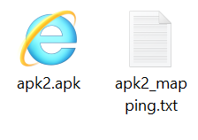

You can upload your `mapping.txt` file like this.

1. Find your obfuscation mapping file in the project directory.

2. Sign in to [AppGallery Connect](https://developer.huawei.com/consumer/en/service/josp/agc/index.html) and click **My projects**.

3. Find your project from the project list and click your app on the project card.

4. Go to **Quality > Crash**. The **Crash** page is displayed.

5. Go to **Mapping file > Obfuscation mapping file** and click **Upload** in the app version record for which you need to upload a mapping file.

      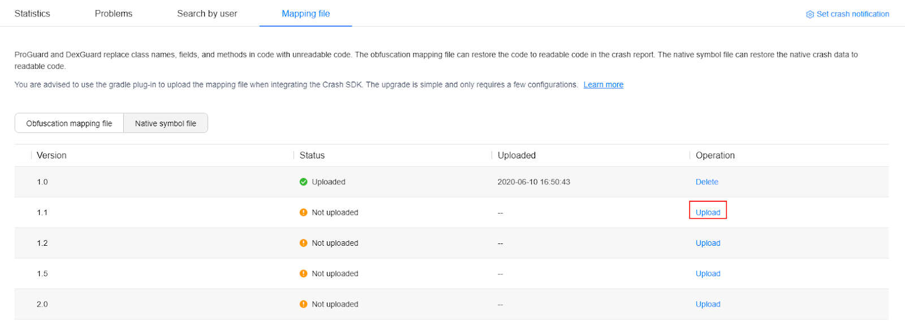

6. Click **upload** button in the dialog box that is displayed to upload the obfuscation mapping file.

   **NOTE:**<br>You can upload an obfuscation mapping file in ZIP or TXT format.

   - The ZIP package size cannot exceed 5 MB. The obfuscation mapping file compressed in the ZIP package must be in .txt format and be stored in the root directory of the package. The root directory can contain only one .txt obfuscation mapping file. The size of the decompressed file cannot exceed 40 MB or contain more than 600 thousand lines.

   - The size of a TXT file cannot exceed 10 MB or contain more than 600 thousand lines. If the size exceeds 10 MB, the file must be compressed before being uploaded. The interval between two uploads must be greater than 60 seconds.

The following figures show the crash reports before and after de-obfuscation processing.

**Before de-obfuscation:**

   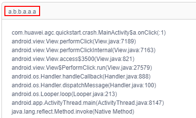

**After de-obfuscation:**

   

### How to build apk in Unity?

After setting in the project setting,check the scene you want to build in **File->Build Settings->Scenes** In **Build**, select **Android** in **Platform**. 

If you want to build release apk, please set as follows.


if you want to build debug apk, please set as follows.

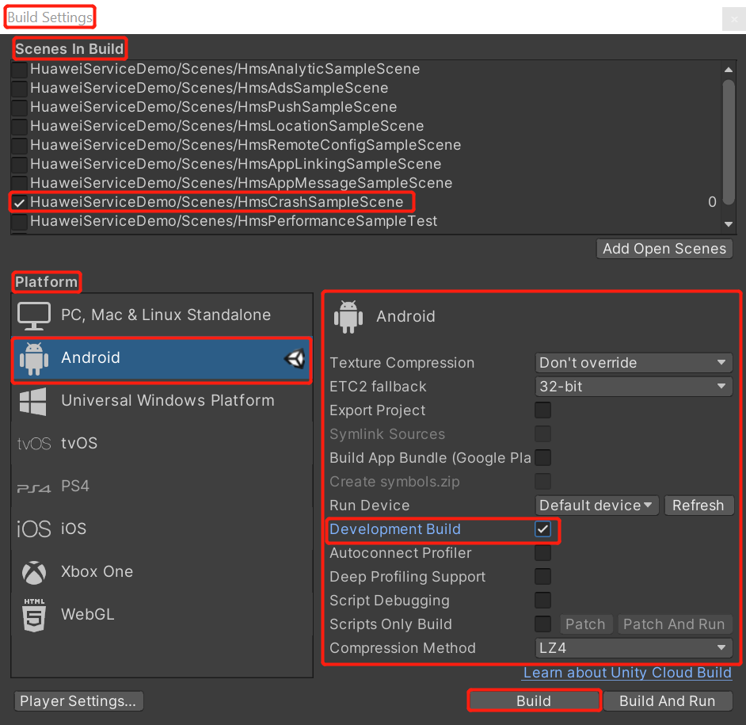

Then click **Build**.


### Analyzing a Crash

When a crash occurs, the Crash service reports the crash data to AppGallery Connect. You can view details about the crash in AppGallery Connect and analyze the cause of the crash. This section describes the basic method of locating a crash, using the crash triggered during Crash service testing as an example.

#### Before You Start

1. Enable the Crash service in AppGallery Connect. For details, please refer to [Enabling the Crash Service](https://developer.huawei.com/consumer/en/doc/development/AppGallery-connect-Guides/agc-crash-getstarted-0000001055260538#EN-US_TOPIC_0000001055260538__section0780913181619).

2. Report crash data at least once. For details, please refer to [Testing the Crash Service](https://developer.huawei.com/consumer/en/doc/development/AppGallery-connect-Guides/agc-crash-test-0000001055420516).

#### Accessing the Crash Page

1. Sign in to [AppGallery Connect](https://developer.huawei.com/consumer/en/service/josp/agc/index.html) and click **My projects**.

2. Find your project from the project list and click your app on the project card.

3. Go to **Quality > Crash**. The **Crash** page is displayed.

   

#### Viewing Crash Details

1. Click the **Statistics** tab and add filters or select a period in the upper right corner to filter crash data based on your needs. For example, if you triggered crashes on multiple devices to test the Crash service in the **last 24 hours**, you can select Last 24 hours in the upper right corner to check whether the crash data was reported.

   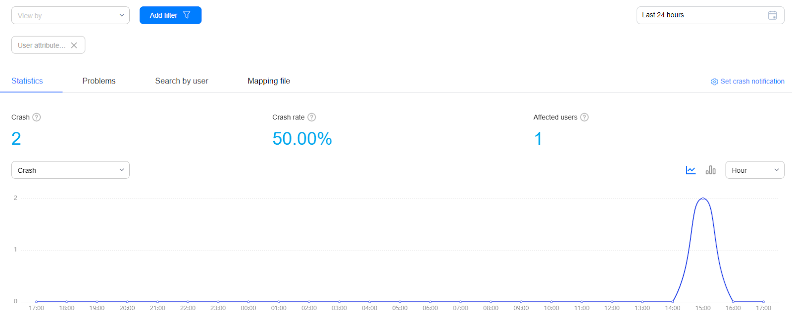

2. After confirming that crash data exists, click the **Problems** tab and select a period in the upper corner to check the crashes that took place during the period. For example, you can select **Last 24 hours** if your app crashed in the last 24 hours. Based on the crash time and quantity, you can find the specific crash. As shown in the following figure, **java.lang.NullPointerException** is the crash triggered during Crash service testing. Click **java.lang.NullPointerException** to access the crash details page.

   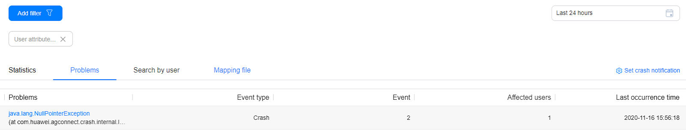

   **NOTE:**<br>
   For details about more operations on the **Crash** page, please refer to [Crash Statistics Overview](https://developer.huawei.com/consumer/en/doc/development/AppGallery-connect-Guides/agc-crash-appendix-statistics-0000001058516327#EN-US_TOPIC_0000001058516327__section196772618248).

#### Analyzing a Crash

1. On the crash details page, analyze the crash trend based on the chart.

   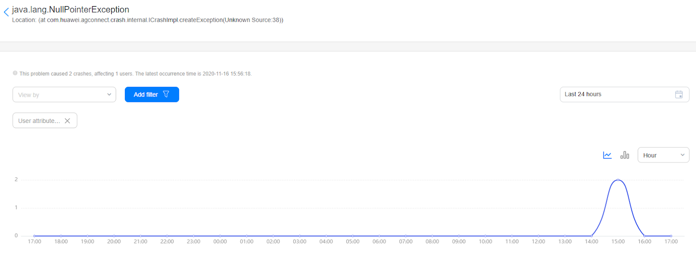

2. View the cause of the crash on the **Stack** tab page. For example, at **com.huawei.agconnect.crash.AGConnectCrash.testIt(Unknown Source:2)** indicates that the crash occurred during an app test.

   

   **NOTE:**<br>
   For details about more operations on the **Crash** page, please refer to [Crash Problems Overview](https://developer.huawei.com/consumer/en/doc/development/AppGallery-connect-Guides/agc-crash-appendix-problems-0000001059262024#EN-US_TOPIC_0000001059262024__en-us_topic_0216095923_section134761421485).

#### Crash Problems Overview

On the **Problems** tab page, you can view the list of all crashes and click a crash to view its details.

1. Problems

   You can add filters and select a time segment to search problems and view problem information including the number of crashes, number of affected users, and last occurrence time.

      

2. Viewing Crash Details

   On the **Problems** tab page, you can click a crash name to access the problem details page. The details include the stack and related information (device, operating system, and app version) involved when the problem occurs. You can view problem details by day, week, or month.

      


The following table describes the areas on the page shown in the preceding figure.


<div style="width:50px">No.</div>| Description
---|---
1 | Displays the overview of a specific problem, including the number of crashes, number of affected users, and last occurrence time.
2 | Allows you to set query criteria, including View by, Add filter, and time segment.
3 | Shows the trend chart of the crash meeting the specified criteria. You can click to switch between a line chart and a bar chart.
4 | Shows the summary of a crash, including the app device, operating system version, device model, and last occurrence time.
5 | Displays all stack information when a crash occurs.
6 | Displays basic information about a crash, including the app, operating system, and device information.


### Obtaining a Custom Crash Report
#### Querying Crash Information by User ID

1. Sign in to [AppGallery Connect](https://developer.huawei.com/consumer/en/service/josp/agc/index.html) and click **My projects**.

2. Find your project from the project list and click your app on the project card.

3. Go to **Quality > Crash**.

4. Click the **Search by user** tab and enter a user ID in the search box to query crash information of the user.

   

5. Click a crash in the **Problems** column and select a time period in the upper right corner to check the number of times that the crash occurs during the period and the details about each crash.

#### Querying Crash Information by Custom Log

1. Click the **Problems** tab and click a crash for which you need to query information in the **Problems** column.

2. Click the **Logs** tab, select a log level from the drop-down list box, and enter a keyword in the search box to narrow down the log search scope.

   

#### Querying Crash Information by Custom Key-Value Pair

1. Click the **Problems** tab and click a crash for which you need to query information in the **Problems** column.

2. Click the **Status** tab and enter a keyword in the search box to check the user status before and after the crash to further analyze the impact of the crash on users.

   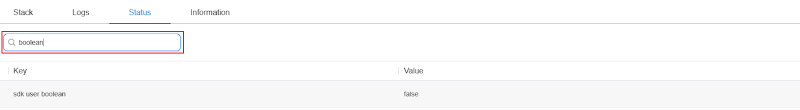


### Demo Project

How to use this demo project?

After integration, you can create a crash and report the crash for testing, please refer to here:
[https://developer.huawei.com/consumer/cn/doc/development/AppGallery-connect-Guides/agc-crash-test](https://developer.huawei.com/consumer/cn/doc/development/AppGallery-connect-Guides/agc-crash-test)

If there are still things not clear you can check the demo on github. The corresponding crash usage is
[https://github.com/Unity-Technologies/unity-hms_sdk/blob/master/hmsDemo/Assets/HuaweiServiceDemo/Scripts/test/CrashTest.cs](https://github.com/Unity-Technologies/unity-hms_sdk/blob/master/hmsDemo/Assets/HuaweiServiceDemo/Scripts/test/CrashTest.cs)

After writing and testing the code according to this Demo Project, the crash information you created will be uploaded to the crash service page, as shown in the following document
[https://developer.huawei.com/consumer/cn/doc/development/AppGallery-connect-Guides/agc-crash-locate](https://developer.huawei.com/consumer/cn/doc/development/AppGallery-connect-Guides/agc-crash-locate)

You can also set the user ID according to our API setting custom user identifier, add custom logs, add custom key-value pairs, etc. According to the custom information you set, you can get a custom crash report. The usage is as follows:
[https://developer.huawei.com/consumer/cn/doc/development/AppGallery-connect-Guides/agc-crash-customreport](https://developer.huawei.com/consumer/cn/doc/development/AppGallery-connect-Guides/agc-crash-customreport)

