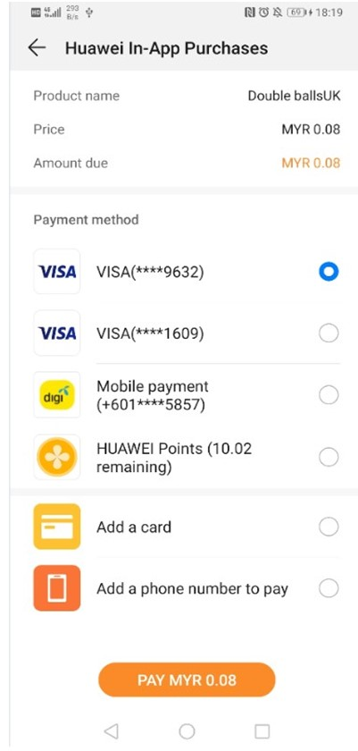
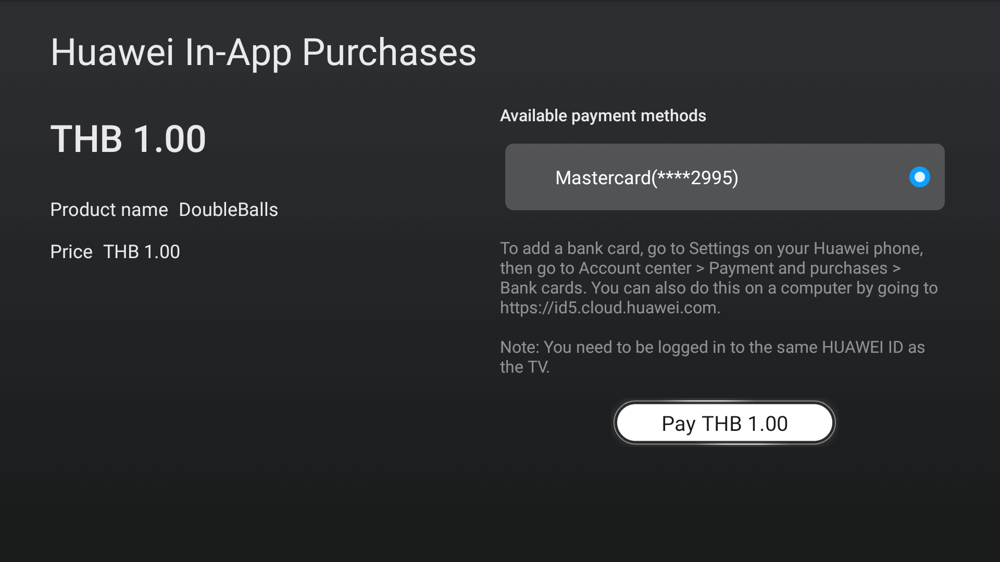

# IAP Kit (HMS)

## Service Introduction

HUAWEI In-App Purchases (IAP) enables you to sell digital products and content directly within your app. To make in-app purchases available in your app, you only need to integrate the IAP SDK and then call its API to launch the IAP checkout screen.

To learn how to integrate it, watch the coding practice tutorial [here](https://developer.huawei.com/consumer/en/training/detail/101583014863994176).

With IAP, you can offer the following types of digital products and content within your app:

- One-time products: Users can purchase with a single, non-recurring charge. There are two types of one-time products.
    - Consumables: Such products are depleted as they are used and can be purchased again, for example, in-game currencies and items.
    - Non-consumables: Such products are purchased once and never expire, for example, extra game levels in a game or permanent membership of an app.
- Subscriptions: They provide users with ongoing access to content or services in your app. Users are charged on a recurring basis until they decide to cancel. Examples include non-permanent memberships of an app, such as a monthly video membership.

### Supported Devices

| <div style="width:80px">Device Type</div>                       | OS Version                | HMS Core（APK）Version                                                     |
  | ------------------------------------------------------------ | ----------------------- | ------------------------------------------------------------ |
  | Huawei phones and tablets | EMUI 3.0 or later                   | 3.0.0 or later |
  | Non-Huawei Android phones | Android 4.4 or later (API level 19 or higher)             | 3.0.0 or later                         |
  | HUAWEI Vision| HarmonyOS                    | 5.0.0 or later |

### Checkout Screens

- On the phone/tablet (The checkout screens on the phone and tablet only differ in their sizes. Here, the checkout screen on the phone is used as an example.)<br>
  

- On the HUAWEI Vision<br>
  

### Service Features

- Easy access and sandbox testing<br>
Comprehensive access procedure guidance and sandbox testing configuration are provided so that you can quickly and easily access HUAWEI IAP.

- Localized languages and currencies for a convenient worldwide release<br>
Your app shows product information and its price in the language and currency of the country or region where the user's account is located. All you have to do is just releasing an app, and then the app will be promoted within [Supported Countries/Regions](https://developer.huawei.com/consumer/en/doc/development/HMSCore-Guides/huawei-iap-coverage-0000001050438753).

- Multiple payment methods aggregated for global payments<br>
Users can pay with bank cards, Alipay, WeChat, Direct Carrier Billing (DCB), and HUAWEI Points. The bank cards include those issued by major banks in China as well as Visa and Mastercard. DCB is supported by many large carriers outside China. Users can bind their bank cards and phone numbers to their HUAWEI IDs and make payments by entering HUAWEI ID payment passwords they have set before, which is more convenient than traditional payment methods.<br>
The following table lists supported payment methods.

| <div style="width:80px">Country/Region</div> | Supported Payment Method                                                     |
| -------------------------------------- | ------------------------------------------------------------ |
| Chinese mainland                               | Bank card<br>Alipay<br>WeChat Pay<br>HUAWEI Points |
| Hong Kong (China), Macao (China), Taiwan (China), and countries/regions outside China                               | Bank card<br>DCB<br>HUAWEI Points<br>Third-party payment<br>|

- High security, high reliability, and 24/7 monitoring
    - The TLS protocol is used to encrypt data for transmission and the RSA algorithm is used for signatures to protect user messages from being intercepted or tampered with. Data is encrypted and anonymized before being saved in the background, ensuring data security.
    - Cluster deployment and redundancy design are adopted for background servers, and 24/7 real-time system monitoring can facilitate locating a fault and providing assistance for operations.

### Use Cases
HUAWEI IAP provides a Product Management System (PMS) through AppGallery Connect for you to manage your products after adding their information including ID and price. Your app with HUAWEI IAP integrated will display the product information in the local language and also show the price in the local currency based on the location and exchange rate, facilitating global distribution for your app.

The latest version supports the following functions.

- Release: You can release an app (gaming app or other) with one package and manage the prices and languages of in-app products. The countries/regions supported by the PMS on the price configuration page shall prevail.
- Currencies and languages: You can set one default currency and one default language for each country/region. Only one language is allowed for a country/region.
- Price: Huawei provides an in-app product reference price for each country/region based on the price (tax included) you set and the exchange rate. You can change the reference price for each country/region as needed. For example, if you enter one euro, the system automatically sets the prices for other countries/regions based on the exchange rate. If Euro to CNY rate is 7.88, the system automatically sets the price for China to CNY7.88. You can change the price as needed.
- Exchange rate: The PMS provides fixed exchange rates by which Huawei will update prices. Exchange rate updates by Huawei have no affect on your product prices. You should manually change your product prices if needed.
- Intended audience: The PMS is available for global developers. To release an app (gaming app or other) to multiple countries/regions, you need to manage the price and language of the products locally.

### Function Usage Restrictions

| <div style="width:80px">Function</div> | Location Requirement                                                     |
| -------------------------------------- | ------------------------------------------------------------ |
| Sandbox testing on the HUAWEI Vision                               | Supported only outside the Chinese mainland. |

### Supported Countries/Regions
HUAWEI IAP is now available in [these countries/regions](https://developer.huawei.com/consumer/en/doc/development/HMSCore-Guides/huawei-iap-coverage-0000001050438753).

### Privacy Statement
Before integrating IAP into your app, you will need to sign the [HUAWEI Developers Service Agreement](https://developer.huawei.com/consumer/en/doc/start/agreement-0000001052728169) and [Agreement on Use of Huawei APIs](https://developer.huawei.com/consumer/en/doc/distribution/app/10129). You understand and accept that downloading or using the said kit will be deemed as you having agreed to all of the preceding agreements, and you will fulfill and assume the legal responsibilities and obligations in accordance with said agreements.

## Integrating into Your Unity Project

### Register and get verified

Before doing this step, you need to create an HMS Account, project and App according to [the HMS document](https://developer.huawei.com/consumer/en/doc/development/HMS-Guides/Preparations).


Now you have your Huawei HMS Project and App information.

### Create an app

Create Unity project, and you will also need to set up the build environment for building Android apk with HMS SDK. Then, finish the following preparation.


In **Editor -> Build Settings**, Switch platform to Andriod and Connect your Android device


In **Player Settings -> Publishing Settings**, enable the following environment checkboxes


### Prepare for development

According to [HMS integration process introduction](https://developer.huawei.com/consumer/en/codelab/HMSPreparation/index.html#6), we still need to add some configurations to the gradle files for development preparations.


You can follow [Huawei documentation guidance](https://developer.huawei.com/consumer/en/codelab/HMSPreparation/index.html#6) to do the configuration, you can also refer and compare with the files in our [Unity example project](https://github.com/Unity-Technologies/HMSSDKSample/tree/master/Assets/Plugins/Android).

1. Enable and add configurations to `AndroidManifest.xml`

   Go to **Edit -> Project Settings -> Player -> Android(icon) -> Publishing Settings -> Build**

   Enable **Custom Main Manifest**

   If Unity Version is **2019.2 or before**, there is no **AndroidManifest** checkbox, but you can put `AndroidManifest.xml` under `Assets/Plugins/Android`.

   ```
       <?xml version="1.0" encoding="utf-8"?>
       <!-- GENERATED BY UNITY. REMOVE THIS COMMENT TO PREVENT OVERWRITING WHEN EXPORTING AGAIN-->
       <manifest
           xmlns:android="http://schemas.android.com/apk/res/android"
           package="com.unity3d.player"
           xmlns:tools="http://schemas.android.com/tools">
           <uses-permission android:name="android.permission.ACCESS_COARSE_LOCATION"/>
           <uses-permission android:name="android.permission.ACCESS_FINE_LOCATION"/>
           <uses-permission android:name="android.permission.ACCESS_BACKGROUND_LOCATION" />
           <uses-permission android:name="com.huawei.hms.permission.ACTIVITY_RECOGNITION" />
           <uses-permission android:name="android.permission.ACTIVITY_RECOGNITION" />
           <uses-permission android:name="android.permission.ACCESS_MOCK_LOCATION" />
           <uses-permission android:name="android.permission.FOREGROUND_SERVICE" />
           <application>
               <activity android:name="com.hms.hms_analytic_activity.HmsAnalyticActivity"
                       android:theme="@style/UnityThemeSelector">
                   <intent-filter>
                       <action android:name="android.intent.action.MAIN" />
                       <category android:name="android.intent.category.LAUNCHER" />
                   </intent-filter>
                   <meta-data android:name="unityplayer.UnityActivity" android:value="true" />
               </activity>
               <service
                   android:name="com.unity.hms.push.MyPushService"
                   android:exported="false">
                   <intent-filter>
                       <action android:name="com.huawei.push.action.MESSAGING_EVENT"/>
                   </intent-filter>
               </service>
               <receiver
                       android:name="com.unity.hms.location.LocationBroadcastReceiver"
                       android:exported="true">
                   <intent-filter>
                       <action android:name="com.huawei.hmssample.location.LocationBroadcastReceiver.ACTION_PROCESS_LOCATION" />
                   </intent-filter>
               </receiver>
               <receiver
                       android:name="com.unity.hms.location.GeoFenceBroadcastReceiver"
                       android:exported="true">
                   <intent-filter>
                       <action android:name="com.huawei.hmssample.geofence.GeoFenceBroadcastReceiver.ACTION_PROCESS_LOCATION" />
                   </intent-filter>
               </receiver>
               <meta-data     
                android:name="com.huawei.hms.client.channel.androidMarket"  
                android:value="false" />
           </application>
       </manifest>
   ```

2. Enable and add configurations to project gradle

   Go to **Edit -> Project Settings -> Player -> Android(icon) -> Publishing Settings -> Build**

   Enable **Custom Base Gradle Template** and add the AppGallery Connect plugin and the Maven repository. The path is `Assets/Plugins/Android/baseProjectTemplate.gradle`.

   If your unity version is **2019.2 or before**, you should add implement and other configuration on `MainGradleTemplate.gradle`.

   ```
       // GENERATED BY UNITY. REMOVE THIS COMMENT TO PREVENT OVERWRITING WHEN EXPORTING AGAIN
   
       allprojects {
           buildscript {
               repositories {**ARTIFACTORYREPOSITORY**
                   google()
                   jcenter()
                   maven { url 'https://developer.huawei.com/repo/' }
               }
   
               dependencies {
                   // If you are changing the Android Gradle Plugin version, make sure it is compatible with the Gradle version preinstalled with Unity
                   // See which Gradle version is preinstalled with Unity here https://docs.unity3d.com/Manual/android-gradle-overview.html
                   // See official Gradle and Android Gradle Plugin compatibility table here https://developer.android.com/studio/releases/gradle-plugin#updating-gradle
                   // To specify a custom Gradle version in Unity, go do "Preferences > External Tools", uncheck "Gradle Installed with Unity (recommended)" and specify a path to a custom Gradle version
                   classpath 'com.android.tools.build:gradle:3.6.4'
                   classpath 'com.huawei.agconnect:agcp:1.6.1.300'
                   **BUILD_SCRIPT_DEPS**
               }
           }
   
           repositories {**ARTIFACTORYREPOSITORY**
               google()
               jcenter()
               flatDir {
                   dirs "${project(':unityLibrary').projectDir}/libs"
               }
               maven { url 'https://developer.huawei.com/repo/' }
           }
       }
   
       task clean(type: Delete) {
           delete rootProject.buildDir
       }
   ```

3. Enable and add configurations to app gradle

   Go to **Edit -> Project Settings -> Player -> Android(icon) -> Publishing Settings -> Build**

   Enable **Custom Launcher Gradle Template** and add build dependencies in `launcherTemplate.gradle`. The path is `Assets/Plugins/Android/launcherTmeplate.gradle`.

   If unity version is **2019.2 or before**, you should add implement and other configuration on `MainGradleTemplate`.

   ```
       dependencies {
           implementation project(':unityLibrary')
           implementation 'com.huawei.hms:ads-lite:13.4.49.301'
           implementation 'com.huawei.hms:ads-consent:3.4.49.301'
           implementation 'com.huawei.hms:push:6.1.0.300'
           implementation 'com.huawei.hms:hianalytics:6.3.2.300'
           implementation 'com.huawei.hms:location:6.2.0.300'
           implementation 'com.android.support:appcompat-v7:28.0.0'
           implementation 'com.huawei.agconnect:agconnect-core:1.6.1.300'
           implementation 'com.huawei.hms:hwid:6.1.0.303'
           implementation 'com.huawei.hms:iap:6.3.0.300'
           implementation 'com.huawei.hms:game:6.1.0.301'
           }
   ```
   
4. Enable and add configurations to unity library gradle

   Go to **Edit -> Project Settings -> Player -> Android(icon) -> Publishing Settings -> Build**

   Enable **Custom Main Gradle Template** and add build dependencies. The path is `Assets/Plugins/Android/mainTemplate.gradle`.

   If unity version is **2019.2 or before**, you should add implement and other configuration on `MainGradleTemplate.gradle`.

   ```
   dependencies {
       implementation fileTree(dir: 'libs', include: ['*.jar'])
       implementation 'com.huawei.hms:hianalytics:6.3.2.300'
       implementation 'com.huawei.agconnect:agconnect-core:1.6.1.300'
       implementation 'com.huawei.hms:hwid:6.1.0.303'
       implementation 'com.huawei.hms:iap:6.3.0.300'
       implementation 'com.huawei.hms:game:6.1.0.301'
   **DEPS**}
   ```

5. Signature

   Go to **Edit -> Project Settings -> Player -> Android(icon) -> Publishing Settings -> Keystore Manager**

   Click **Keytore... -> create new**

   

   You need to enter the password when you open unity, otherwise you cannot build. There's no need to add a signature on gradle.

6. Signing Certificate Fingerprint

   Please refer to Huawei [preparation documentation step 4](https://developer.huawei.com/consumer/en/codelab/HMSPreparation/index.html#3) for generating a SHA256 Certificate Fingerprint.

   

   And refer to Huawei [preparation documentation step 5](https://developer.huawei.com/consumer/en/codelab/HMSPreparation/index.html#4) to add Fingerprint to AppGallery Connect.

   

7. Package name

   Set the package name in **Edit -> Project Settings -> Player**

   The package name is `com.${Company Name}.${Product Name}`.

   You can also complete the rest of the settings here, such as version number, icons, resolution, etc. 

   

8. `agconnect-services.json`

   We should put the json file under `Assets/Plugins/Android`.

   Add this following message into the json file downloaded from your Huawei developer dashboard. Also, you can [refer to that file](https://github.com/Unity-Technologies/HMSSDKSample/blob/master/Assets/Plugins/Android/agconnect-services.json) in our Unity example project.

   ```
   "agcgw":{
   "backurl":"connect-drcn.dbankcloud.cn",
   "url":"connect-drcn.hispace.hicloud.com"
   },
   ```

   You can refer to [this link](https://developer.huawei.com/consumer/en/doc/development/HMSCore-Guides/android-config-agc-0000001050170137) to create `agconnect-services.json`.

   

9. Configuring Obfuscation Scripts

    Before building the APK, configure the obfuscation configuration file to prevent the HMS Core SDK from being obfuscated.（[Reference](https://developer.huawei.com/consumer/en/doc/development/HMSCore-Guides/android-config-obfuscation-scripts-0000001050176973)）
    - Open the proguard file in your Unity project and add configurations to exclude the HMS Core SDK from obfuscation.

    ```
    -ignorewarnings
    -keepattributes *Annotation*
    -keepattributes Exceptions
    -keepattributes InnerClasses
    -keepattributes Signature
    -keepattributes SourceFile,LineNumberTable
    -keep class com.huawei.hianalytics.**{*;}
    -keep class com.huawei.updatesdk.**{*;}
    -keep class com.huawei.hms.**{*;}
    ```
    
    - (Optional) Configure the keep.xml file as follows to keep layout resources if you have enabled R8 resource shrinking (with shrinkResources being set to true in the project-level build.gradle file) and strict reference checks (with shrinkMode being set to strict in the res/raw/keep.xml file). Not keeping layout resources will lead to app rejection during release to HUAWEI AppGallery.

    ```
        <?xml version="1.0" encoding="utf-8"?>
    <resources xmlns:tools="http://schemas.android.com/tools"
        tools:keep="@layout/hms_download_progress,@drawable/screen_off,@layout/upsdk*"
        tools:shrinkMode="strict" />
    ```
    
10. Get activity

   For getting the activity, you can use the  `Common.GetActivity()` function.

11. Enabling IAP
    
    To use IAP, [enable this service](https://developer.huawei.com/consumer/en/doc/distribution/app/agc-help-enabling-service-0000001146598793#EN-US_TOPIC_0000001146598793__en-us_topic_0000001064950324_section135355454314) first.

12. Setting IAP Parameters

    To use the HUAWEI in-app payment function, you need to [set IAP Parameters](https://developer.huawei.com/consumer/en/doc/development/HMSCore-Guides/config-agc-0000001050033072).


## Developing with the SDK

### Developing

There are corresponding example scenes in the [example project](https://github.com/Unity-Technologies/HMSSDKSample) for all 4 Kits. For testing, you will need to build it onto Android mobile build by HMS. Make sure you have already created your HMS account and project. Then, you can change the configuration and test different functions.


In the example project, the corresponding scene for IAP Kit is  `Assets/HuaweiServiceDemo/Scenes/HmsIAPSampleScene.unity` and the code is `Assets/HuaweiServiceDemo/Scripts/test/iap/IAPTest.cs`.


We need to update AndroidManifest and add custom HmsIapActivity.java.

You need to get the id of the purchased item in the agent activity.

**IAP Kit** receives sign in results in `onActivityResult` hook,which can't be overridden in c# code.
So we need a transparent activity as a proxy to receive and deliver the results.

To receive results, you shall get the id and type of the purchased item and `getIapIntent` in the proxy-activity but in the unityPlayerActivity where `onActivityResult` has not been overridden , then `startActivityForResult` and receive results in `onActivityResult` hook in the proxy-activity.

To deliver the results, you can write a custom `MyOnActivityResult` in c# code, pass it on to in the proxy-activity,  call that callback in  `onActivityResult` in the proxy-activity, then you can handle the results in your c# code.

To simplify this scenario, we provide[IapActivity.cs](https://github.com/Unity-Technologies/HuaweiServiceSample/blob/test2022/Assets/HuaweiService/iap/IapActivity.cs), in which common functions are packaged. You can find the examples in [IAPTest.cs](https://github.com/Unity-Technologies/HuaweiServiceSample/blob/test2022/Assets/HuaweiServiceDemo/Scripts/test/IAPTest.cs)s.  

Update AndroidManifest for HmsIapActivity  in  **Assets/Plugins/Android/AndroidManifest.xml**

```
<?xml version="1.0" encoding="utf-8"?>
<!-- GENERATED BY UNITY. REMOVE THIS COMMENT TO PREVENT OVERWRITING WHEN EXPORTING AGAIN-->
<manifest
   xmlns:android="http://schemas.android.com/apk/res/android"
   package="com.unity3d.player"
   xmlns:tools="http://schemas.android.com/tools">
...
   <application>
        <activity android:name="com.unity.hms.iap.HmsIapActivity" 
                  android:theme="@android:style/Theme.Translucent.NoTitleBar">
        </activity>
...
   </application>
</manifest>
```

You may add corresponding custom HmsIapActivity.java in **Assets/Plugins/Android/HmsIapActivity.java**

```
package com.unity.hms.iap;

import android.app.Activity;
import android.content.Intent;
import android.os.Bundle;
import com.huawei.hms.iap.Iap;
import com.huawei.hmf.tasks.Task;
import com.huawei.hms.iap.entity.PurchaseIntentResult;
import com.huawei.hmf.tasks.OnSuccessListener;
import com.huawei.hmf.tasks.OnFailureListener;
import com.huawei.hms.support.api.client.Status;
import com.huawei.hms.iap.IapApiException;
import android.content.IntentSender;
import android.util.Log;
import com.huawei.hms.iap.entity.PurchaseIntentReq;

public class HmsIapActivity extends Activity {

    private static IIapCallback mCallback;
    private static String mIntent = "test";
    private static String mId = "test";
    private static int mType = 0;
    private String TAG = "ResolutionForResult: ";
    public static void setCallback(IIapCallback callback){
        mCallback=callback;
    }
    public static void setIntent(String intent){
        mIntent=intent;
    }
    public static void setConProductId(String id){
        mId=id;
    }
    public static void setPriceType(int type){ mType=type;}

    @Override
    protected void onCreate(Bundle savedInstanceState) {
        super.onCreate(savedInstanceState);
        switch (mIntent) {
            case "Consumables":
                purchase("Consumables");
                break;
            case "Non-Consumables":
                purchase("Non-Consumables");
                break;
            case "Subscription":
                purchase("Subscription");
                break;
            default:
                break;
        }
    }

    public static void start(Activity activity){
        Intent intent = new Intent(activity, HmsIapActivity.class);
        activity.startActivity(intent);
    }

    public Activity getActivity() {
        return this;
    }

    public void purchase(String type) {
        PurchaseIntentReq req = new PurchaseIntentReq();
        if (type == "Consumables"){
            req.setProductId(mId);
            req.setPriceType(mType);
        }else if(type == "Non-Consumables"){
            req.setProductId(mId);
            req.setPriceType(mType);
        }else{
            req.setProductId(mId);
            req.setPriceType(mType);
        }
        req.setDeveloperPayload("test");
        final Activity activity = getActivity();
        Task<PurchaseIntentResult> task = Iap.getIapClient(activity).createPurchaseIntent(req);
        task.addOnSuccessListener(new OnSuccessListener<PurchaseIntentResult>() {
            @Override
            public void onSuccess(PurchaseIntentResult result) {
                Status status = result.getStatus();
                if (status.hasResolution()) {
                    try {
                        status.startResolutionForResult(activity,6666);
                    } catch (IntentSender.SendIntentException exp){
                        Log.e(TAG, exp.getMessage());
                    }
                }
            }
        }).addOnFailureListener(new OnFailureListener() {
            @Override
            public void onFailure(Exception e) {
                if (e instanceof IapApiException) {
                    IapApiException apiException = (IapApiException) e;
                    Status status = apiException.getStatus();
                    int returnCode = apiException.getStatusCode();
                    Log.e(TAG, e.getMessage());
                } else {
                    Log.e(TAG, e.getMessage());
                }
            }
        });
    }

    @Override
    protected void onActivityResult(int requestCode, int resultCode, Intent data) {
        super.onActivityResult(requestCode, resultCode, data);
        if(mCallback!=null){
            mCallback.onActivityResult(requestCode, resultCode,data);
        }
        finish();
    }
}
 ```

### Test & Release

Please refer to Huawei [integration procedure](https://developer.huawei.com/consumer/en/doc/start/htiHMSCore) for testing and releasing.


