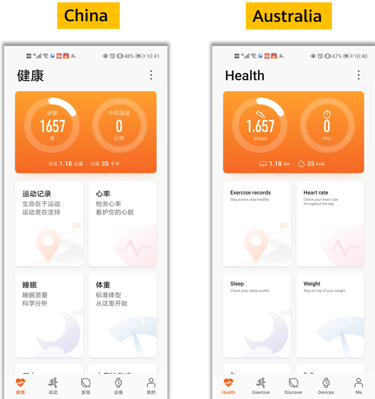
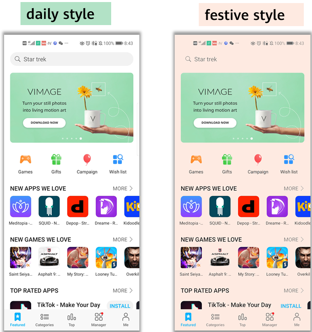

# Remote Configuration (AGC)

## Service Introduction

HUAWEI AppGallery Connect provides the [Remote Configuration](https://developer.huawei.com/consumer/en/doc/development/AppGallery-connect-Guides/agc-remoteconfig-introduction) service for you to manage parameters online. With the service, you can change the behavior and appearance of your app online without requiring users to update the app.

By integrating the client SDK, your app can periodically obtain parameter values delivered on the console to modify the app's behavior and appearance.

### Functions

* **Parameter management**: Includes adding, deleting, and modifying parameters, copying and modifying existing parameters as new ones, and setting conditional values.

* **Condition management**: Includes adding, deleting, and modifying conditions, and copying and modifying existing conditions as new ones. Currently, you can set the following conditions: version, language, country/region, audience, user attribute, user percentage, and time. More conditions will be available in the future.

* **Version management**: Supports management and rollback of up to 90 days of 300 historical versions for parameters and conditions.

* **Permission management**: Allows the account holder, administrator, app administrator, R&D personnel, and operations personnel to access Remote Configuration by default.

### Use Cases

#### Displaying the Language by Country/Region

You can schedule a promotion by setting a trigger in Remote Configuration. More importantly, the promotion content can vary depending on the country or region as long as you set the locale information in Remote Configuration.



#### Displaying Different Content to Different Users

Remote Configuration can work with HUAWEI Analytics to personalize content displayed to different user groups. For example, office workers and students will see different products and UI layouts in an app.


#### Adapting the App Theme by Time

You can set the time condition, different app colors, and various picture materials in Remote Configuration to change the app theme for a special time. For example, during the graduation season, you can adapt your app to the graduation theme to attract more users.


#### Releasing New Functions

Releasing new functions to all users at the same time may be risky. Remote Configuration enables new function release by user percentage for you to slowly increase the target user scope, effectively helping you improve your app based on the feedback from users already exposed to the new functions.

## Setting up in Huawei AppGallery Connect

1. Create an app in AppGallery Connect and integrate the AppGallery Connect SDK into your app. For details, please refer to [AppGallery Connect Quick Start](https://developer.huawei.com/consumer/en/doc/development/AppGallery-connect-Guides/agc-get-started).

2. Find your project from the project list and click the app for which you need to enable Remote Configuration on the project card.

    

3. Go to **Growing > Remote Configuration**. On the Remote Configuration page that is displayed, click **Enable now**.

   **Note:**
   You may need to set the data storage location when enabling Remote Configuration. Then, the setting in `agconnect-services.json` will be automatically updated accordingly. If you have set the data storage location when enabling Remote Configuration, you need to download the `agconnect-services.json` file again and integrate it into your project after the service is enabled. For details, please refer to [Adding the Configuration File](https://developer.huawei.com/consumer/en/doc/development/AppGallery-connect-Guides/agc-get-started#addjson).

    

4. Config the json file

   Copy the `agconnect-services.json` file to the `Assets/Plugins/Android` folder.

   

## Setting up in Unity

### Integrating Remote Configuration Kit

1. Enable and add configurations to project gradle

   Go to **Edit -> Project Settings -> Player -> Android(icon) -> Publishing Settings -> Build**
   
   Enable **Custom Base Gradle Template** and add the configuration to the Maven repository. The path is `Assets/Plugins/Android/baseProjectTemplate.gradle`.

   If your unity version is **2019.2 or before**, you should add implement and other configuration on `MainGradleTemplate.gradle`. 

   And the repository is:
   
   ```
       allprojects {
           buildscript {
               repositories {
                   maven { url 'https://developer.huawei.com/repo/' }
               }
           }
           repositories {
   
               maven { url 'https://developer.huawei.com/repo/' }
           }
       }
   ```
   
2. Enable and add configurations to app gradle

   Go to **Edit -> Project Settings -> Player -> Android(icon) -> Publishing Settings -> Build**
   
   Enable **Custom Launcher Gradle Template** and add build dependencies in `launcherTemplate.gradle`. The path is `Assets/Plugins/Android/launcherTmeplate.gradle`.
   
   If your unity version is **2019.2 or before**, you should add implement and other configuration on `MainGradleTemplate`.
   
   ```
       dependencies {
   
       implementation 'com.huawei.agconnect:agconnect-remoteconfig:1.6.1.300'
   
   }
   ```

3. Optional: Using an XML resource file

   Since Unity could not use the xml resource as Android, please put the xml resource under `Assets/HuaweiService/Android/res/xml`. 

   For example,  `Assets/HuaweiService/Android/res/xml/remote_config.xml`.

   ```
   <?xml version="1.0" encoding="utf-8"?>
   <remote-config>
       <value key="test1">test1</value>
       <value key="test2">true</value>
       <value key="test3">111</value>
       <value key="test4">123.456</value>
       <value key="test5">FromXml</value>
   </remote-config>
   ```

   Use help function to get config id, and apply the xml data like

   ```
   public void SetXmlValue()
   {
       var config = AGConnectConfig.getInstance();
       int configId = AndroidUtil.GetId(new Context(), "xml", "remote_config");
       config.applyDefault(configId);
       showAllValues();
   }
   ```

4. Set the package name in **Edit -> Project Settings -> Player ->  Android(icon) -> other settings -> Identification -> Package Name**
   The package name is the package name of app in huawei project.


## Developing with the SDK

### Example: Apply xml config

Setting up a scene

1. Open a scene:

    
    
2. Right click and select UI and then you can choose a button:

    
    
3. Add component to the button and develop a script:
   
    
    
    

4. Edit the script:
   
    
    
    Double click the script file,and u will open it in VS code

    

5. Defines the code

    ```
    using HuaweiService;
    
    public class 
    {
    
        public void SetXmlValue()
        {
            var config = AGConnectConfig.getInstance();
            // get res id
            int configId = AndroidUtil.GetId(new Context(), "xml", "remote_config");
            config.applyDefault(configId);
            // get variable
            Map map = config.getMergedAll();
            var keySet = map.keySet();
            var keyArray = keySet.toArray();
            foreach (var key in keyArray)
            {
                var value = config.getSource(key);
                // Use the key and value ...
            }
        }
    
    }
    ```

    Create a function above

6. Bind buttons and interfaces in scripts

   

   - Step1. Click “+” to add a function

   - Step2. Choose the corresponding scene which has the interface you want to use

   - Step3. Click the “No Function” select to choose the script and then choose the corresponding function

      

### Demo Project

If there are still things not clear you can check the demo on github. The corresponding Remote Configuration usage is [RemoteConfigTest.cs](https://github.com/Unity-Technologies/HuaweiServiceSample/blob/8a72eb9b34a2d6f1cfe3a8d3340dbf2c6ae1eb4b/Assets/HuaweiServiceDemo/Scripts/test/RemoteConfigTest.cs ) 


